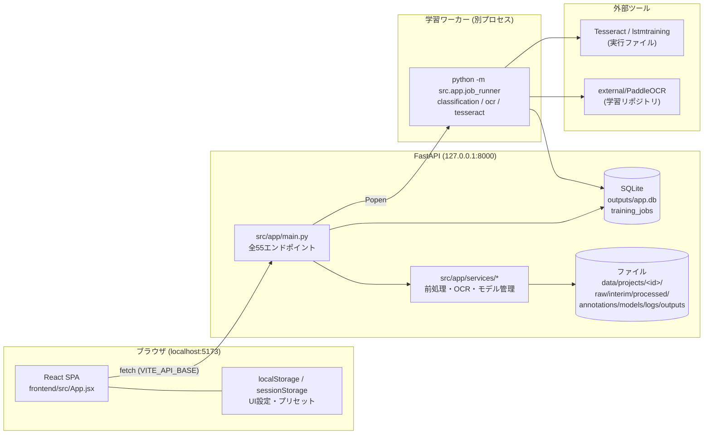
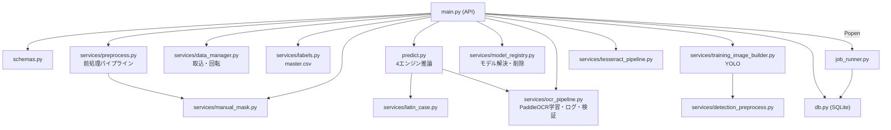
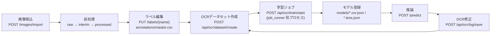

# 01. アーキテクチャ

## 全体構成

ローカル2プロセス構成。コンテナ・外部サービス・認証はない。

## レイヤ構造

| レイヤ | 場所 | 役割 |
|---|---|---|
| プレゼンテーション | `frontend/src/views/`（12画面）+ `components/` | 画面表示・操作。全状態は `App.jsx` に集約し props で配布 |
| API | `src/app/main.py` | ルーティング・入力検証（`schemas.py` の Pydantic）・エラー変換 |
| ドメインサービス | `src/app/services/`（17モジュール） | 前処理・OCR学習/推論・モデル管理・評価・ラベル管理 |
| 永続化 | `src/app/db.py` + ファイルシステム | SQLite（ジョブのみ）と CSV/JSON/画像ファイル |
| 設定 | `src/app/config.py` + `config/settings.yaml` | `yaml.safe_load` のみ（デフォルトマージは呼び出し側の `.get()`） |

## モジュール関係（バックエンド）

- 循環依存を避けるため、共通判定は独立モジュール化（`latin_case.py` はバック/フロント両方に同等実装: `frontend/src/lib/lowercase.js`）。
- OCR前処理（`preprocess.py`）と YOLO検出前処理（`detection_preprocess.py`）は**意図的に分離**されている。

## データフロー（主要ワークフロー）

- 前処理は取込時・回転時に自動再実行される（対象ファイルのみ）。
- 推論プレビュー（`/preprocess/preview`）は前処理＋推論を1リクエストで実行し、ラベル編集・OCR修正画面のOCR候補にも使われる。
- 手動マスク・候補辞書は「推論後の補助」であり、学習には注入されない。

## API構成

- REST（JSON + 一部 multipart/form-data）。`src/app/main.py` 単一ファイルに全55エンドポイント（`APIRouter` 不使用）。
- 一覧は `docs/06_API_REFERENCE.md` を参照。
- 学習は非同期: API がジョブを SQLite に登録し `python -m src.app.job_runner <type> <job_id>` を `Popen` で起動。フロントはポーリング（`GET /train/{job_id}` 等）で進捗取得。WebSocket は不使用。

## 状態管理

| 場所 | 内容 |
|---|---|
| React（`App.jsx`） | 全UI状態を単一コンポーネントの hooks で管理（Redux/Context 不使用） |
| localStorage | 前処理パラメータ・プリセット・比較スロット・モデルAlias・候補辞書など（多くはプロジェクト別 `{ [projectId]: value }` 形式） |
| sessionStorage | 学習ジョブセッション・最終プロジェクトID |
| SQLite | 学習ジョブ（`training_jobs` 1テーブル、`training_family`/`engine` 列で分類/OCR/Tesseractを区別） |
| ファイル | ラベル（`annotations/master.csv`）、手動マスク（`annotations/manual_masks.json`）、推論ログ（`outputs/ocr_logs/predictions.jsonl`）、モデルメタ（`models/*.pt|*.ocr.json|*.tess.json`） |

## 通信方法

| 経路 | 方式 |
|---|---|
| フロント → バック | `fetch`（`frontend/src/lib/api.js` の `request()`。ベースURLは `VITE_API_BASE`、既定 `http://127.0.0.1:8000`） |
| 画像表示 | `` で直接APIのFileResponseを参照（キャッシュ制御に `v=` クエリ） |
| CORS | 明示オリジンのみ許可（localhost:5173）。未処理例外も JSON 500 で返しCORSヘッダを維持 |
| API → ワーカー | サブプロセス起動（`Popen`）+ SQLite経由の状態共有 + ログファイル tail |
