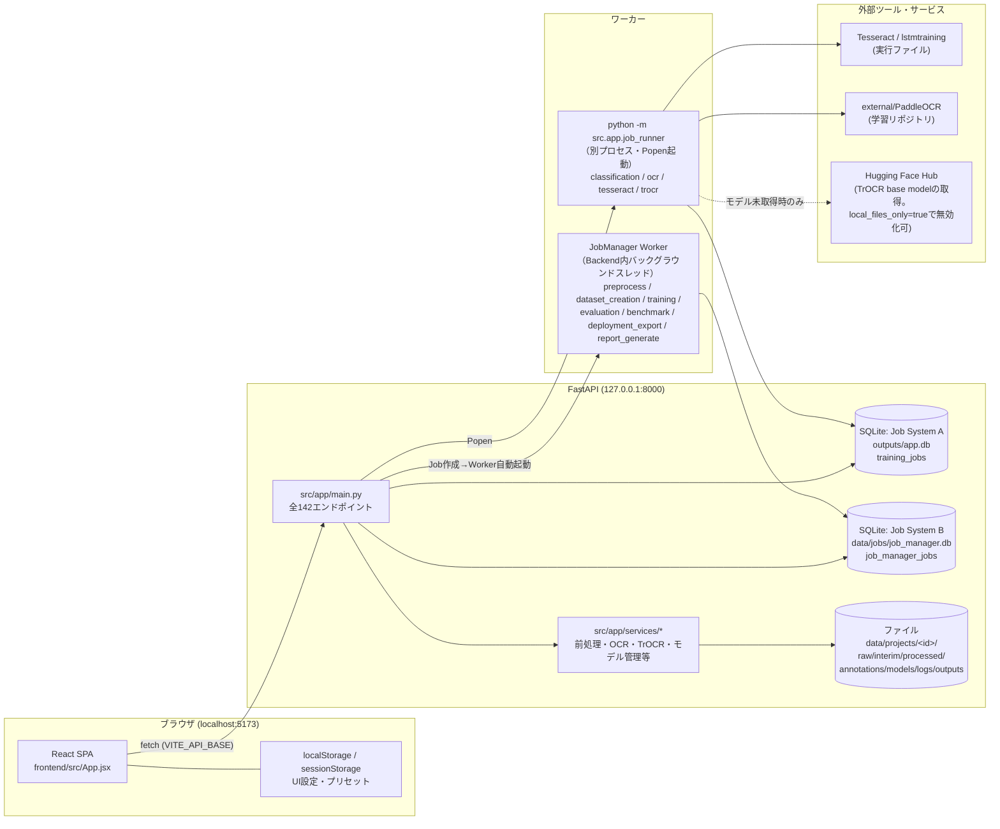
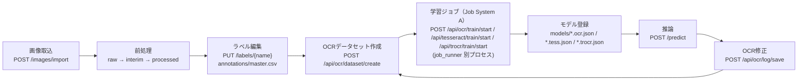

# 01. アーキテクチャ

## 全体構成

ローカル2プロセス構成。コンテナ・外部サービス・認証はない。

```mermaid
flowchart LR
    subgraph Browser["ブラウザ (localhost:5173)"]
        UI["React SPA<br/>frontend/src/App.jsx"]
        LS["localStorage / sessionStorage<br/>UI設定・プリセット"]
    end
    subgraph Backend["FastAPI (127.0.0.1:8000)"]
        API["src/app/main.py<br/>全142エンドポイント"]
        SVC["src/app/services/*<br/>前処理・OCR・TrOCR・モデル管理等"]
        DBA[("SQLite: Job System A<br/>outputs/app.db<br/>training_jobs")]
        DBB[("SQLite: Job System B<br/>data/jobs/job_manager.db<br/>job_manager_jobs")]
        FS[("ファイル<br/>data/projects/&lt;id&gt;/<br/>raw/interim/processed/<br/>annotations/models/logs/outputs")]
    end
    subgraph Workers["ワーカー"]
        JR["python -m src.app.job_runner<br/>（別プロセス・Popen起動）<br/>classification / ocr / tesseract / trocr"]
        JW["JobManager Worker<br/>（Backend内バックグラウンドスレッド）<br/>preprocess / dataset_creation / training /<br/>evaluation / benchmark / deployment_export / report_generate"]
    end
    subgraph External["外部ツール・サービス"]
        TESS["Tesseract / lstmtraining<br/>(実行ファイル)"]
        PDL["external/PaddleOCR<br/>(学習リポジトリ)"]
        HF["Hugging Face Hub<br/>(TrOCR base modelの取得。<br/>local_files_only=trueで無効化可)"]
    end
    UI -- "fetch (VITE_API_BASE)" --> API
    UI --- LS
    API --> SVC
    SVC --> FS
    API --> DBA
    API --> DBB
    API -- "Popen" --> JR
    API -- "Job作成→Worker自動起動" --> JW
    JR --> DBA
    JR --> TESS
    JR --> PDL
    JR -. "モデル未取得時のみ" .-> HF
    JW --> DBB
```

Job System A（`outputs/app.db`・`training_jobs`・別プロセスsubprocess）とJob System B（`data/jobs/job_manager.db`・`JobManager`/`JobWorker`・Backend内スレッド）は、Job Lifecycle Unification Architecture Investigation（Issue #123〜#135）の結論として**意図的に併存**している。統一Facadeへの移行は行わない（Issue #135「Shared Job Facade Implementation Readiness」で明確化。詳細は `docs/workitems/jobs/SHARED_JOB_FACADE_READINESS_135.md`）。両システムの責務分担は下記「API構成」「状態管理」・`docs/18_JOB_MANAGEMENT.md` を参照。

## レイヤ構造

| レイヤ | 場所 | 役割 |
|---|---|---|
| プレゼンテーション | `frontend/src/views/`（22画面）+ `components/` | 画面表示・操作。全状態は `App.jsx` に集約し props で配布 |
| API | `src/app/main.py` | ルーティング・入力検証（`schemas.py` の Pydantic）・エラー変換 |
| ドメインサービス | `src/app/services/`（57モジュール） | 前処理・OCR学習/推論（Tesseract/PaddleOCR/TrOCR）・モデル管理・Dataset管理・実験管理・Multi-engine評価・Benchmark・リリース管理・ジョブ管理（2系統）・監査・SQLiteバックアップ/復元・ラベル管理 |
| 永続化 | `src/app/db.py` + `services/job_manager.py`（`JobRepository`） + ファイルシステム | SQLite2種（`outputs/app.db`・`data/jobs/job_manager.db`）と CSV/JSON/画像ファイル |
| 設定 | `src/app/config.py` + `config/settings.yaml` | `yaml.safe_load` のみ（デフォルトマージは呼び出し側の `.get()`） |

## モジュール関係（バックエンド）

```mermaid
flowchart TD
    main["main.py (API)"] --> schemas["schemas.py"]
    main --> pre["services/preprocess.py<br/>前処理パイプライン"]
    main --> dm["services/data_manager.py<br/>取込・回転"]
    main --> lb["services/labels.py<br/>master.csv"]
    main --> mm["services/manual_mask.py"]
    main --> predict["predict.py<br/>4エンジン推論"]
    main --> reg["services/model_registry.py<br/>モデル解決・削除"]
    main --> ocrp["services/ocr_pipeline.py<br/>PaddleOCR学習・ログ・検証"]
    main --> tess["services/tesseract_pipeline.py"]
    main --> tib["services/training_image_builder.py<br/>YOLO"]
    main --> dsreg["services/dataset_registry.py<br/>Dataset Manager"]
    main --> exptr["services/experiment_tracker.py<br/>実験管理"]
    main --> bm["services/benchmark.py<br/>Benchmark Runner"]
    main --> bmc["services/benchmark_center.py<br/>Benchmark Center"]
    main --> relm["services/release_manager.py<br/>リリース管理"]
    main --> relg["services/release_gate.py<br/>Release Gate判定（Tesseract/PaddleOCR/TrOCR対応）"]
    main --> trocr["services/trocr_engine.py<br/>services/trocr_training_core.py<br/>TrOCR推論・学習コア"]
    main --> trocreval["services/trocr_evaluation_predictor.py<br/>services/trocr_model_registry.py<br/>TrOCR評価・.trocr.jsonレジストリ"]
    main --> evaldisp["services/evaluation_dispatcher.py<br/>Multi-engine Evaluation Dispatcher"]
    main --> sqlbkp["services/sqlite_backup.py<br/>Global SQLite backup/restore"]
    main --> jm["services/job_manager.py<br/>Job System B（JobManager/JobWorker）"]
    main --> al["services/audit_log.py<br/>監査ログ"]
    main --> rg["services/report_generator.py<br/>レポート生成"]
    main --> ops["services/operations.py<br/>運用ダッシュボード・ヘルスチェック"]
    main --> bkp["services/backup_manager.py<br/>project単位バックアップ"]
    main --> infm["services/inference_model.py<br/>推論モデル永続化"]
    main --> dba["db.py<br/>(SQLite: outputs/app.db)"]
    main -- "Popen" --> jr["job_runner.py<br/>classification/ocr/tesseract/trocr"]
    jr --> dba
    jm --> dbb["JobRepository<br/>(SQLite: data/jobs/job_manager.db)"]
    sqlbkp -. "backup/restore対象" .-> dba
    sqlbkp -. "backup/restore対象" .-> dbb
    predict --> lc["services/latin_case.py"]
    predict --> ocrp
    predict --> trocr
    pre --> mm
    tib --> dp["services/detection_preprocess.py"]
    bmc -. "参照のみ・非依存" .-> dsreg
    bmc -. "参照のみ・非依存" .-> exptr
```

- 循環依存を避けるため、共通判定は独立モジュール化（`latin_case.py` はバック/フロント両方に同等実装: `frontend/src/lib/lowercase.js`）。
- OCR前処理（`preprocess.py`）と YOLO検出前処理（`detection_preprocess.py`）は**意図的に分離**されている。
- Benchmark Center（`benchmark_center.py`）は Dataset Manager・実験管理・モデル管理の既存データを**参照するだけ**で、それらのモジュール側からBenchmark Centerへの依存は無い（一方向）。Benchmark Runner（`benchmark.py`）とはコード・保存先とも別（旧称「Benchmark」）。
- `services/job_manager.py`（Job System B、SQLite `data/jobs/job_manager.db`）と `db.py`（Job System A、SQLite `outputs/app.db`）は別々のSQLiteファイル・別々のテーブル（`job_manager_jobs`/`training_jobs`）を持つ**意図的に独立したシステム**であり、統一Facadeへの移行は行わない（詳細は上記「全体構成」の注記・`docs/workitems/jobs/SHARED_JOB_FACADE_READINESS_135.md`参照）。
- `services/sqlite_backup.py`（Issue #147/#162）は両SQLiteの Online Backup（稼働中でも安全）・Restore（Backend停止前提。WAL/SHM除去・失敗時ロールバックを含む）を提供する。project単位のバックアップ（`backup_manager.py`）とは責務が分離しており、UI/APIは持たない（詳細: `docs/BACKUP_AND_RESTORE.md`）。
- TrOCR（Epic #27）は `services/trocr_engine.py`（推論コア）・`trocr_training_core.py`（学習ループ）・`trocr_dataset_adapter.py`（データセット読込）・`trocr_model_registry.py`（`.trocr.json`sidecar registry）・`trocr_evaluation_predictor.py`（評価アダプタ）で構成され、Tesseract/PaddleOCRと同じ`.tess.json`/`.ocr.json`パターンを踏襲した`.trocr.json`をモデル登録簿として使う（Unified Model Metadata Infrastructure、Epic #28、とは別方式。Epic #28は現在Continue Hold）。
- Multi-engine Evaluation（Issue #61-#79）は `evaluation_dispatcher.py` が `tesseract_evaluation_predictor.py`/`paddleocr_evaluation_predictor.py`/`easyocr_evaluation_predictor.py`/`trocr_evaluation_predictor.py` へディスパッチする構成で、`ocr_evaluation.py::build_recognizer()`（Tesseract専用の既存モノリシック関数）はTesseract用アダプタが内部で再利用するのみ。
- 上記以外に `services/` には `dataset_builder.py`・`evaluation.py`・`evaluation_dataset.py`・`evaluation_metrics.py`・`evaluation_multi_engine.py`・`evaluation_runner.py`・`evaluation_types.py`・`ocr_evaluation.py`・`ocr_preprocess.py`・`ocr_preview_cache.py`・`ocr_tuning.py`・`preprocess_config_store.py`・`preprocess_snapshot.py`・`image_classifier.py`・`dialogs.py`・`atomic_io.py`・`engine_capability.py`・`engine_registry.py`・`model_metadata.py`・`legacy_metadata_adapter.py`・`metadata_reader.py`・`metadata_writer.py`・`model_catalog.py`・`models_api.py`・`training_metadata_factory.py` が存在する（計57モジュール、詳細は各モジュールのdocstring参照）。**`model_metadata.py`とその周辺（`metadata_reader.py`/`metadata_writer.py`/`model_catalog.py`/`models_api.py`/`training_metadata_factory.py`/`legacy_metadata_adapter.py`）は実装・テスト済みだが`main.py`から未配線**（Epic #28、Consumer Migration自体は意図的にContinue Hold中。「壊れている」のではなく、Production Consumerが無いため配線を保留している状態）。

## データフロー（主要ワークフロー）

```mermaid
flowchart LR
    A["画像取込<br/>POST /images/import"] --> B["前処理<br/>raw → interim → processed"]
    B --> C["ラベル編集<br/>PUT /labels/{name}<br/>annotations/master.csv"]
    C --> D["OCRデータセット作成<br/>POST /api/ocr/dataset/create"]
    D --> E["学習ジョブ（Job System A）<br/>POST /api/ocr/train/start / /api/tesseract/train/start / /api/trocr/train/start<br/>(job_runner 別プロセス)"]
    E --> F["モデル登録<br/>models/*.ocr.json / *.tess.json / *.trocr.json"]
    F --> G["推論<br/>POST /predict"]
    G --> H["OCR修正<br/>POST /api/ocr/log/save"]
    H --> D
```

- 前処理は取込時・回転時に自動再実行される（対象ファイルのみ）。
- 推論プレビュー（`/preprocess/preview`）は前処理＋推論を1リクエストで実行し、ラベル編集・OCR修正画面のOCR候補にも使われる。
- 手動マスク・候補辞書は「推論後の補助」であり、学習には注入されない。
- 上図はJob System A（学習ジョブ）を中心とした主要ワークフロー。Job System B（`POST /api/jobs`、`job_type=preprocess/dataset_creation/training/evaluation/benchmark/deployment_export/report_generate`）は、Benchmark実行・レポート生成・非同期化された前処理/データセット作成等の別ワークフローを担う（詳細: `docs/18_JOB_MANAGEMENT.md`）。

## API構成

- REST（JSON + 一部 multipart/form-data）。`src/app/main.py` 単一ファイルに全142エンドポイント（`APIRouter` 不使用）。
- 一覧は `docs/06_API_REFERENCE.md` を参照。
- 学習（Tesseract/PaddleOCR/TrOCR/分類）は非同期: API がジョブを SQLite（`outputs/app.db`）に登録し `python -m src.app.job_runner <classification|ocr|tesseract|trocr> <job_id>` を `Popen` で起動。フロントはポーリング（`GET /train/{job_id}` 等）で進捗取得。
- Benchmark・レポート生成等（Job System B）は `POST /api/jobs` でJob（SQLite `data/jobs/job_manager.db`）を作成し、Backend内のバックグラウンドスレッド（`JobManager`/`JobWorker`）が実行する。こちらも別プロセスではなくポーリング（`GET /api/jobs/{job_id}`）で進捗取得。
- いずれもWebSocket は不使用。

## 状態管理

| 場所 | 内容 |
|---|---|
| React（`App.jsx`） | 全UI状態を単一コンポーネントの hooks で管理（Redux/Context 不使用） |
| localStorage | 前処理パラメータ・プリセット・比較スロット・モデルAlias・候補辞書など（多くはプロジェクト別 `{ [projectId]: value }` 形式） |
| sessionStorage | 学習ジョブセッション・最終プロジェクトID |
| SQLite（Job System A） | `outputs/app.db`の`training_jobs`（1テーブル、`training_family`/`engine`列で分類/OCR(PaddleOCR)/Tesseract/TrOCRを区別） |
| SQLite（Job System B） | `data/jobs/job_manager.db`の`job_manager_jobs`（`JobRepository`、Issue #127でjobs.jsonから移行済み。WALモードで動作） |
| ファイル | ラベル（`annotations/master.csv`）、手動マスク（`annotations/manual_masks.json`）、推論ログ（`outputs/ocr_logs/predictions.jsonl`）、モデルメタ（`models/*.pt` / `*.ocr.json` / `*.tess.json` / `*.trocr.json`） |

## 通信方法

| 経路 | 方式 |
|---|---|
| フロント → バック | `fetch`（`frontend/src/lib/api.js` の `request()`。ベースURLは `VITE_API_BASE`、既定 `http://127.0.0.1:8000`） |
| 画像表示 | `` で直接APIのFileResponseを参照（キャッシュ制御に `v=` クエリ） |
| CORS | 明示オリジンのみ許可（localhost:5173）。未処理例外も JSON 500 で返しCORSヘッダを維持 |
| API → ワーカー | サブプロセス起動（`Popen`）+ SQLite経由の状態共有 + ログファイル tail |
