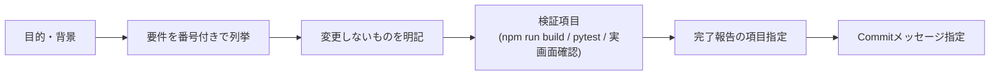

# 09. AIコーディング向け開発ガイド

AIエージェント（Claude Code / Codex 等）がこのリポジトリで安全・正確に開発するためのガイド。すべて本リポジトリの事実に基づく。

## プロジェクト概要（1分版）

- ローカルOCR学習環境。FastAPI（`src/app/`、port 8000）+ React/Vite（`frontend/`、port 5173）。
- データは `data/projects/<project_id>/` にプロジェクト単位で分離。ラベルは `annotations/master.csv`。
- OCRエンジン: EasyOCR / PaddleOCR / Tesseract（外部exe）/ 自作分類モデル。学習は別プロセスの非同期ジョブ。

## ディレクトリの役割

| 場所 | 役割 | 詳細 |
|---|---|---|
| `src/app/main.py` | 全APIエンドポイント | `docs/06_API_REFERENCE.md` |
| `src/app/services/` | ドメインロジック | `docs/02_DIRECTORY_STRUCTURE.md` |
| `frontend/src/App.jsx` | 全UI状態・view切替 | 状態は props で各viewへ配布 |
| `frontend/src/lib/` | UI非依存の純関数（テスト対象） | node:test でテスト |
| `config/settings.yaml` | 全設定の起点 | `docs/08_CONFIGURATION.md` |
| `tests/` / `frontend/tests/` | 回帰テスト | pytest / node:test |

## 編集してよい場所

- `src/app/`, `frontend/src/`, `tests/`, `frontend/tests/`, `config/settings.yaml`, `docs/`

## 編集・操作に注意が必要な場所

| 対象 | 理由・ルール |
|---|---|
| `data/projects/` 配下 | ユーザーの実データ（画像・ラベル・モデル）。テストは `temp_projects` フィクスチャで必ず隔離する |
| `annotations/master.csv` | ユーザーが手動編集することがある正解ラベル。コードから勝手に書き換え・大文字化しない |
| 元画像（`raw/`） | 前処理・マスク補正は元画像を変更しない設計（回転APIのみ例外的に直接更新） |
| `external/`, `models/`, `outputs/` | gitignore対象の大容量資産。削除・再生成しない |
| `requirements.txt` | UTF-16エンコード。テキスト処理時は注意（QA記録に既知課題として記載） |
| `.git` | dangling blob を意図的に保持中。`git gc` / `git prune` は実行しない（`docs/13_QA_STATUS.md`） |
| 削除系コード | `safe_rmtree` / models配下検証などの安全ガードを弱めない（過去にCWD誤削除の重大バグ→修正済み。`CHANGELOG.md`） |

## 実装ルール（コードベースの確立パターン）

- エンドポイントは `main.py`、ロジックは `services/`、リクエストスキーマは `schemas.py` に追加する。
- 例外変換: `FileNotFoundError→404`, `ValueError→400`。未捕捉例外はミドルウェアがJSON 500化する。
- 前処理に工程を足す場合: `services/preprocess.py` の `_op_*` 関数 + `OPERATIONS` 登録 + `settings.yaml` の `pipelines` へ挿入、の3点セット。
- フロントの新規設定は localStorage キー `ocr_<用途>_v1`（プロジェクト別なら `_by_project_` + `readProjectScopedStorage`/`writeProjectScopedStorage`）。
- 純粋ロジックは `frontend/src/lib/` に切り出し、`frontend/tests/*.test.mjs`（node:test、依存追加不要）でテストする。
- OCR前処理と YOLO検出前処理（`detection_preprocess.py`）は混ぜない。
- 補助機能（候補辞書・手動マスク等）を OCRエンジンの学習・推論内部へ注入しない。

## コーディング規約

`docs/05_CODING_CONVENTIONS.md` を参照。要点:

- コメント・docstring・UIテキストは日本語。コミットメッセージは `<type>: <英語要約>` + 日本語本文。
- Python は snake_case + 型ヒント、React は関数コンポーネント + hooks のみ（Redux/Context不使用）。
- 新しい依存パッケージの追加は既存構成（依存最小主義）から逸脱するため、必要性の説明が先。

## テスト方法

```bash
python -m pytest -q            # バックエンド全件
cd frontend && npm test        # フロント純関数
```

- バックエンドテストは `temp_projects` フィクスチャ（`tests/conftest.py`）で実プロジェクトから隔離する。
- 外部ツール（Tesseract等）必須のテストは `skipif` でスキップされる設計に合わせる。

## コミット前チェックリスト

1. `cd frontend && npm run build` が成功する
2. `python -m pytest -q` が全件パスする
3. `cd frontend && npm test` が全件パスする
4. `data/` / `models/` / `outputs/` / `task.md` を誤ってstageしていない（gitignore済みだが確認）
5. コミットメッセージが既存形式（`feat:`/`fix:`/`ui:`/`refactor:` + 日本語本文）に沿っている

## Pull Request時の確認事項

- CI は未整備（`.github/` は空）のため、上記のビルド・テスト結果をPR本文へ記載する。
- 破壊的変更（削除系・パス操作）は安全ガードのテスト（`test_delete_model_safety.py`, `test_output_dir_safety.py`）を必ず実行する。
- 既存挙動を変える場合は `CHANGELOG.md` の形式（Added/Changed/Fixed）に追記する。

## 重要な設計思想（コード・docsから確認できるもの）

- **プロジェクト分離**: すべてのデータ・設定・モデルは project_id 単位。切替時の混在防止（レスポンス競合ガード）が徹底されている。
- **charset仕様**: 学習対象文字 `A-Z0-9klt` / 推論whitelist / 評価whitelist は**別概念**（`docs/12_TESSERACT_CHARSET_SPEC.md`）。評価はcase-sensitive完全一致。GTは勝手に大文字化しない。
- **既存動作を壊さない**: 新設定は「未設定=従来動作」のデフォルトを持つ（例: include_lowercase未指定=true）。
- **元データ不変**: 前処理・マスク・辞書は表示/推論用の派生であり、元画像・元ファイルを変更しない。

## AIへ実装依頼するときの推奨プロンプト

このリポジトリで実績のあるタスク指示（task.md）の構成に基づくテンプレート集。
共通の型: **目的 → 対象画面/API → 要件（番号付き）→ 変更しないもの → 検証 → 完了報告 → Commitメッセージ**。



### UI変更

```markdown
# UI改善: <画面名>の<改善内容>

<現状の問題点と、誰のどの作業が遅くなっているか>

## 要件
1. <表示・配置・色などを具体値で>（例: 18px / font-weight:700 / 緑）
2. <レイアウト例をアスキーアートで>
## 変更しないもの
- 仮想スクロール・React.memo・サムネイルキャッシュ等の性能実装
- ダークテーマ・既存コンポーネント（Button/Card）のデザイン体系
## 検証
- npm run build / npm test / pytest
- <実画面での確認項目>
## 完了報告
1. 変更内容 2. 性能へ影響が無いこと 3. build/テスト結果
# Commit
ui: <英語要約>
```

### API追加

```markdown
# 機能追加: <機能名>

## 要件
1. エンドポイント: <METHOD> /<path>（既存の命名に合わせる）
2. リクエスト: schemas.py に Pydantic モデルを追加（Field に日本語 description）
3. 後方互換: 追加パラメータは「未指定=従来動作」の既定値を持つこと
4. エラー: FileNotFoundError→404 / ValueError→400 の既存変換パターンに従う
## 変更しないもの
- 既存エンドポイントの挙動・レスポンス形式
## 検証
- pytest（tests/ にテスト追加。temp_projects フィクスチャで隔離）
- docs/06_API_REFERENCE.md の更新
# Commit
feat: <英語要約>
```

### OCR改善

```markdown
# 機能追加: <OCR改善内容>

## 対象エンジン
<EasyOCR / PaddleOCR / Tesseract のどれか。Tesseractのcharset仕様は docs/12 参照>
## 要件
1. <改善内容。エンジン側で対応可能か実装前に調査し、不可なら代替方式を報告>
2. 共通処理は services/ の独立関数へ分離（例: latin_case.py 方式）
3. 日本語等の非対象言語へ影響させない
## 変更しないもの
- OCRエンジン本体・モデル・正解ラベル・学習処理
## 検証
- pytest + 実画像での推論比較（GT付き画像でON/OFF両方の実測値を報告）
# Commit
feat: <英語要約>
```

### モデル追加

```markdown
# 機能追加: <モデル種別>の対応

## 要件
1. モデルメタの形式: 既存（*.pt / *.ocr.json / *.tess.json）に倣い models/ 配下へ保存
2. model_registry.py へ一覧・解決・削除を追加（削除は models 配下限定の安全検証必須）
3. 学習ジョブは training_jobs テーブル（training_family / engine 列）へ upsert
4. 推論は predict.py の engine 分岐へ追加
## 変更しないもの
- 既存モデルの読込互換・削除系の安全ガード
## 検証
- pytest（test_delete_model_safety.py 相当の安全テストを追加）
# Commit
feat: <英語要約>
```

### 前処理追加

```markdown
# 機能追加: 前処理「<工程名>」

## 要件
1. services/preprocess.py に _op_<name> を実装し OPERATIONS へ登録
2. settings.yaml の operations に既定パラメータ（既存プロジェクトへ影響しないよう enabled: false）
3. settings.yaml の pipelines（single / wide）の適切な位置へ挿入
4. フロント: DEFAULT_PREPROCESS_PARAMS・buildPreprocessOverrides・PreprocessPanel のセクション追加
5. LabelingView の前処理サマリへ表示行を追加
## 変更しないもの
- 既存工程のアルゴリズム・元画像
## 検証
- pytest（OFF時に従来出力と完全一致する回帰テスト必須）+ 実画像でのOCR前後比較
# Commit
feat: <英語要約>
```

### パフォーマンス改善

```markdown
# 性能改善: <対象>が<件数・状況>で遅い

## 調査
- 実測から始める（<N>件の一時データを作成し、API応答時間・描画を数値で記録。終了後に削除）
- ボトルネック特定before/afterを数値で報告
## 要件
1. <目標値>（例: 1000枚で一覧表示1秒以内）
2. 既存機能の見た目・操作は変えない
## 変更しないもの
- API互換・データ形式
## 検証
- 実測値のbefore/after、既存テスト全件パス
# Commit
perf: <英語要約>
```

### テンプレート共通の注意

- 疑問点がある場合の指示を入れる（例:「疑問点は実装前に聞いてください」→ AIが選択肢を提示して確認する）
- 破壊的操作を含む場合は「勝手に確定せずユーザー確認後に実行」を明記する
- 完了報告の項目を番号付きで指定すると、検証漏れが減る（本リポジトリのtask.md実績より）
