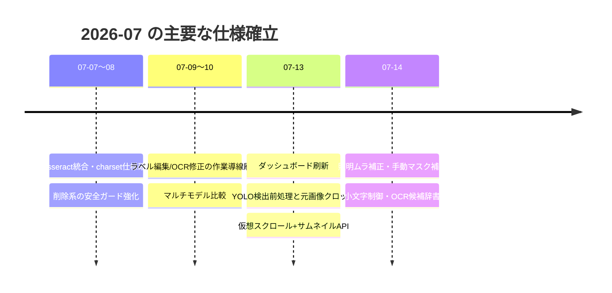

# AI仕様変更履歴

Gitコミットログではなく、**「なぜ現在の仕様になっているか」**をAIエージェント向けに整理した履歴。
根拠は各コミット（ハッシュ併記）・`CHANGELOG.md`・`docs/13_QA_STATUS.md`。

---

## 2026-07

### YOLO検出前処理追加（4b1a212）

**概要**
学習画像作成のYOLO検出の直前にのみ適用する前処理（回転・クロップ・リサイズ・明るさ等）を追加。`src/app/services/detection_preprocess.py` として **OCR前処理（`preprocess.py`）から完全に独立**したモジュールで実装。

**変更理由**
検出対象（チューブ全体の写真）とOCR対象（切り出した文字列画像）では前処理の要件が異なるため。OCR前処理（二値化等）を検出に流用すると検出精度が落ち、逆に検出用の調整をOCR側へ混ぜると学習入力が変わってしまう。

**注意事項**
設定の保存も別（localStorage `ocr_detection_preprocess_by_project_v1`）。**両者の設定・保存・処理系を共有してはならない。**

**影響範囲**
`/image-builder/*` API、TrainingImageBuilderView、`detection_preprocess.py`、`tests/test_detection_bbox_inversion.py`

---

### 学習画像は元画像から切り出す仕様（a150ce4）

**概要**
Step4のクロップ出力は、検出前処理後の画像ではなく**元画像**から切り出す。検出時のBBox座標は `invert_detection_bbox`（リサイズ逆変換→クロップオフセット復元→回転逆変換→クランプ）で元画像座標へ逆変換する。

**変更理由**
検出前処理（縮小・明るさ変更等）を経た画像を学習画像として保存すると、解像度・色情報が劣化した画像で学習することになるため。検出前処理はあくまで「検出のための一時加工」に限定した。

**注意事項**
座標の丸め誤差を防ぐため、適用側と逆変換側は同一の `detection_preprocess_geometry` を共有している。逆変換に失敗するBBoxは `skipped_invalid_bbox` として報告しスキップする。

**影響範囲**
`training_image_builder.py`（`export_selected_crops`）、`detection_preprocess.py`

---

### Bounding Box Undo / Redo・Tab移動（5739c54）

**概要**
Step3のBBox編集に Undo/Redo と、Tabキーによる次BBoxへのフォーカス移動を追加。

**変更理由**
BBoxの誤削除・誤移動からの復帰手段がなく、大量のBBoxを1つずつマウス選択する操作が非効率だったため。キーボード中心の高速編集を可能にした。

**注意事項**
Undo/Redo はBBox編集操作を対象とした画面内履歴（ブラウザのUndoとは独立）。

**影響範囲**
TrainingImageBuilderView（Step3）

---

### Bounding Box編集仕様変更: 選択と有効/無効の分離（63e8637、d5c7936）

**概要**
Step3で「BBoxの選択（編集対象にする）」と「有効/無効（出力対象にするか）」を分離。**有効/無効の切替は一覧右端のチェックボックスのみ**で行い、画像クリックでは変更しない。画像上のCtrl+スクロール拡大縮小はカーソルが画像上にある場合のみ動作（d5c7936）。

**変更理由**
画像クリックで有効/無効がトグルされる旧仕様では、編集のためにクリックしただけで出力対象が意図せず変わる誤操作が発生したため。「Step3は編集画面」という位置づけを明確化し、移動・サイズ変更・追加・削除は編集モードON時のみ許可する。

**注意事項**
この操作体系（クリック=選択、チェックボックス=有効/無効）を崩す変更は禁止。

**影響範囲**
TrainingImageBuilderView(Step3)

---

### OCR候補辞書（ec3ada8 → e3ed703 で配置変更）

**概要**
ユーザーが用意した1行1候補のテキストファイル（正解候補一覧）から、OCR結果に近い文字列を上位3件（設定可）提示しクリック採用できる機能。混同文字（O↔0, B↔8等=コスト0.4）・大小文字差（0.2）を軽くした重み付きLevenshtein距離＋末尾suffix（kt/lt等）加点で順位付け。

**変更理由**
OCR結果が完全一致しない場合の手入力を減らすため。辞書は学習・推論内部へは注入せず「推論後の補助表示」に限定（OCRエンジンの挙動を変えないため）。localStorageへプロジェクト別保存とし、ブラウザではローカルファイルパスを永続参照できない制約に対応した。
当初は前処理設定画面に配置したが、**ラベル編集時に使う機能なのに別画面へ移動して最下部までスクロールする導線が悪い**ため、ラベル編集画面右サイドバーへ移設した（e3ed703）。

**注意事項**
純関数として `frontend/src/lib/candidateDictionary.js` に実装（将来のバッチ推論流用を想定）。設定UIは2箇所に置かない（設定元はラベル編集のみ）。

**影響範囲**
LabelingView、`lib/candidateDictionary.js`、`frontend/tests/candidateDictionary.test.mjs`

---

### OCR小文字制御（51fdfcd）

**概要**
EasyOCR/PaddleOCRの推論に「小文字を出力に含める」設定（`include_lowercase`、既定ON）を追加。EasyOCRは `readtext(allowlist=...)` でエンジン側制限、PaddleOCR 3.5 は**実行時whitelistが存在しない**ため出力後の英字大文字化（削除ではなく変換、長さ維持）で実現。

**変更理由**
同じ外国語モデルでも案件により「大文字英数字のみ（CHYB12）」と「小文字混在（CHYBkt）」の両方が必要なため。ラテン文字言語のみ適用し、日本語等には英数字allowlistを適用しない（誤った制限を防ぐ）。従来はvalidation層が常に大文字化していたため、ON時は検証も大小文字保持（`text_case="keep"`）へ拡張した。

**注意事項**
Tesseractは既存charset/whitelist仕様の対象外。API未指定時は `true`（後方互換）。

**影響範囲**
`predict.py`、`services/latin_case.py`、`services/ocr_pipeline.py`（validate_ocr_result）、全推論API、前処理設定/ラベル編集/推論/OCR修正/バッチ推論の各画面、`tests/test_lowercase_control.py`

---

### 仮想スクロール（56e6997）

**概要**
画像取込み画面の一覧/カード表示を `@tanstack/react-virtual` で仮想化し、`GET /images` にページング（offset/limit/検索/未ラベルフィルタ）を追加。

**変更理由**
1000枚超の画像でDOMが数千ノードになり一覧がフリーズ気味だったため。表示範囲のみレンダリングして初期表示と切替を高速化した（1000枚プロジェクトで一覧API 72msを実測記録）。

**注意事項**
仮想スクロール・React.memo・Lazy Load は性能の前提。見た目変更時もこれらの仕組みを変更しないこと（82226b8 のカードUI改善もこの制約下で実施）。

**影響範囲**
ImagesView、`GET /images`

---

### サムネイルAPI（56e6997 → 80ca9e4 で修正）

**概要**
`GET /images/{name}/thumbnail` を追加。元画像のmtimeをキーにしたディスクキャッシュで縮小画像（数百バイト〜）を返す。フロントは `` の直接参照。

**変更理由**
一覧でフル解像度画像を読むと帯域・デコード負荷が大きいため。初回29ms/キャッシュ後21ms・784B程度を実測。
当初フロントに自前の同時リクエスト制限（セマフォ）を実装したが、**React StrictModeの二重マウントでスロットが解放されず全サムネイルが0件になる障害**が発生。自前制御を廃止し、ブラウザの接続管理に任せる方式へ変更した（80ca9e4）。これが現在「直接 img src + lazy」の理由。

**注意事項**
回転時は対象画像のみ `imageVersions[name]` でキャッシュキーを進める（全件再取得しない）。フロント側に同時リクエスト制御を再実装しないこと。

**影響範囲**
`main.py`（thumbnailエンドポイント）、ImagesView、`tests/test_thumbnail_api.py`

---

### 手動マスク補正（2f15b09 → e86d5b7 で操作改善）

**概要**
OCR前処理に、画像上の不要な黒塊・影を矩形ドラッグまたは黒領域ポイントクリック（scipy 8近傍連結成分）で指定し、白/周辺背景色で塗りつぶす機能。マスクは画像単位で `annotations/manual_masks.json` にサーバー保存（矩形=正規化座標、領域=行RLE）。

**変更理由**
照明ムラ補正後も残る局所的な黒ブロックが誤認識の原因になるため。**影の位置は画像ごとに異なる**ためプロジェクト共通ではなく画像単位保存とし、正規化座標でリサイズ・表示倍率に依存しない設計にした。文字誤削除を防ぐため、候補は必ずプレビュー＋明示確定（自動確定しない）、25%超は警告。
既定方式は当初「矩形」だったが、実運用では黒塊クリックの方が速いため「黒領域ポイント指定」を既定に変更し、Enter確定/Esc取消を追加した（e86d5b7）。

**注意事項**
元画像は変更しない。適用タイミングは二値化前/後を選択（白埋め=後、背景色埋め=前が推奨ペア）。マスクは学習へ注入しない。

**影響範囲**
`services/manual_mask.py`、`services/preprocess.py`（manual_mask_pre/post工程）、`settings.yaml` pipelines、PreprocessView/ManualMaskEditor、`tests/test_manual_mask.py`

---

### 照明ムラ補正（194c094）

**概要**
前処理のグレースケール直後に照明ムラ補正工程（`illumination`）を追加。方式は Gaussian背景補正 / Rolling Ball（形態学近似）/ Retinex の3種、背景サイズ・強度（元画像ブレンド）を調整可能。

**変更理由**
チューブ端の影・照明の偏りが二値化後に黒帯として残り、先頭ゴースト文字（例: `ASRJVZE`→実際は`SRJVLt`）の原因になっていたため。実画像比較で Gaussian が最も安定して影を除去できたことを確認して採用。cv2依存を増やさないため scipy ベースで実装。

**注意事項**
既存プロジェクトへ影響しないよう既定OFF。

**影響範囲**
`services/preprocess.py`、`settings.yaml`、PreprocessPanel、LabelingViewの前処理サマリ、`tests/test_illumination_correction.py`

---

### ダッシュボード刷新（f9d1882 → c76d233 → 97046b0）

**概要**
ダッシュボードを「プロジェクトランチャー」として再設計。プロジェクトのプレビュー画像・件数などのメトリクス表示（`_build_project_summary` が image_stage / updated_at 等を返す）と、続きから作業するためのクイックアクションを追加。

**変更理由**
複数プロジェクト運用時に「どのプロジェクトがどこまで進んでいるか」を開かずに判断できず、毎回プロジェクトを開いて確認する手間があったため。

**影響範囲**
DashboardView、`GET /projects`（summaries）

---

### OCR修正画面改善（7a4f051、7ef6e39 ほか）

**概要**
OCR修正（RapidOCR）画面をレビューフロー向けに再構成。中央=元画像→OCR候補→修正入力→文字別ヒートマップ→操作ボタンの縦動線、右=OCR情報（表示専用）+折り畳み推論設定、左=状態フィルタ付き画像一覧。キーボード中心（Enter確定/Shift+Enter保留/Ctrl+←→移動）。

**変更理由**
大量画像のOCR結果を「見て・直して・次へ」を最短で回すため。設定変更は例外的な操作なので折り畳みへ退避し、修正入力とヒートマップを常時見える位置に固定した。Tesseract選択時は大小文字を区別して扱う（`keepCase`。筆記体 k/l/t の修正・保存を可能にするため）。

**注意事項**
推論結果は画像×設定のキャッシュで再利用（同一画像の再推論を避ける）。修正確定は `POST /api/ocr/log/save` でログ保存され、OCRデータセット再生成（from_logs）の入力になる。

**影響範囲**
RapidOCRView、`/api/ocr/log/*`

---

### Tesseract Confidence の取得不能= null 扱い（fix: correct Tesseract confidence extraction and display）

**概要**
Tesseract の Confidence を「内部値 0.0〜1.0 / 取得不能= null / UI表示 `--`」へ統一。TSV解析（`parse_tsv_words`）と集約（`aggregate_word_confidences`、複数wordは文字数加重平均）を関数分離し、predict・評価・全画面へ null を伝播。

**変更理由**
ラベル編集のOCR候補で Tesseract だけ常に 0.0% になる不具合の修正。端から端まで実測した結果、抽出・変換・表示は正しく、**Tesseract 5.3.3 の LSTM が `tessedit_char_whitelist` 指定時に信頼度を計算せず生TSVの時点で conf=0.000000 を返す**ことが根本原因だった（whitelist無しでは 60.9 等の実値。TSV/hOCR・PSM・OEM・lstm_choice_mode を変えても同様）。本アプリのTesseract推論は常にwhitelistを使うため、この「偽の0」を本当の0%と区別して取得不能（null）として扱う。whitelist未指定時の conf=0 は実測値として 0.0 のまま保持する。

**注意事項**
数値を人工補正しない（最低50%化・倍率調整等は禁止）。whitelist無しで再推論した信頼度を元の認識結果へ混ぜない（設定不一致のため）。フロントの `confidence || 0` パターンは null を 0% に偽装するため禁止（`formatConfidencePercent` を使用）。

**影響範囲**
`tesseract_pipeline.py`（recognize_line の戻り値が `Optional[float]` に）、`predict.py`、`ocr_evaluation.py`、`lib/confidence.js`（新設）、LabelingView / RapidOCRView / InferenceView / OcrBatchView の表示、`tests/test_tesseract_confidence.py`

---

### OCR学習UIのジョブ状態連動と二重起動防止（fix: align OCR training UI with actual job state）

**概要**
学習画面をジョブ実態と一致させた。UI状態を7状態（idle/preparing/training/stopping/completed/failed/cancelled、日本語表示）へ整理し、主ボタンを状態連動化。実行中は設定をfieldsetで編集ロック。バックエンドは同一プロジェクトのアクティブジョブ存在時に開始APIを **409** で拒否し、`GET /api/ocr/train/active` で再読込時に実行中ジョブへ再接続する。ログは「サマリー＋重要イベント＋折り畳み詳細ログ（ターミナル形式）」へ再構成。

**変更理由**
学習実行中（lstmtraining起動済み）でも「次アクション: OCR学習開始」が有効表示され、二重起動の危険と現在状態の判断不能があったため。根本原因は「次アクション」ボタンが `ocrNextAction = dataset準備の有無` のみで決まりジョブ状態を見ていなかったこと。また生ログのカード表示は学習状況の把握に機能していなかった。進捗・ETAはTesseractの `At iteration a/b/c`（bが累積学習iteration）とログ時刻から算出し、根拠がない段階では表示しない（0%やダミーETAの偽装禁止）。

**注意事項**
バックエンドのジョブ状態値（queued/running/completed/failed/stopped）とDBスキーマは不変。runningでもiterationログ出現までは「学習準備中」と表示する。`stopping` はフロント側の停止要求中フラグで表現（バックエンドの中間状態は追加していない）。学習アルゴリズム・停止処理は無変更。
（同日修正: 旧変数 `statusText` の参照が左カード上部に1箇所残り `ReferenceError` で画面全体が消える不具合が発生。状態ラベルは `UI_TRAINING_STATE_LABELS` を唯一のソースとする `statusLabel` へ統一し、未知状態は「状態不明」表示＋console警告（idleへ偽装しない）。再発防止としてvite `ssrLoadModule` によるTrainingViewの状態別レンダリングテストと、画面単位のError Boundary（`ViewErrorBoundary`、1画面の例外でアプリ全体を消さない）を追加。）
（同日レイアウト再設計: 画面全体の横スクロール発生・左カラム潰れ・右カラムの巨大空白・重要イベントが読めない問題を修正。35%/65%カラム（1400px未満は縦積み）＋各カラム `min-w-0`＋ページ縦スクロールのみへ変更。左は「実行概要（日本語2列）→実行時設定（ジョブスナップショット・読み取り専用）→▶次回学習の設定（折り畳み）→実行操作」へ再構成し、完了ジョブ閲覧中に過去ジョブのログと現在の編集設定が混同されないよう分離。重要イベントは `summarizeEventText` で短い日本語種別＋詳細行の縦型タイムラインへ整形（生ログ・パスは詳細ログのみ）。進捗バーは状態色（完了=緑）。左右の状態重複表示は右サマリーへ集約。）
（同日高さ配分修正: ページ縦スクロール方式ではログ追加のたびに画面が揺れ、左設定が下へ伸び続けるため、デスクトップは表示領域高さへ固定し内部スクロールへ変更。スクロール対象は「次回学習の設定」「重要イベント」「詳細ログ」の3箇所のみで、実行操作はFlex末尾固定（position:fixed不使用）。詳細ログ開時は右ペイン内で高さ分割（約45%）し右カード全体を伸ばさない。重要イベントは最下部付近を見ている時のみ自動追従（過去ログ閲覧中は動かさない）。`tabular-nums`・`scrollbar-gutter: stable`・1行省略で数値/ログ更新による画面揺れを防止。開閉状態はReact stateで保持しポーリングで失われない。縦積み時はページ縦スクロールを許可。）
（同日ビューポート内封じ込め修正: 上記の初回実装で使った `calc(100vh - 175px)` の固定px差し引きは、タイトル行・ワークフロー・余白・倍率などで実際の差分が変わり実画面で高さが合わなかったため**廃止**。App の `main` をOCR学習画面表示中のみ `h-dvh` + flex-col + overflow-hidden とし、「タイトル行/ワークフロー=shrink-0 → section=flex-1 min-h-0 → 学習グリッド=flex-1 + `grid-rows-[minmax(0,1fr)]` → 左右カード=min-h-0+overflow-hidden」の**親Flex残り高さ継承**へ変更（html/body/#root は height:100% 済み）。また「次回学習の設定」「詳細ログ」の折り畳みは `
` をFlexコンテナ化していたが、ChromiumはdetailsのコンテンツをUAシャドウのスロットへ包むため本文へ高さが伝わらず内部スクロールが効かなかった——これが「設定内部がスクロールできない」根本原因。React state制御のアコーディオン（button＋Flex本文＋`hidden`切替。閉時も本文はマウント維持しスクロール位置・入力状態を保持）へ置換。内部スクロール3領域へ `overscroll-behavior: contain` を追加しホイールのページ伝播を防止。2カラム切替は1400px→**xl(1280px)** へ引き下げ（1366×768でも2カラム＋ページスクロールなしを保証。縦積みは幅不足時のみで高さ不足では発生しない）。低い画面で次回学習設定の高さを確保するため、実行時設定を折り畳み（初期閉・1行サマリー）、学習方式の固定表示は実行概要と重複するため切替可能なallモードのみ表示、作成済みデータ情報は1行省略表示へ短縮（情報自体は削除しない）。ヘッドレスブラウザ実測で 1920×1080 / 1366×768 とも documentElement.scrollHeight == clientHeight（ページスクロールなし）と各内部領域の scrollHeight > clientHeight（スクロール可）を確認済み。）
（同日導線改善: 旧構成「共通設定→1. データ準備」では、OCRタイプ（データ準備内）の変更で最大イテレーション（共通設定内）の名称・説明・扱いが変わるのに設定順が逆で、変更後に画面上部へ戻る必要があった。セクションを「学習設定（OCRタイプ/学習データ作成方法/演算デバイス）→プロジェクト設定（旧・共通設定）→データ準備（再学習オプション。新規作成時は説明文のみ）→エンジン固有設定」へ再編し、依存関係が上から下へ流れる導線にした。「共通設定」は内容が曖昧なため「プロジェクト設定」へ改名。セクション番号（1.〜のみ付番されていた不揃い）は分類ブランチ含め全廃し見出しのみとした。高さ制御・Flex構造・内部スクロール・状態管理は無変更。）

**影響範囲**
`main.py`（409ガード・activeエンドポイント）、`db.py`（`fetch_active_training_job`）、TrainingView、App.jsx（jobInfo/再接続/開始ロック）、`lib/trainingLog.js`、`tests/test_training_guard.py`、`frontend/tests/trainingLog.test.mjs`

---

### そのほか同月に確立した仕様

| 仕様 | 理由 | コミット |
|---|---|---|
| CORS許可を明示オリジン化＋未処理例外のJSON 500化 | `allow_origins=["*"]`+credentialsの無効な組合せを排除。500応答にCORSヘッダが付かずブラウザで原因が見えない問題を解消 | 106af9d |
| プロジェクト切替時の画像一覧混在防止 | 切替直後の1フレームで旧一覧+新プロジェクトIDのURLが生成され404が多発したため、一覧に所有プロジェクトIDタグを付与し不一致時は描画しない | fd8b2b3, 7156c7d |
| 「保存して次へ」は1件だけ進む | 保存処理と画面側の両方が前進して2件飛ぶ不具合。次画像は保存前に画像名で確定する方式Aへ集約（未編集フィルタでも飛ばさない） | a1d25ad |
| 回転操作は90°/180°の2ボタン | 任意角度指定より2アクションの方が実運用（上下逆・横向き）に速い | 9246152 |
| charset仕様の確定（`A-Z0-9klt`） | 学習対象文字/推論whitelist/評価whitelistを別概念として分離。評価はcase-sensitive完全一致 | `docs/12_TESSERACT_CHARSET_SPEC.md`, CHANGELOG |
| 削除系の安全ガード | モデルメタの空パスがCWD再帰削除に化ける重大バグの修正以降、`safe_rmtree`/models配下検証/allowed_rootsの多重ガードを維持 | ea4daf6, 2c438ca, CHANGELOG |
| 画像配信は `Cache-Control: no-cache`（毎回再検証・変更なしは304） | 回転で画像更新後、リロードでURLの `v=` が初期値へ戻ると、`max-age` やヒューリスティックキャッシュが古い向きの画像を再検証なしで表示する実害があったため（792.png で発生）。`max-age` へ戻さないこと | `main.py` の /file・/interim・/processed・/thumbnail |
