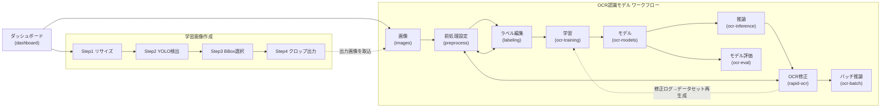

# 16. 画面仕様書

各画面の目的・表示内容・主操作・ショートカット・関連画面。根拠は `frontend/src/App.jsx`（viewMeta / view切替）と各 `views/*.jsx` の実装。

## 画面マップ

- 画面遷移はルーティングなし（`App.jsx` の `activeView` state）。サイドバー・ワークフロー工程ナビ・画面内ボタンで切替。
- 実験機能（`cls-training` / `cls-models` / `cls-inference` / `cls-evaluation`）は分割学習（分類モデル）系で、「開発中」バナーが表示される。

---

## ダッシュボード（dashboard / DashboardView）

**目的**
プロジェクトの選択・作成・削除と、各プロジェクトの進捗把握（プロジェクトランチャー）。

**表示内容**
- プロジェクト一覧（プレビュー画像・画像数・ラベル進捗・工程ステージ・更新日時 — `GET /projects` の summaries）
- ワークフロー進捗と「続きから作業」クイックアクション

**主操作**
- プロジェクト作成 / 選択 / 削除
- 各工程画面への直接遷移

**ショートカット**
なし

**関連画面**
すべて（起点画面）

---

## 画像（images / ImagesView）

**目的**
外部フォルダからの画像取り込みと、1000枚超を想定した一覧確認・回転・ラベル確認。

**表示内容**
- 取り込みフォーム（フォルダパス / Browse / 取り込み / 更新）
- 一覧（テーブル）とカードの2表示（仮想スクロール、検索、未ラベルのみフィルタ）
- カード: サムネイル・ラベルバッジ（緑）・ファイル名・サイズ・🟢/🟡ラベル済みバッジ

**主操作**
- 取り込み（取込時に前処理を自動実行）
- ↻90° / ↺180° 回転（対象画像のみ再前処理・サムネイル再取得）
- カードホバーから「ラベル編集を開く」

**ショートカット**
なし（検索は300msデバウンス）

**関連画面**
ラベル編集、前処理設定

---

## 前処理設定（preprocess / PreprocessView）

**目的**
OCR前処理パラメータの調整とリアルタイムプレビュー（300msデバウンス）、推論結果の確認。

**表示内容**
- 左: 画像一覧 / 中央: 元画像（手動マスクエディタ兼用）・中間画像・最終画像・推論結果（最大3モデル比較）
- 右: 前処理パラメータパネル（基本設定 / 二値化 / 手動マスク補正 / 鮮明化・補正（照明ムラ補正含む）/ ノイズ除去 / その他 / プリセット）と推論設定（エンジン・モデル・言語・小文字設定・比較スロット）

**主操作**
- パラメータ調整（プロジェクト別にlocalStorage保存）・プリセット保存/読込/リセット
- 手動マスク: 黒領域ポイント指定（既定）/ 矩形ドラッグ → 候補を確定
- 比較モデル追加（最大3）

**ショートカット**
- Enter: マスク候補を確定 / Esc: 候補取消（フォーム部品フォーカス中は無効）
- Ctrl+Z / Ctrl+Y: マスク操作のUndo/Redo

**関連画面**
ラベル編集・OCR修正（「〜へ戻る」ボタンで往復）

---

## ラベル編集（labeling / LabelingView）

**目的**
OCR結果を確認し、正解ラベル（`master.csv`）を作成する。

**表示内容**
- 左: 画像一覧（一覧/カード、未編集のみフィルタ）
- 中央: 元画像・中間画像・最終画像（3段プレビュー）、OCR候補（最大3モデル・差分黄色表示・常時3行）、辞書からの近似候補（差分は蛍光緑 `#adff5d` で強調表示）、ラベル入力（**最終画像の実描画幅**に追従して中央配置＝object-contain縮尺をResizeObserverで再計算・倍率変更/リサイズにも追従・最低幅320px/最大親幅、min-height 72px・明背景 `#f4f5f7`×濃文字 `#111827`。**入力済み: 38px太字・等幅** / **未入力: プレースホルダー「ラベル文字列を入力」を入力欄幅に応じて16〜28pxへ縮小**（`:placeholder-shown`＋CSS変数、薄グレー・やや細字））、⌨ ソフトキーボード（折り畳み）
- 見出し行右の「≡ 配置: 中央」ボタンで文字位置を 中央→左→右→中央 の順に循環切替（押下時は青発光、Tab/Enter/Spaceで操作可、プロジェクト別保存）。「保存して次へ」は最頻操作のため他ボタンより大きい強調表示
- 右: 現在の前処理設定サマリ（表示専用）+ OCR候補辞書（ファイル選択・設定）

**主操作**
- 保存 / 保存して次へ（1件だけ進む。次画像は保存前に画像名で確定）
- OCR再実行（OCR候補見出し行右の青系セカンダリボタン「↻ OCR再実行」。押下=青発光→実行中=スピナー＋無効化→成功=緑/失敗=赤の短時間発光。優先度は保存して次へ＞OCR再実行＞保存/前へ/次へ）、候補クリック採用、辞書ファイル選択/選び直し/解除（D&D対応）

**ショートカット**
- Enter: 保存して次へ / Ctrl+S: 保存 / Ctrl+← →: 前後の画像
- Esc: 最上位のOCR候補を採用 / Alt+1〜5: 辞書候補を採用
- 入力欄外での英数字キー: ラベルへ直接入力、Backspace: 1文字削除

**関連画面**
前処理設定（推論設定の変更はこちら）、OCR修正

---

## 学習（ocr-training / TrainingView）

**目的**
OCRデータセット作成と学習ジョブの実行・監視（PaddleOCR / Tesseract。実験機能では分類モデル）。

**レイアウト**
- 2カラム 35%/65%（`minmax(420px,35fr)_minmax(0,65fr)`、xl=1280px未満は縦積み。1366×768等の低解像度でも2カラム維持）。**画面全体の横スクロールは禁止**（横スクロールは詳細ログ内のみ）
- デスクトップ（xl=1280px以上）はブラウザ表示領域内へ完全に収め、**ページ縦スクロールを出さない**。高さは固定px差し引き（旧`calc(100vh-175px)`方式は廃止）ではなく**親Flexの残り高さ継承**で決まる: `main`（`h-dvh` + flex-col + overflow-hidden、OCR学習画面表示中のみ）→ タイトル行/ワークフロー=shrink-0 → `section`（flex-1 min-h-0）→ 学習グリッド（flex-1 + `grid-rows-[minmax(0,1fr)]`）→ 左右カード（min-h-0 + overflow-hidden）
- 内部スクロールは「次回学習の設定」本文・「重要イベント」一覧・「詳細ログ」本文（展開時）の3箇所のみ（`overscroll-behavior: contain`でページ側へホイールを伝播させない。`scrollbar-gutter: stable`＋ダークテーマスクロールバーで幅揺れなし）。1280px未満の縦積み時はページ縦スクロール＋各カード自然高さ（内容を切らない）
- 折り畳みは`
`ではなく**React state制御のアコーディオン**（button＋Flex本文）。detailsはChromiumの内部スロット構造によりFlex子として本文へ高さが伝わらず内部スクロールが効かないため使用しない
- 左ペイン: 実行概要/実行時設定（折り畳み・初期閉で1行サマリー表示）/実行操作/作成済みデータ（1行省略表示）=固定（実行操作はFlex末尾で常時表示）、次回学習の設定=残り高さへ伸縮（デスクトップmin-height 160px、開閉してもカード全体の高さ不変・閉時は固定領域が詰まる）。学習方式の固定表示は実行概要「方式」行と重複するため切替可能なallモードのみ
- 右ペイン: サマリー=固定、重要イベント=残り高さへ伸縮（min-height 180px、最下部付近を見ている時のみ自動追従）、詳細ログ=開時に右ペイン高さの約45%を分割（min-height 160px。右カード全体は伸びない）
- 揺れ防止: サマリー数値は `tabular-nums`、長い値（Job ID/checkpoint/データセット等）は1行省略＋Tooltip

**表示内容**
- 左「学習パラメータ」: ①実行概要（方式/状態/学習時間の2列グリッド・日本語統一）②実行時設定（ジョブ開始時スナップショットの読み取り専用表示: OCRタイプ/Base Model/PSM/最大iteration/Charset/データセット）③▶次回学習の設定（折り畳み。共通設定＋データ準備＋エンジン固有設定。**preparing/training/stopping中はfieldsetで編集ロック**。未開始時のみ初期展開）④実行操作（状態連動ボタン＋開始日時）
- 右「学習状況」: 状態バッジ付きサマリー（進捗 current/max・状態色の進捗バー=実行中青/完了緑/失敗赤/停止黄・最新BCER・経過時間・推定残り時間・Job ID・最終checkpoint、指標は最大4列で折り返し）→ **重要イベントの縦型タイムライン**（時刻固定幅＋短い日本語種別＋詳細2〜3行。生ログ全文・長いパスは表示しない。例: 「評価改善 / 最良誤差: 4.069% / 処理時間: 127秒」）→ ▶詳細ログ（初期は閉。ターミナル形式=縦積み時は固定高さ320px・デスクトップは右ペイン分割高さ、等幅12px・1行1ログ・横スクロール・エラー赤/警告黄・自動スクロールON/OFF・最新行へ・コピー・フィルタ すべて/重要のみ/警告・エラー）
- ヘッダー右上のグローバル学習インジケータはアプリ全体のジョブ監視用（他画面からも見える）。カード内の状態バッジは当該ジョブの状態表示で用途が異なる

**状態と主ボタン**（UI状態は idle/preparing/training/stopping/completed/failed/cancelled の7状態。running でも iteration ログ出現までは「学習準備中」）
- 未開始: 「OCR学習を開始」（押下直後にロック）
- 学習準備中/学習中: スピナー付き無効ボタン（開始APIを再送できない。バックエンドも409で二重起動拒否）
- 停止処理中: 全実行操作を無効化
- 完了: 「学習が完了しました」＋[学習結果を確認][推論で試す][同じ設定で再学習（確認ダイアログ）]
- 失敗: 原因概要＋[再実行] / 停止済み: [学習を再実行]
- 「データを再作成」は実行中無効（Tooltip: 学習実行中はデータを再作成できません。）

**主操作**
- データセット作成 / 学習開始 / 学習停止（生成物保持）/ 停止して削除（この実行のcheckpoint・モデル・ログを削除。確認ダイアログあり）

**ショートカット**
なし（2秒ポーリングで状態自動更新。画面再読込・別タブでも `GET /api/ocr/train/active` で実行中ジョブへ自動再接続）

**関連画面**
モデル（完了時の導線）、推論、ラベル編集（データ元）、OCR修正（ログ由来データセット）

---

## モデル（ocr-models / ModelsView）

**目的**
保存済みモデル（.pt / .ocr.json / .tess.json）の管理と推論への適用。

**表示内容**
- モデル一覧（種別・作成日時・学習条件・Alias・評価履歴）
- 最新モデル表示（PaddleOCR / Tesseract 並記）

**主操作**
- Alias設定 / 削除（複数選択可・models配下限定の安全検証）/ ダウンロード / 「推論に使用」/ 評価画面へ

**ショートカット**
なし

**関連画面**
推論、モデル評価、学習

---

## 推論（ocr-inference / InferenceView）

**目的**
アップロード画像1枚の推論と結果確認。

**表示内容**
- エンジン選択（カスタム / EasyOCR / PaddleOCR / Tesseract）・モデル・言語・「小文字を出力に含める」
- 画像プレビュー（90°回転）・推論結果・文字別確信度ヒートマップ（CharHeatmap）

**主操作**
- ファイル選択 → 推論実行（`POST /predict`）

**ショートカット**
なし

**関連画面**
モデル、バッチ推論

---

## OCR修正（rapid-ocr / RapidOCRView）

**目的**
OCR結果をキーボード中心で高速に確認・修正し、修正ログを保存する（学習データ再生成の入力になる）。

**表示内容**
- 左: 状態フィルタ付き画像一覧（未処理/確定/保留/すべて）
- 中央: 元画像 → OCR候補 → 修正入力 → 編集可能ヒートマップ → 操作ボタン
- 右: OCR情報（Engine/Model/Language/小文字/Confidence/前処理/推論時間）+ 折り畳み推論設定

**主操作**
- 確定して次へ / 保留して次へ / 候補採用 / ヒートマップの1文字編集

**ショートカット**
- Enter: 確定して次へ / Shift+Enter: 保留して次へ / Ctrl+S: 確定保存
- Ctrl+← →: 前後の画像 / Esc: 元のOCR結果へ戻す / Backspace（入力欄）: 入力クリア

**関連画面**
前処理設定、学習（ログ由来データセット）

---

## バッチ推論（ocr-batch / OcrBatchView）

**目的**
フォルダ内の複数画像を一括推論し、結果をCSVへ出力する。

**表示内容**
- エンジン/モデル/言語/小文字設定・前処理適用トグル
- ファイル一覧（D&D対応・推論前の向き補正 0/90/180/270）・結果テーブル（prediction/corrected/confidence/valid）

**主操作**
- バッチ実行 / 結果CSVエクスポート（engine/model/language/include_lowercase 列含む）/ クリア

**ショートカット**
なし

**関連画面**
推論、OCR修正

---

## モデル評価（ocr-eval / OcrEvaluationView）

**目的**
学習前（eng.traineddata）と学習後のTesseractモデルを同一データ・同一前処理で比較評価する。

**表示内容**
- 評価用画像フォルダ・正解CSV・whitelist（実運用/なし/カスタム）
- 認識率・増減・改善率・誤認識一覧

**主操作**
- 評価実行（`POST /api/ocr/evaluate`）/ CSVエクスポート

**ショートカット**
なし

**関連画面**
モデル、学習

---

## 学習画像作成 Step1〜4（image-builder-step1〜4 / TrainingImageBuilderView）

**目的**
大きな写真からYOLOで文字列領域を検出し、学習用のクロップ画像を作成する。

**表示内容 / 主操作（ステップ別）**

| Step | 内容 |
|---|---|
| Step1 | 画像指定とリサイズ設定（長辺/幅/高さ基準）、検出前処理（YOLO専用）の設定・プレビュー |
| Step2 | YOLO検出（モデル選択・信頼度しきい値・重複マージ） |
| Step3 | **BBox編集画面**: 編集モードON時のみ移動・サイズ変更・追加・削除。有効/無効は一覧右端チェックボックスのみ。一括削除・日本語ラベル表示 |
| Step4 | クロップ出力（**元画像から切り出し**・出力先/高さ指定） |

**ショートカット（Step3）**
- Tab / Shift+Tab: 次/前のBBoxへ移動（編集モードON時・表示中のみ・循環）
- Ctrl+Z / Ctrl+Y: Undo / Redo
- Ctrl+スクロール: 画像の拡大縮小（カーソルが画像上にある場合のみ）

**関連画面**
画像（出力画像の取込先）

---

## 実験機能（cls-training / cls-models / cls-inference / cls-evaluation）

**目的**
分割学習（1文字分類モデル）系の学習・管理・推論・評価。全画面に「開発中」バナー（ExperimentalNotice）を表示。

**表示内容 / 主操作**
OCR系の同名画面と同構成（TrainingView / ModelsView / InferenceView / EvaluationView を trainingMode で切替共用）。

**関連画面**
OCR認識モデル系の各画面
