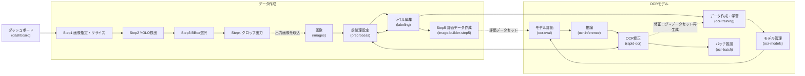

# 16. 画面仕様書

各画面の目的・表示内容・主操作・ショートカット・関連画面。根拠は `frontend/src/App.jsx`（viewMeta / view切替）と各 `views/*.jsx` の実装。

## 画面マップ



- 画面遷移はルーティングなし（`App.jsx` の `activeView` state）。サイドバー・ワークフロー工程ナビ・画面内ボタンで切替。

## サイドバー構成（OCR開発フロー順）

サイドバーは機能一覧ではなく**作業工程**を表す（`Sidebar.jsx` の `SIDEBAR_SECTIONS`。上から順に進めるとOCRモデルが完成する構成）。セクションアイコンはHeroicons outlineのSVGインライン（絵文字・追加依存なし）。ヘッダーのホバーで工程説明をツールチップ表示。選択中ページの所属セクションはヘッダー（アイコン・文字色）もアクティブ表示。

```text
📁 プロジェクト（初期展開）        … ダッシュボード
🖼 データ作成（初期展開）          … 画像指定・リサイズ → YOLO検出 → Bounding Box選択 → クロップ出力
                                     → 画像 → 前処理設定 → ラベル編集 → 評価データ作成（フロー順・並び替え禁止）
🤖 OCRモデル（初期展開）           … データ作成・学習 → モデル管理 → モデル評価 → 推論 → OCR修正 → バッチ推論
                                     （学習後はまず評価→性能確認後に推論、の順）
🧪 実験機能（初期折りたたみ・最下部）… 分類モデルの学習/管理/推論/評価
```

- 旧「モデル作成」「学習画像作成」「学習 > OCR認識モデル」は廃止（プロジェクト/データ作成/OCRモデルへ再編。view idは全て不変＝遷移・状態は互換）
- 新機能はカテゴリ名を変えずに各セクションの items へ追加する（例: Data Augmentation・AIアノテーション→データ作成 / ONNX変換・モデル配布→OCRモデル）
- 実験機能（`cls-training` / `cls-models` / `cls-inference` / `cls-evaluation`）は分割学習（分類モデル）系で、「開発中」バナーが表示される。

---

## ダッシュボード（dashboard / DashboardView）

**目的**
プロジェクトの選択・作成・削除と、各プロジェクトの進捗把握（プロジェクトランチャー）。

**表示内容**
- プロジェクト一覧（プレビュー画像・画像数・ラベル進捗・工程ステージ・更新日時 — `GET /projects` の summaries）
- ワークフロー進捗と「続きから作業」クイックアクション

**主操作**
- プロジェクト作成 / 選択 / 削除
- 各工程画面への直接遷移

**ショートカット**
なし

**関連画面**
すべて（起点画面）

---

## 画像（images / ImagesView）

**目的**
外部フォルダからの画像取り込みと、1000枚超を想定した一覧確認・回転・ラベル確認。

**表示内容**
- 取り込みフォーム（フォルダパス / Browse / 取り込み / 更新）
- 一覧（テーブル）とカードの2表示（仮想スクロール、検索、未ラベルのみフィルタ）
- カード: サムネイル・ラベルバッジ（緑）・ファイル名・サイズ・🟢/🟡ラベル済みバッジ

**主操作**
- 取り込み（取込時に前処理を自動実行）
- ↻90° / ↺180° 回転（対象画像のみ再前処理・サムネイル再取得）
- カードホバーから「ラベル編集を開く」

**ショートカット**
なし（検索は300msデバウンス）

**関連画面**
ラベル編集、前処理設定

---

## 前処理設定（preprocess / PreprocessView）

**目的**
OCR前処理パラメータの調整とリアルタイムプレビュー（300msデバウンス）、推論結果の確認。

**表示内容**
- 左: 画像一覧 / 中央: 元画像（手動マスクエディタ兼用）・中間画像・最終画像・推論結果（最大3モデル比較）
- 右: 前処理パラメータパネル（基本設定 / 二値化 / 手動マスク補正 / 鮮明化・補正（照明ムラ補正含む）/ ノイズ除去 / その他 / プリセット）と推論設定（エンジン・モデル・言語・小文字設定・比較スロット）

**主操作**
- パラメータ調整（プロジェクト別にlocalStorage保存）・プリセット保存/読込/リセット
- 手動マスク: 黒領域ポイント指定（既定）/ 矩形ドラッグ → 候補を確定
- 比較モデル追加（最大3）

**ショートカット**
- Enter: マスク候補を確定 / Esc: 候補取消（フォーム部品フォーカス中は無効）
- Ctrl+Z / Ctrl+Y: マスク操作のUndo/Redo

**関連画面**
ラベル編集・OCR修正（「〜へ戻る」ボタンで往復）

---

## ラベル編集（labeling / LabelingView）

**目的**
OCR結果を確認し、正解ラベル（`master.csv`）を作成する。

**表示内容**
- 左: 画像一覧（一覧/カード、未編集のみフィルタ）
- 中央: 元画像・中間画像・最終画像（3段プレビュー）、OCR候補（最大3モデル・差分黄色表示・常時3行）、辞書からの近似候補（差分は蛍光緑 `#adff5d` で強調表示）、ラベル入力（**最終画像の実描画幅**に追従して中央配置＝object-contain縮尺をResizeObserverで再計算・倍率変更/リサイズにも追従・最低幅320px/最大親幅、min-height 72px・明背景 `#f4f5f7`×濃文字 `#111827`。**入力済み: 38px太字・等幅** / **未入力: プレースホルダー「ラベル文字列を入力」を入力欄幅に応じて16〜28pxへ縮小**（`:placeholder-shown`＋CSS変数、薄グレー・やや細字））、⌨ ソフトキーボード（折り畳み）
- 見出し行右の「≡ 配置: 中央」ボタンで文字位置を 中央→左→右→中央 の順に循環切替（押下時は青発光、Tab/Enter/Spaceで操作可、プロジェクト別保存）。「保存して次へ」は最頻操作のため他ボタンより大きい強調表示
- 右: 現在の前処理設定サマリ（表示専用）+ OCR候補辞書（ファイル選択・設定）

**主操作**
- 保存 / 保存して次へ（1件だけ進む。次画像は保存前に画像名で確定）
- OCR再実行（OCR候補見出し行右の青系セカンダリボタン「↻ OCR再実行」。押下=青発光→実行中=スピナー＋無効化→成功=緑/失敗=赤の短時間発光。優先度は保存して次へ＞OCR再実行＞保存/前へ/次へ）、候補クリック採用、辞書ファイル選択/選び直し/解除（D&D対応）

**ショートカット**
- Enter: 保存して次へ / Ctrl+S: 保存 / Ctrl+← →: 前後の画像
- Esc: 最上位のOCR候補を採用 / Alt+1〜5: 辞書候補を採用
- 入力欄外での英数字キー: ラベルへ直接入力、Backspace: 1文字削除

**関連画面**
前処理設定（推論設定の変更はこちら）、OCR修正

---

## 学習（ocr-training / TrainingView）

**目的**
OCRデータセット作成と学習ジョブの実行・監視（PaddleOCR / Tesseract。実験機能では分類モデル）。

**レイアウト**
- 2カラム 35%/65%（`minmax(420px,35fr)_minmax(0,65fr)`、xl=1280px未満は縦積み。1366×768等の低解像度でも2カラム維持）。**画面全体の横スクロールは禁止**（横スクロールは詳細ログ内のみ）
- デスクトップ（xl=1280px以上）はブラウザ表示領域内へ完全に収め、**ページ縦スクロールを出さない**。高さは固定px差し引き（旧`calc(100vh-175px)`方式は廃止）ではなく**親Flexの残り高さ継承**で決まる: `main`（`h-dvh` + flex-col + overflow-hidden、OCR学習画面表示中のみ）→ タイトル行/ワークフロー=shrink-0 → `section`（flex-1 min-h-0）→ 学習グリッド（flex-1 + `grid-rows-[minmax(0,1fr)]`）→ 左右カード（min-h-0 + overflow-hidden）
- 内部スクロールは「次回学習の設定」本文・「重要イベント」一覧・「詳細ログ」本文（展開時）の3箇所のみ（`overscroll-behavior: contain`でページ側へホイールを伝播させない。`scrollbar-gutter: stable`＋ダークテーマスクロールバーで幅揺れなし）。1280px未満の縦積み時はページ縦スクロール＋各カード自然高さ（内容を切らない）
- 折り畳みは`<details>`ではなく**React state制御のアコーディオン**（button＋Flex本文）。detailsはChromiumの内部スロット構造によりFlex子として本文へ高さが伝わらず内部スクロールが効かないため使用しない
- 左ペイン: 実行概要/実行時設定（折り畳み・初期閉で1行サマリー表示）/実行操作/作成済みデータ（1行省略表示）=固定（実行操作はFlex末尾で常時表示）、次回学習の設定=残り高さへ伸縮（デスクトップmin-height 160px、開閉してもカード全体の高さ不変・閉時は固定領域が詰まる）。学習方式の固定表示は実行概要「方式」行と重複するため切替可能なallモードのみ
- 右ペイン: サマリー=固定、重要イベント=残り高さへ伸縮（min-height 180px、最下部付近を見ている時のみ自動追従）、詳細ログ=開時に右ペイン高さの約45%を分割（min-height 160px。右カード全体は伸びない）
- 揺れ防止: サマリー数値は `tabular-nums`、長い値（Job ID/checkpoint/データセット等）は1行省略＋Tooltip

**表示内容**
- 左「学習パラメータ」: ①実行概要（方式/状態/学習時間の2列グリッド・日本語統一）②実行時設定（ジョブ開始時スナップショットの読み取り専用表示: OCRタイプ/Base Model/PSM/最大iteration/Charset/データセット）③▶次回学習の設定（折り畳み。**preparing/training/stopping中はfieldsetで編集ロック**。未開始時のみ初期展開）④実行操作（状態連動ボタン＋開始日時）
- 次回学習の設定内のセクション構成（番号なしの見出しのみ）: **学習設定**（OCRタイプ/学習データ作成方法/演算デバイス。以降の設定の意味・初期値を決めるため最初に配置）→ **プロジェクト設定**（プロジェクト/学習データ/データ分割/最大イテレーション=Tesseract・学習回数=PaddleOCR/出力先。旧称「共通設定」）→ **データ準備**（再学習作成時のオプション。新規作成時は説明文のみ）→ **エンジン固有設定**（選択エンジン別）。OCRタイプ→最大イテレーションの依存が画面上でも上から下へ流れ、OCRタイプ変更後に上へ戻る必要がない導線
- プロジェクト設定の2カラムは**左3:右2**（`grid-cols-[minmax(0,3fr)_minmax(0,2fr)]`。左のデータ分割が3入力横並びのためサイドバー表示時も潰れない幅を確保）。データ分割は0.1単位入力（min 0 / max 1 / step 0.1）で、スピナー操作の浮動小数点誤差は `lib/ratio.js normalizeRatioInput` が小数第1位へ丸めて表示させない。合計1.00の検証は許容誤差つき（`summarizeRatios`）
- 学習回数の既定値: PaddleOCR等=30（Epoch）/ Tesseract=**1500**（最大iteration・Fine-tuning向け）。OCRタイプ切替時に既定値のままの場合のみ相互に切替（ユーザー変更済みの値は上書きしない。charset既定切替と同方式）
- フォームの視認性（共通クラス `.app-input` / `.app-select`＝全画面共通）: 通常=カードより明るい背景（slate-600/60）＋slate-500枠、hover=枠slate-400、focus=**シアン枠＋ring**（cyan-400）、disabled=暗背景・低コントラスト・not-allowed・opacity-70、readOnly=disabledと区別（少し暗い背景だが文字は通常どおり読める・cursor default）。チェックボックスは `accent-color: cyan`、`html { color-scheme: dark }` で数値スピナー・selectドロップダウンをダーク描画
- 演算デバイス等の選択式ボタン: 選択中=色付き強発光（既存）、未選択=明るめ背景（slate-700/70）＋色付き枠の弱発光、無効=暗背景・低コントラスト・発光なし（未選択と混同しない）。Buttonのvariant: primary=アクセント青（主要操作）/ secondary=明るめslate＋枠線（通常操作。入力欄と同化しない）/ danger=赤枠＋暗赤背景（破壊的操作）
- 右「学習状況」: 状態バッジ付きサマリー（進捗 current/max・状態色の進捗バー=実行中青/完了緑/失敗赤/停止黄・最新BCER・経過時間・推定残り時間・Job ID・最終checkpoint、指標は最大4列で折り返し）→ **重要イベントの縦型タイムライン**（時刻固定幅＋短い日本語種別＋詳細2〜3行。生ログ全文・長いパスは表示しない。例: 「評価改善 / 最良誤差: 4.069% / 処理時間: 127秒」）→ ▶詳細ログ（初期は閉。ターミナル形式=縦積み時は固定高さ320px・デスクトップは右ペイン分割高さ、等幅12px・1行1ログ・横スクロール・エラー赤/警告黄・自動スクロールON/OFF・最新行へ・コピー・フィルタ すべて/重要のみ/警告・エラー）
- ヘッダー右上のグローバル学習インジケータはアプリ全体のジョブ監視用（他画面からも見える）。カード内の状態バッジは当該ジョブの状態表示で用途が異なる

**状態と主ボタン**（UI状態は idle/preparing/training/stopping/completed/failed/cancelled の7状態。running でも iteration ログ出現までは「学習準備中」）
- 未開始: 「OCR学習を開始」（押下直後にロック）
- 学習準備中/学習中: スピナー付き無効ボタン（開始APIを再送できない。バックエンドも409で二重起動拒否）
- 停止処理中: 全実行操作を無効化
- 完了: 「学習が完了しました」＋[学習結果を確認][推論で試す][同じ設定で再学習（確認ダイアログ）]
- 失敗: 原因概要＋[再実行] / 停止済み: [学習を再実行]
- 「データを再作成」は実行中無効（Tooltip: 学習実行中はデータを再作成できません。）

**主操作**
- データセット作成 / 学習開始 / 学習停止（生成物保持）/ 停止して削除（この実行のcheckpoint・モデル・ログを削除。確認ダイアログあり）

**ショートカット**
なし（2秒ポーリングで状態自動更新。画面再読込・別タブでも `GET /api/ocr/train/active` で実行中ジョブへ自動再接続）

**関連画面**
モデル（完了時の導線）、推論、ラベル編集（データ元）、OCR修正（ログ由来データセット）

---

## モデル（ocr-models / ModelsView）

**目的**
保存済みモデル（.pt / .ocr.json / .tess.json）の管理と推論への適用。

**表示内容**
- **管理No（M0001形式）**: モデル作成順にOCR Crafter全体で一意採番（削除しても再利用しない。`data/model_ids.json` に永続化）。一覧はモデル名の左・カルテはモデル名の横＋モデル情報欄にチップ表示。チップのホバーで「M0004 → ファイル名」ツールチップ。検索ボックスは管理No/モデル名/表示名の部分一致
- モデル一覧（種別・作成日時・学習条件・Alias・評価情報＝**CER主表示**・正解/総数・完全一致率・評価日時。一覧だけで性能比較できる。CER未記録の旧履歴はAccuracy表示）
- **推奨バッジ6種**（🏆Best CER=最新評価でCER最小 / 🏆Best Char Acc=文字正解率最大 / 🏆Best Accuracy=完全一致率最大 / 🟢Recommended=総合推奨（CER→文字正解率→Accuracy→悪化件数の優先順。Accuracy単独では決めない）/ ⭐Latest Best=最新の評価実行で最良 / 🔵Baseline=eng系ベースモデル。評価履歴から自動判定・手動設定なし）は**モデル比較（モデル詳細情報の展開部）にのみ**表示。**モデル一覧・モデルカルテには表示しない**——一覧は「管理No＋モデル名／Engine／方式／作成日／評価／状態」だけの簡素な表示とし、比較・順位情報（推奨モデル・Best系・指標別結果・総合勝利数）は比較画面へ集約する。状態列の「最新」ラベルは維持
- **レイアウト（右=比較・分析の主領域）**: 1600px以上=左 `minmax(0,1.2fr)` : 右 `minmax(0,1fr)`（右≈45.5%）/ 1366〜1599px=左 `minmax(0,1.05fr)` : 右 `minmax(0,1fr)`（右≈49%）/ 1366px未満=右ペインを下段へ縦積み（固定高を外し自然高。一覧は max-h-60vh で内部スクロール。文字を縮小して押し込まない）。**両列とも minmax(0,…) で固定最低幅を持たず**連続的に収縮＝ページ全体に横スクロールを出さない
- **一覧の列定義（共有定数 `MODEL_LIST_GRID_COLUMNS`）**: ヘッダーと各データ行が同じCSS Grid列定義を共有 `28px minmax(280px,400px) 90px 90px 145px 150px 70px`（選択/モデル名/Engine/方式/作成日/評価/状態）。**モデル名列は最大400pxの上限付き**で余った幅いっぱいまで伸ばさず、モデル名〜Engine間に大きな空白を作らない。長いモデル名はtruncate＋title（ホバー全文）。最小合計853px未満の幅では一覧コンテナ内のみ横スクロール
- **比較カードのモデル名短縮（`getComparisonModelLabel`）**: 管理Noが主識別子のため、カード等の補助モデル名は拡張子（.tess.json/.ocr.json/.json/.traineddata）除去→**YYYYMMDD_HHMMSS を最優先で抽出**（例: `tess_20260715_131053.tess.json`→`20260715_131053`）。日時を抽出できない場合は拡張子を除いた名前。適用=性能サマリーカード/推奨モデル欄の補助名/学習条件比較のヘッダー補足。元ファイル名はtitle（ホバー）で確認可。**左一覧・保存データ・APIのモデル名は不変**
- **右ペインの収縮機構**: 右ペイン（Card）は `.model-side-pane`（`container-type: inline-size`・min-width:0）の**幅コンテナ**。比較の主要指標カードは `.comparison-cards`（`repeat(var(--cols), minmax(0,1fr))`・gap/padding=clamp）で固定最小幅を持たず、**右ペイン幅が379px以下になるとコンテナクエリで縦並び**へ切替（文字縮小で3列へ詰め込まない）。詳細・比較テーブルは `.comparison-table-wrap`（overflow-x:auto・min-width:0）の内側だけ横スクロール（Charset等の長い値はtruncate＋ホバー全文）。グリッド・左右ペイン・比較コンテナへ min-w-0 を指定し、Flex/Grid既定の min-width:auto による収縮不能を防ぐ
- 最新モデル表示（PaddleOCR / Tesseract 並記）
- **モデル詳細（モデルカルテ）**: 「数字を主役にしたダッシュボード」。表示順は**①最新評価 → ②評価サマリー → ③混同TOP5 → ④評価条件 → ⑤モデル情報 → ⑥評価履歴**（良いのか？→なぜ？→どんな条件？→どんなモデル？→過去は？の読み順）
  - **①最新評価**: **CERを画面中最大の32pxエメラルドで中央表示**（CER未記録の旧履歴は完全一致率を同サイズで色分け表示）→ 文字正解率バー → 文字正解率（18px太字）・完全一致率（18px太字・青系。正解/総数＋%）を左右2カラム → 誤認識（赤）・CER改善（学習前比。改善=緑/悪化=赤。pt差＋相対）
  - **②評価サマリー**: 改善（緑）/同等/悪化（赤）の3カード＋完全一致へ改善（緑）/から悪化（赤）の2カード。**数字（20px太字）をラベル（12px）より大きく**。未記録はmuted表示
  - **③混同TOP5**: 縦2行チップ（上段=組み合わせ14px太字・下段=件数11px）の横並び
  - **④評価条件**（評価データセット・評価画像数・OCR前処理・Whitelist・評価日時）と**⑤モデル情報**（管理No・Engine・方式・ベースモデル・Charset・Iteration・学習画像数・モデルサイズ・学習時間・学習日時・Export状態）は**ラベル13px muted / 値15px太字**でメリハリ
  - **⑥評価履歴**: 日時/CER/文字/一致/正解/改善/悪化/前処理の表（12px・行高py-1.5。**残り高を使って内部スクロール・ヘッダーsticky固定**。CER列はエメラルド）
  - セクションタイトルは16px・セクション間は space-y-3・カード内は px-3 py-3 の余白。旧形式の履歴（詳細情報なし）は「未記録」表示
  - **?ヘルプアイコン**（共通 `InfoTooltip` コンポーネント・ホバーまたはクリックで表示・文言は `lib/helpTexts.js` の `HELP_TEXTS` に集約）: CER・文字正解率・完全一致率・CER改善・改善/同等/悪化・完全一致の増減・混同TOP5・Iteration・ベースモデル・Whitelist・OCR前処理に付与。説明パネルは **document.body へのポータル描画（position:fixed・最前面）** のため、比較テーブルの横スクロール枠・stickyセル・カードの overflow に埋もれない（画面端では左右クランプ・下にはみ出す場合は上側へ反転・スクロール時はトリガーへ追従）
- **モデル比較（比較ダッシュボード・CER中心・最大3件・管理No主体）**: パネルタイトル「モデル比較 選択中 n件 / 最大3件」。構成順=①比較対象・凡例 → ②推奨モデル → ③性能サマリー（ここまで固定領域。画面が低い場合のみ内部スクロールし、下の詳細分析の最低高150pxを確保）→ スクロール領域: ④改善・悪化比較 → ⑤学習条件比較（初期表示）→ ⑥条件差分の要約 → ⑦次回学習の提案 → ⑧評価条件 → ⑨混同比較（初期折りたたみ）→ ⑩指標別結果・総合勝利数（初期折りたたみ）→ ⑪モデル詳細情報（初期折りたたみ）
  - **②推奨モデル（コンパクト1〜2行）**: 「推奨モデル M0003 ファイル名」を1行＋理由1行（4項目以上は「CER・文字正解率・完全一致率など9項目で最良」形式）。判定ロジックは従来どおり
  - **③性能サマリー**: 各モデルカード内でCER/文字正解率/完全一致率を**横3列**表示（縦積みしない=カード高さ約60%削減）。値**20px**太字（ラベルより明確に大きい）の直下に略称ラベル（CER/文字/一致・?ヘルプ付き）と差分（最良=エメラルド「最良」・劣る側=±pt。一致は正解数/総数）を小さく表示。カード補助名は日時短縮（上記getComparisonModelLabel）。カードpaddingはclamp(5〜9px)/(7〜11px)。右ペイン幅719px以下ではコンテナクエリでカードを縦積み（「34.65%」のような6グリフ値も3列で**途中で切れない**幅を確保。文字は縮小しない）
  - **⑤学習条件比較**: 実験名/親モデル/ベースモデル/Iteration/学習画像数/Train・Val・Test/学習前処理/Augmentation/Charset/学習時間/学習日時/学習メモの12項目をモデル別テーブルで比較（未記録は「未記録」・?ヘルプ付き）。Train/Validation分割がモデル間で異なる場合は上部にamber注意（最終性能比較は可能だが単一条件の効果比較は不可）
  - **⑥条件差分の要約**: 隣接ペア（M0001→M0002等）ごとに 変更項目（n件）・分類チップ（**単一条件比較**=緑/**複数条件変更**=amber/条件同一。?ヘルプ付き）・結果（CER/文字正解率/完全一致率のpt差を改善=緑/悪化=赤で色分け）・判定文（単一条件で改善→要因判断に適する / 複数条件変更→要因特定不可 等）
  - **⑦次回学習の提案**: ルールベースの比較実験候補（候補A/B/…）。「この提案は比較結果に基づく実験候補です。性能向上を保証するものではありません」の注意文を常時表示。各候補の「この条件で学習設定を作成」ボタンで学習画面へ設定（Iteration・データ分割・実験名・親モデル管理No・学習メモ）を引き継ぐ（**学習は開始しない**・ユーザーが編集可能）
  - **モデル識別色**: 比較表示順に固定色を割り当て（1番目=ブルー#60a5fa / 2番目=オレンジ#fb923c / 3番目=パープル#c084fc。`lib/modelCompare.js` の `COMPARE_MODEL_COLORS`・`buildCompareColorMap`。管理Noへ永続保存せず現在の比較配列の並びへ割り当て——同一セッション内は再描画でも不変）。適用箇所=凡例（●＋管理No。ホバーでファイル名）/ 推奨モデルの管理No / 主要指標カードの上端アクセント線（3px）＋管理No / 各テーブル列ヘッダーの管理No / 混同比較のモデルラベル＋横棒（0件でもラベルは固定色）/ 指標別結果のモデル名（同率併記も各自の色）/ 総合勝利数のラベル＋横棒（最多は棒を緑にせず「最多」ラベルで表示）。**評価結果の良否色（最良=緑/悪化=赤）とは役割を分離**し、指標値の色は従来どおり。色だけに依存せず管理No・表示順・ラベル・アクセント線を併用（色覚差対応）
  - **評価条件不一致の警告**: 評価データセット / 評価画像数 / OCR前処理 / Whitelist がモデル間で異なると上部にamber警告「選択モデル間で◯◯が一致していません。比較結果は参考値として確認してください」。全一致時は評価条件セクションに控えめな「評価条件一致」チップ（評価日時の差は警告対象外。評価済み2件未満は判定なし）
  - **推奨モデル**: 管理Noを20px太字で主体表示＋ファイル名（12px補助）＋理由チップ（最良を取った指標。上位4件＋「ほかn項目で最良」）。王冠・バッジなし。判定=勝利数→CER→文字正解率（Accuracy単独では決めない・従来同様）
  - **主要3指標カード**: モデルごとのカードに管理No（18px太字）＋ファイル名（11px）＋CER/文字正解率/完全一致率（**22px太字**。完全一致率は正解/総数を12pxで併記）＋**最良との差分**（13px。最良=エメラルド「最良」表示、劣る側は `+1.9pt`（CER等のmin指標）/ `-1.9pt`（max指標）。狭い幅では縦積みにせず**横スクロールの3列比較**（指標名・管理Noは常に表示）
  - **改善・悪化比較**: 改善件数/同等件数/悪化件数/完全一致へ改善/から悪化/CER相対改善率のモデル別テーブル（値15px・行高py-1.5・指標名列はsticky固定・最良値はエメラルド文字＋小さな「最良」表示。**セル背景の緑塗りはしない**）
  - **評価条件**: 評価データセット/評価画像数/OCR前処理/Whitelist/評価日時のモデル別テーブル
  - **混同比較**: 全モデル合計の多い順（比較中は同じ混同が同じ位置）。**モデル別の横棒グラフ**（件数併記・0件は棒なし・旧形式=混同データなしは—）。初期TOP8・「すべて表示」で全件展開。挿入/脱落は `∅ → 1` / `Y → ∅` 表記。特殊文字は可視化して表示（半角スペース=␠ / 全角スペース=□ / タブ=⇥ / 改行=↵ / 復帰=CR / NULL=NUL / U+FFFD・制御文字=U+XXXX表記。`lib/confusionFormat.js` に集約・`.confusion-glyphs` フォールバックフォント使用）。ラベルのホバーで種別の意味（「脱落：正解文字「Y」が認識結果から欠落」等）＋特殊文字のコードポイント説明をツールチップ表示（モデルカルテ混同TOP5・モデル評価の混同ランキングも同様）
  - **指標別結果**（旧・勝敗表）: 指標ごとの最良モデルを表示。**同率最良は「M0003 / M0001」のように全モデルを併記**（勝者なしにしない）
  - **総合勝利数**: 管理No＋勝利数（18px太字）＋横棒。**同率最良は対象モデル全てに1勝**（`buildWinLoss` の採番ルール。推奨モデル判定と同じ勝利数を使用）
  - **モデル詳細情報**: 初期折り畳み（`<details>`）。展開でEngine/方式/ベースモデル/Iteration/学習画像数/Train・Val・Test/Charset/Augmentation/モデルサイズ/学習日時を列形式比較（推奨バッジもここに表示）
  - ?ヘルプ（`InfoTooltip`＋`HELP_TEXTS`）: CER/文字正解率/完全一致率/CER相対改善率/改善・同等・悪化/完全一致の増減/混同比較/Iteration/ベースモデル/Whitelist/OCR前処理
  - 管理No未付与（旧レスポンス等）は従来の短縮名へフォールバック。CER・混同未記録の旧履歴は「未記録」「—」表示（エラーにしない）

**主操作**
- Alias設定 / 削除（複数選択可・models配下限定の安全検証）/ ダウンロード / 「推論に使用」/ 評価画面へ

**ショートカット**
なし

**関連画面**
推論、モデル評価、学習

---

## 推論（ocr-inference / InferenceView）

**目的**
アップロード画像1枚の推論と結果確認。

**表示内容**
- エンジン選択（カスタム / EasyOCR / PaddleOCR / Tesseract）・モデル・言語・「小文字を出力に含める」
- 画像プレビュー（90°回転）・推論結果・文字別確信度ヒートマップ（CharHeatmap）

**主操作**
- ファイル選択 → 推論実行（`POST /predict`）

**ショートカット**
なし

**関連画面**
モデル、バッチ推論

---

## OCR修正（rapid-ocr / RapidOCRView）

**目的**
OCR結果をキーボード中心で高速に確認・修正し、修正ログを保存する（学習データ再生成の入力になる）。

**表示内容**
- 左: 状態フィルタ付き画像一覧（未処理/確定/保留/すべて）
- 中央: 元画像 → OCR候補 → 修正入力 → 編集可能ヒートマップ → 操作ボタン
- 右: OCR情報（Engine/Model/Language/小文字/Confidence/前処理/推論時間）+ 折り畳み推論設定

**主操作**
- 確定して次へ / 保留して次へ / 候補採用 / ヒートマップの1文字編集

**ショートカット**
- Enter: 確定して次へ / Shift+Enter: 保留して次へ / Ctrl+S: 確定保存
- Ctrl+← →: 前後の画像 / Esc: 元のOCR結果へ戻す / Backspace（入力欄）: 入力クリア

**関連画面**
前処理設定、学習（ログ由来データセット）

---

## バッチ推論（ocr-batch / OcrBatchView）

**目的**
フォルダ内の複数画像を一括推論し、結果をCSVへ出力する。

**表示内容**
- エンジン/モデル/言語/小文字設定・前処理適用トグル
- ファイル一覧（D&D対応・推論前の向き補正 0/90/180/270）・結果テーブル（prediction/corrected/confidence/valid）

**主操作**
- バッチ実行 / 結果CSVエクスポート（engine/model/language/include_lowercase 列含む）/ クリア

**ショートカット**
なし

**関連画面**
推論、OCR修正

---

## モデル評価（ocr-eval / OcrEvaluationView）

**目的**
学習前（eng.traineddata）と学習後のTesseractモデルを同一データ・同一前処理で比較評価する。

**レイアウト（ビューポート追従）**
- xl以上はビューポート内固定（ページスクロールなし）。左右カードはメイン領域の高さいっぱいに伸び下端が揃う
- 左パネル: 上部（データセット・OCR評価条件・パス詳細・モデル・whitelist）が**内部スクロール領域**、下部（評価を実行・評価履歴）は**固定表示**（画面高が低くても実行ボタンへ到達できる）。詳細設定（上書き）のアコーディオン本文は `min-h 120px / max-h 40vh` の内部スクロール
- 右パネル: ヘッダー・評価条件サマリー・指標カード・モデル別結果表は内容高、**誤認識一覧だけが残り高いっぱいに伸縮して内部スクロール**（thead sticky固定・縦横スクロール・列最小幅・セル内改行）
- 内部スクロール領域は `overscroll-behavior: contain`＋`scrollbar-gutter: stable`。xl未満（縦置きモニター等）は通常フロー（ページスクロール許容・lg以上で2カラム/未満で縦積み）

**表示内容**
- 評価データセット選択（Step5で作成したデータセットの一覧＋「手動指定」。選択時はデータセット情報＝画像数・ラベル数・Series・作成日時・回転済み枚数を表示）
- 学習データとの重複警告（データセット選択時に `GET /api/evaluation/datasets/{id}/overlap` で自動チェック。重複あり＝黄色バナーで重複枚数を表示）
- **OCR評価条件**: OCRプロファイル（前処理なし/Step5既定/カスタム）＋「Step5の前処理設定と同期する」チェック＋使用中サマリー（1行省略・ツールチップ）＋「詳細設定（上書き）」アコーディオン（button+aria-expanded/aria-controls。グレースケール・二値化（なし/大津/固定しきい値）・しきい値＝**Step5の評価データOCR前処理と共通定義**。Step5同期時は参照表示＋[上書きを有効化]でカスタムへ複製、前処理なし時は無効表示）。アコーディオン内に小型の前処理プレビュー（サンプル画像選択＋[プレビュー更新]の手動実行。元画像/前処理後の2枚・バッチAPIのslots=[]を流用）
- 評価用画像フォルダ・正解CSV（データセット選択時は自動反映され「詳細設定」に折り畳み。手動指定時は展開）・whitelist（実運用/なし/カスタム）
- **CER主指標の結果カード**: CER（学習前→学習後）・文字正解率（1-CER）・完全一致率（業務指標。正解/総数・誤認識・総評価数）・CER改善（pt差＋相対改善率）・改善/同等/悪化件数（画像単位の編集距離比較）・完全一致の増減（+へ改善/-から悪化）。その下に**混同ランキング**（置換/脱落/挿入TOP10。∅表記）。モデル別結果表はCER・文字正解率・完全一致率・正解/総数・誤認識列
- 誤認識一覧（結果カードに使用した評価データセット名・枚数・作成日時と、**評価実行時にサーバーが実際に適用した前処理**（応答のecho。UI選択中の値ではない）を表示。旧形式の結果は「未記録」）
- 評価実行中はボタン下へ状態表示＋アニメーションバー（サーバーが同期処理のため段階別進捗は表示しない）
- 評価履歴テーブル（モデル / 評価データセット / **CER / 文字正解率** / Accuracy / 前処理 / 日時。localStorage履歴から最大50行・内部スクロール。前処理列は短いサマリー＋ツールチップで詳細、旧形式の履歴は「未記録」）
- CSV出力はCER・文字正解率・編集距離・置換/脱落/挿入件数・学習前比（improved/unchanged/regressed）・混同集計を含む

**主操作**
- 評価実行（`POST /api/ocr/evaluate`。データセット選択時はそのimage_dir/gt_csvを使用し、結果にデータセット情報を紐付け）/ CSVエクスポート
- データセットの名前変更（`POST /api/evaluation/datasets/{id}/rename`）/ 削除（`DELETE /api/evaluation/datasets/{id}`。確認ダイアログに名前と枚数を表示し、CSV・metadata・画像・editing_stateを一括削除）

**ショートカット**
なし

**関連画面**
モデル、学習

---

## データ作成 Step1〜4（image-builder-step1〜4 / TrainingImageBuilderView）

**目的**
大きな写真からYOLOで文字列領域を検出し、学習用のクロップ画像を作成する。

**表示内容 / 主操作（ステップ別）**

| Step | 内容 |
|---|---|
| Step1 | 画像指定とリサイズ設定（長辺/幅/高さ基準）、検出前処理（YOLO専用）の設定・プレビュー。**選択画像・検出結果はStep移動（前へ/次へ・Step1↔2↔3）では解除されない**（ErrorBoundaryのkeyをStep1〜4で共通化し再マウントを防止）。クリア条件は「別画像を選択 / プロジェクト切替（全クリア）/ リサイズ設定変更（座標系が変わるため検出結果のみ）」に限定。**画像の向きはEXIF Orientationを読込時に1回だけ反映して確定**し、Step1〜4・YOLO検出・クロップまで同じ向きを使用（検出前処理の回転はそこからのユーザー操作） |
| Step2 | YOLO検出（モデル選択・信頼度しきい値・重複マージ）。モデル選択は**取得元ごとのグループ表示**（optgroup: プロジェクトモデル/共通モデル/Ultralytics標準モデル。同名モデルは各取得元に独立表示され、選択した取得元を必ず使用＝暗黙フォールバックなし）。標準モデルは「取得済み/未取得」を表示し、**選択と取得を分離**——未取得を選択しただけでは外部通信せず、使用モデルカードの[取得]ボタン→確認ダイアログ経由でのみダウンロード（取得中はボタン無効・二重取得防止・取得済みなら再DLなし・失敗は明示エラー）。未取得のまま検出実行は不可（明示エラー。API側も409）。画像未選択時は「YOLO検出を実行できません。Step1で検出対象画像を選択してください。」を表示。**検出対象Series**: モデル選択の直下に選択中モデルのclass一覧をチェックボックスで表示（[すべて選択][すべて解除]＋選択数カウンタ。多い場合は一覧のみ内部スクロール）。初期状態は全選択で、モデル変更時は新モデルのclass一覧へ入れ替え（旧選択は破棄）。0件選択時は検出実行を無効化し「検出対象Seriesを1つ以上選択してください」を表示。カスタムパス指定はSeries絞り込み対象外（全class対象）。検出結果サマリーは「推論検出数→Series絞込後→重複統合後→選択Series→処理時間…」で各段階の件数を区別表示。「使用モデル」情報カードに選択中モデル名・取得元（プロジェクトモデル/共通モデル/Ultralytics標準モデル/カスタムパス指定）・リポジトリ相対パス（省略表示＋Tooltip。絶対パスは常時表示しない）を表示。保存済み選択が一覧に無い場合は黙って別モデルへ置き換えず「（見つかりません）」表示＋警告を出す。検出成功後（0件含む）は**検出結果サマリー**（検出件数・処理時間=全体（うち推論）・使用モデル・取得元・検出前処理ON/OFF=noop判定）を表示し、0件時は「処理は正常に完了しましたが、対象は検出されませんでした。」を付記（エラー表示にしない）。処理失敗は「YOLO検出に失敗しました。理由: …［使用モデル: …］」で成功サマリーと区別（サマリーは消去）。画像・プロジェクト切替後に届いた古い検出レスポンスは破棄（リクエスト連番ガード） |
| Step3 | **BBox編集画面**（横長ディスプレイ向け作業特化レイアウト）: 「大きな画像（約78%）＋編集パネル（初期22%・ドラッグで18〜35%可変・localStorage `ocr_image_builder_step3_panel_v1` 保存）＋最下部ステータスバー（検出数/有効/無効/選択中/表示/ズーム/ファイル名。高さ固定・常時表示）」。xl以上はビューポート内固定でページスクロールなし・スクロールは一覧のみ（ズーム100%は画像をフィット表示、Ctrl+スクロールでズーム時のみ画像スクロール可）。編集ツールバーは画像上部へ横一列（編集モード/元に戻す/やり直す/コピー/貼り付け/追加/すべて選択/選択解除/削除/？）。編集パネルは「選択中パネル（#id・ラベル・Confidence・有効・編集・削除）→ Series → BBox一覧（チェック＋#id＋色分けConfidenceのみ。行クリック=画像側と選択連動・画像クリック=一覧自動スクロール）→ 下部固定の次へ/戻る」。Confidence色分け: 0.90以上=緑/0.70〜0.89=水色/0.50〜0.69=黄/0.30〜0.49=オレンジ/0.29以下=赤（数値も表示）。操作説明は？ボタンで開閉（初期は閉）。機能仕様は従来どおり: 編集モードON時のみ移動・サイズ変更・追加・削除、有効/無効は一覧チェックボックスのみ、Undo/Redo・コピー/貼り付け・Tab移動・ショートカット不変。見出し付近に「検出モデル: <名前>（取得元）」「検出Series: <一覧>」（検出実行時のスナップショット。Step3には選択SeriesのBBoxのみが渡される） |
| Step4 | クロップ出力（**元画像から切り出し**・出力先/高さ指定）。出力時に対応関係マニフェスト（元画像・BBox・Series・sha256）を `image_builder_exports/` へ保存し、完了後に[評価用データを作成（Step5へ）]の導線を表示 |
| Step5 | **評価用データ作成**: 上部に「評価画像の取得方法」ラジオ（Step4で作成した画像=従来動作 / フォルダから読み込む=追加機能。フォルダ指定時は評価画像フォルダ入力＋[参照]＋[画像を読み込む]＋画像数＋対応形式 PNG/JPG/JPEG/BMP/TIFF/WEBP の注記を表示。フォルダ直下のみ対象でサブフォルダは対象外。取得方法・フォルダパスはediting_stateへ保存されリロード後に自動復元）。**xl以上はビューポート内固定（ページスクロールなし）**で、スクロールは左一覧とOCR候補領域のみ。3カラム構成: 左=候補一覧（固定幅280px・仮想スクロール・1000件対応・Series/未入力フィルタ・scrollbar-gutter:stable）/ 中央=上から「3画像プレビュー（元=ユーザー回転適用後・中間・最終。約45%）→ OCR候補（約40%・内部スクロール。候補1行＋辞書候補（Alt+1〜3採用）＋OCR再実行＋ソフトキーボード）→ 入力欄（内容高さ・常時表示。幅追従38px・配置切替=Step5専用キー `ocr_eval_label_text_align_by_project_v1`＋保存・保存して次へ・前へ・次へ）」を固定pxでなくflex-basis割合で配分 / 右=固定幅280px・内部のみスクロールで「評価画像情報（回転は現在角度の表示のみ）・評価対象チェック・**評価データOCR前処理**・**評価データOCR設定**」＋下部固定の「データセット名・正解CSV作成・Step4へ戻る」。**回転ボタン（↻90°/↺180°）はOCR候補見出し行**（OCR再実行の隣）にあり、押下で300ms発光→プレビュー・中間/最終画像が自動更新され、OCRも自動再実行される（既定ON。連打時はデバウンスで最終角度のみ1回実行・ラベル入力値は保持）。**評価データOCR前処理はStep5専用**（グレースケール・二値化（方式=大津/固定しきい値・しきい値0-255）。初期=全てOFF・大津・127。OCR候補の生成時だけ適用し評価用画像・作成データには反映しない。localStorage `ocr_eval_preprocess_settings_by_project_v1`）。**評価データOCR設定はStep5専用の最大3モデルスロット**（各スロット: 有効/Engine=PaddleOCR/Tesseract/EasyOCR・Model・Language・小文字・Tesseract PSM・whitelist。エンジンに無い設定は非表示。初期=モデル1のみ有効。localStorage `ocr_eval_preview_slots_by_project_v1`・旧単一設定キーはモデル1へ自動移行。ラベル編集（前処理画面の推論設定）とは独立し、片方の変更が他方へ影響しない）。OCR候補は `/api/ocr/preview-file/batch` 経由で**回転適用後**の評価画像＋Step5専用前処理＋各スロット設定を使用し、スロット番号順に最大3件表示（重複設定はスキップ表示・1件失敗しても他は表示・Confidence順へ並べ替えない。Tesseract行はPSM表示・EasyOCR/PaddleOCR行は小文字ON/OFF表示）。**OCRは自動実行（既定ON）**: 画像選択・前へ/次へ・保存して次へ・90°/180°回転・前処理/OCR設定変更の後、連続操作終了後（300msデバウンス）に1回だけ自動でOCRが走り、待機（デバウンス・キュー待ち）中は「OCR待機中...」、推論中は「OCR認識中...」行を表示して区別（画像・ラベル入力は操作可能なまま）。保存中は[保存して次へ]/[保存]が「保存中...」表示で一時無効になり、保存完了後はOCR結果を待たずに即操作可能へ戻る（保存・画面遷移・OCRは完全に独立）。実行前に必ずキャッシュを確認し、同一条件（フロント側LRU30件）ならAPIを呼ばず即時表示。Step5を開いた直後も現在画像で1回自動実行。OCR完了後は次の1画像を先読みしてキャッシュを作る。OCR中に別画像へ移動した場合はAbortControllerで旧リクエストを中止し古い結果を反映しない。「画像切替・回転後にOCRを自動実行」（Step5専用設定）をOFFにすると従来どおり「要再実行」表示＋[OCR再実行]押下時のみ推論（旧バージョンでOFF保存済みの設定は尊重）。3スロットはサーバー側で前処理1回＋同時実行数2の並列推論（3モデル約1秒・1モデル約0.4秒・キャッシュヒットほぼ即時）。ショートカット（Enter/Ctrl+S/Ctrl+←→/Esc/Alt+1〜3）は共通hookで既存ラベル編集と同一。前後移動・保存して次へは「表示中（フィルタ適用後）の評価対象チェック済み一覧」基準でSeries外へ移動しない。保存先は評価用editing_state（master.csvへは書かない）。回転は評価用コピーのみ焼き込み・未入力があるとCSV作成不可・リロード後に再開可能・下部ステータスバー固定（tabular-nums）。作成完了後は[モデル評価へ]ボタンでモデル評価画面へ遷移し、作成したデータセットを自動選択 |

**ショートカット（Step3）**
- Tab / Shift+Tab: 次/前のBBoxへ移動（編集モードON時・表示中のみ・循環）
- Ctrl+Z / Ctrl+Y: Undo / Redo
- Ctrl+スクロール: 画像の拡大縮小（カーソルが画像上にある場合のみ）

**関連画面**
画像（出力画像の取込先）

---

## 実験機能（cls-training / cls-models / cls-inference / cls-evaluation）

**目的**
分割学習（1文字分類モデル）系の学習・管理・推論・評価。全画面に「開発中」バナー（ExperimentalNotice）を表示。

**表示内容 / 主操作**
OCR系の同名画面と同構成（TrainingView / ModelsView / InferenceView / EvaluationView を trainingMode で切替共用）。

**関連画面**
OCR認識モデル系の各画面
