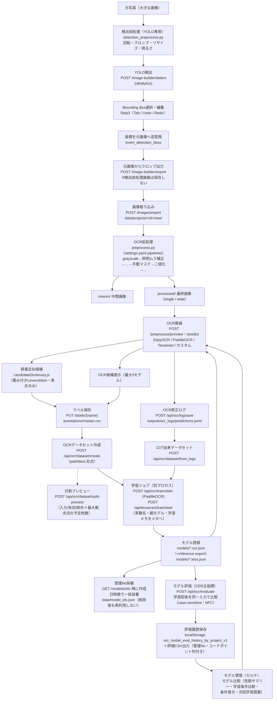
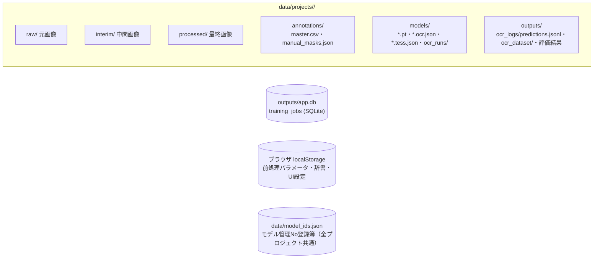

# 17. データフロー全体図

画像の入力から学習・評価までの一連の流れを1枚で示す。根拠は `src/app/main.py` の各エンドポイントと `src/app/services/` の実装。

## 全体フロー

## 補足（フロー上の重要な不変条件）

| 箇所 | 不変条件 | 根拠 |
|---|---|---|
| 検出前処理 → クロップ | クロップは**必ず元画像から**。検出前処理画像を学習画像として保存しない | `training_image_builder.py`（`export_selected_crops`）、`docs/15_CHANGELOG_AI.md` |
| YOLOモデル解決 | **取得元別に独立解決**（暗黙フォールバック禁止）: path=明示実在パス / project=`data/projects/<id>/models/yolo/` / common=`models/yolo/` / builtin=`models/yolo/builtin/`（旧自動DLのリポジトリ直下も取得済みとして互換認識）。`model_source`未指定時のみ後方互換の従来順（path→project→common→取得済みbuiltin）。**検出API実行中は自動ダウンロードしない**（未取得標準モデル=409）。標準モデルの取得は専用API `POST /image-builder/yolo-models/builtin/download`（許可リスト制）のみ | `training_image_builder.py`（`resolve_yolo_model` / `resolve_project_yolo_model` / `resolve_common_yolo_model` / `resolve_builtin_yolo_model` / `download_builtin_yolo_model`） |
| Step間の選択画像保持 | 選択画像（file/プレビューURL/サイズ）・検出結果はビュー全体のstateで保持し、Step移動では解除しない（App側ErrorBoundaryのkeyをStep1〜4で共通化）。クリア条件: 別画像選択=旧検出結果もクリア / プロジェクト切替=全クリア / Step移動=維持 | `App.jsx`（`viewBoundaryKey`）、`TrainingImageBuilderView.jsx` |
| 画像の向き（EXIF） | **読込時に1回だけ** `ImageOps.exif_transpose` でEXIF Orientationを反映し、以降のStep1〜4・YOLO検出・クロップはすべて同じ向きのピクセルを使用（途中で再解釈しない）。ブラウザの``はEXIFを自動適用するため、サーバー側で反映しないとStep1（ブラウザ表示）とStep2以降（サーバー生成画像）で90°ずれる。検出前処理の回転はユーザーが意図して行う別機能で、EXIF反映後の画像を基準に回転する | `training_image_builder.py`（`_decode_image_bytes`） |
| 検出実行スナップショット | 検出成功時に model_name / model_source / resolved_model / inference_time_ms / total_time_ms / preprocess_applied / detected_count / inference_count / series_filtered_count / selected_series をフロントstateへ保持し、Step2結果サマリーとStep3「検出モデル」「検出Series」表示に使用（現在の設定値ではなく検出時点の値） | `TrainingImageBuilderView.jsx`（`detectRunInfo`） |
| 検出対象Series | 「モデルclass一覧取得（/yolo-models/classes・キャッシュあり）→ Step2で複数選択（初期=全選択・モデル変更で入れ替え）→ detectへ series_json 送信 → 推論後にclass名で絞り込み→ID振り直し→重複統合」。Step3には選択SeriesのBBoxのみが渡る。未指定=従来動作（全class対象） | `training_image_builder.py`（`get_yolo_model_classes` / `detect_bboxes_with_yolo(series=...)`） |
| 評価用データ作成（Step5） | 「Step4出力時にマニフェスト保存（`image_builder_exports/<export_id>/manifest.json`=元画像・BBox・Series・sha256の確定情報）→ Step5が候補として読込 → ラベル・回転・評価対象を `evaluation/editing_state.json` へ途中保存 → 作成時に `evaluation/<dataset_id>/` へ画像コピー＋回転焼き込み（0/90/180/270。Step4学習画像は不変）＋ground_truth.csv（filename,label・utf-8-sig・csv.writer・case-sensitive）＋metadata.json」。CSVは既存モデル評価（`ocr_evaluation._read_gt_csv`）互換で、image_dir/gt_csv へそのまま指定可能 | `evaluation_dataset.py` / `training_image_builder.py`（`export_selected_crops`） |
| 評価用データ作成（フォルダ取得モード） | 「Step5で取得方法=フォルダを選択 → `GET /image-builder/evaluation/directory-images` でフォルダ直下の画像を一覧化（サブフォルダ・非画像は対象外）→ プレビュー/OCR候補はフォルダ直下のみ解決（トラバーサル拒否）で、読込時にEXIF Orientationを1回だけ反映してからユーザー回転を適用 → 作成時は 無回転かつEXIFなし=バイト等価コピー / 回転またはEXIFあり=PNGへ焼き込み（`<元stem>.png`。名前衝突は連番付与）→ metadata.json へ `source: "directory"` と `source_directory` を保存」。Step4モードは従来動作のまま（metadata `source: "step4"`）で、両モードの混在作成は拒否。元フォルダの画像は変更しない | `evaluation_dataset.py`（`list_directory_images` / `resolve_directory_image_path` / `load_directory_image` / `create_evaluation_dataset`） |
| Step5のOCR候補 | 「Step4元画像クロップ（EXIF反映済み）→ Step5のユーザー回転（サーバー側適用）→ **Step5専用OCR前処理**（グレースケール・二値化。既存 `_op_grayscale`/`_op_threshold` を再利用する `apply_eval_preprocess` アダプター。**OCR候補生成用の推論入力にのみ適用し、評価用画像・作成データセット・学習画像へは一切反映しない**）→ プロジェクト共通のOCR前処理（既存 `_process_image` を `preview_preprocess_image` で共通利用・手動マスクなし）→ OCR推論（既存 `_attach_preview_prediction`=predict_from_image。小文字制御・whitelist・Confidence正規化も共通）」。回転前の画像はOCRへ渡さない。**OCR設定は最大3モデルのStep5専用スロット**（各スロット: 有効/Engine/Model/Language/小文字/Tesseract PSM/whitelist。エンジン非対応の項目は既定値へ正規化）で localStorage `ocr_eval_preview_slots_by_project_v1` にプロジェクト別保存（旧単一キーは読み込み時にモデル1へ自動移行。ラベル編集=前処理画面の推論設定とは独立）。有効スロットをスロット番号順に並列実行し最大3候補を表示（重複設定は拡張 `predictSignature`＝Engine+Model+Language+小文字+PSM+whitelist で判定しスキップ・1件失敗しても他は表示・Confidence順へ並べ替えない）。Escはスロット順で最初に成功した候補を採用。辞書候補は全スロット結果を入力として既存ロジックで統合。ラベル編集UI部品（入力欄・候補行・辞書候補・ソフトキーボード・ショートカット）は `components/labeling/` の共通部品を既存ラベル編集と共用し、保存先だけコールバックで差し替え（既存=master.csv系API / Step5=評価用editing_state） | `preprocess.py`（`apply_eval_preprocess`）/ `main.py`（`/api/ocr/preview-file/batch`）/ `lib/evalOcrSettings.js` / `lib/evalPreprocess.js` |
| Step5のOCR実行タイミング（性能設計） | 「画像選択・前へ/次へ・保存して次へ・90°/180°回転・前処理/OCR設定変更 → 元画像・保存済みラベル・回転を即表示し、**自動OCR（既定ON・連続操作終了後300msデバウンスで1回だけ）**を実行。実行前に必ず実行条件キー（画像key+回転+Step5前処理+有効スロット設定）のキャッシュを確認し、**ヒット時はAPIを呼ばず即時表示**。自動実行OFF時は候補を『要再実行』表示にして[OCR再実行]押下時のみ推論」。OCRバッチは1リクエストで「前処理1回＋**同時実行数2のスレッドプールでスロット並列実行**」（3モデル合計時間の単純合算を避ける。エンドポイントはasyncio.to_threadでイベントループを塞がない=ラベル編集のsync def並行性と同等）。バッチ応答は中間・最終画像も運ぶため、自動OCR時はプレビュー単独リクエストを発行しない（反映済みプレビューキーで重複取得を防止）。「保存して次へ」は保存成功後にのみ移動し、移動によるrunKey変化が次画像の自動OCRを起動する（保存失敗時は移動もOCRもしない）。OCR実行中の画像移動はAbortControllerで旧リクエストを中止し古い結果を反映しない。現在画像のOCR完了後は表示一覧の**次の1画像だけ先読み**（自動ON・未キャッシュ時のみ。include_images=falseで転送削減・結果はキャッシュへ入れるだけ）。結果キャッシュは二層（サーバー=処理済み画像sha256+設定のLRU128件・エラー除外 / フロント=実行条件キーのLRU30件）。editing_stateへはOCR候補・base64画像・ローディング状態を保存せず、差分がない場合は書き込まない | `main.py`（`run_preview_ocr_batch` / `_execute_preview_slot`）/ `services/ocr_preview_cache.py` / `lib/evalOcrRun.js` |
| Step5のOCR実行キュー（連続作業の安定性） | 推論は**プロセス共有の `_STEP5_OCR_EXECUTOR`（同時実行数2）**へsubmitし、リクエスト横断で同時推論数を制限（リクエスト毎のPool生成・`asyncio.to_thread`への推論積み上げを廃止。Abort残骸や先読みが重なってもCPU飽和せず、連続作業時の周期的な遅延が発生しない）。**in-flight共有**: 同一キャッシュキー（処理済み画像sha256+設定）の推論が実行中なら新規開始せず同じFutureを待つ（先読み×現在画像の二重実行を1回に統合。エントリは所有者が成功・失敗・キャンセルで必ず削除）。**優先順位**: 現在画像のOCR＞プレビュー＞先読み（runOcr開始時に進行中の先読みをAbort。`prefetch=true` はサーバー側で実行中/待機中のOCRがあると破棄=skipped_busy）。**切断対応**: 画像デコード前と各スロット実行前に `request.is_disconnected()` を確認し、切断済みなら未開始スロットを実行しない（キュー内Futureはキャンセル）。**先読み条件**: 現在OCR完了→400ms後に「同じ画像に留まっている・現在OCRが実行中でない・次画像が存在・未キャッシュ」を再判定して次の1画像だけ（連鎖・複数積み上げ・連打中の発火は構造的に不可能） | `main.py`（`_STEP5_OCR_EXECUTOR` / `_OCR_INFLIGHT`）/ `lib/evalOcrRun.js`（`shouldPrefetchNext`） |
| Step5の保存とOCRの資源分離 | ラベル保存（editing_state）はOCRと**資源を一切共有しない**: 保存API（`/image-builder/evaluation/state` POST）はsync defでFastAPI標準スレッドプール実行（OCR専用Executor・in-flight・Futureを経由しない・広域ロックなし・ファイル書込のみ）。実測: OCR専用Executorが遅い推論で満杯でも保存は10〜25msで完了（回帰テストあり）。「保存して次へ」のPromiseチェーンは「入力確定→保存POST→成功→次画像index更新→元画像/保存済みラベル即表示」のみで、OCR・プレビュー・先読みを含まない（自動OCRは移動後のrunKey変化で独立に予約）。保存中はボタンが「保存中...」表示になるが、ラベル入力・移動は操作可能なまま。辞書候補の類似度計算はuseDeferredValueで候補表示より低優先へ分離。Step5サムネイル（crop/directory-image）は `max-age=300` でブラウザキャッシュされ、保存・OCRリクエストと同時接続枠を奪い合わない | `main.py` / `EvaluationDatasetBuilder.jsx`（`saveAndNext` / `saveCurrentLabel`） |
| EasyOCRの入力方式 | `readtext` へは**パス文字列ではなく2次元グレースケールnumpy配列**を渡す。ultralytics（YOLO検出）はWindowsで `cv2.imread` を「グレースケール指定でも常に3次元(H,W,1)を返す」実装へグローバル差し替えするため、パス渡し（easyocr内部のcv2.imread依存）はYOLO実行後に必ず `too many values to unpack (expected 2)` で失敗する。配列渡しはこのパッチの影響を受けず、非ASCIIパスにも安全 | `predict.py`（`_run_easyocr`） |
| 評価データセット→モデル評価 | 「`GET /api/evaluation/datasets` でmetadata.json由来の一覧取得 → モデル評価画面で選択（image_dir/gt_csvを自動反映・手動パス入力は詳細設定へ折り畳み）→ 選択時に学習データ重複チェック（`outputs/ocr_dataset/*/{train,val,test}` のsha256 → マニフェスト逆引きで元画像+BBoxID → ファイル名の優先順位。回転焼き込み後の画像も元画像+BBoxIDで検出）→ 評価実行で結果にdataset_id/名前/枚数/作成日時を紐付け → 履歴はlocalStorage `ocr_model_eval_history_by_project_v1`（モデル×データセットの2軸）」。削除は `safe_rmtree`（`evaluation/` 配下のみ）・名前変更はディレクトリ改名+metadata更新（CSV・画像参照は相対のため不変） | `evaluation_dataset.py`（`list_evaluation_datasets` / `check_training_overlap` / `delete_evaluation_dataset` / `rename_evaluation_dataset`）、`OcrEvaluationView.jsx` |
| CER評価（主指標） | 「評価APIが画像ごとに `levenshtein_ops`（DP+バックトレースの純Python実装）で編集距離とアラインメント（置換/脱落/挿入）を算出 → **CER=全画像の編集距離総和÷全画像の正解文字数総和（マイクロ平均。画像ごとのCER平均は使わない）** → 文字正解率=1-CER。混同集計はアラインメント操作をCounterで集計しTOP10を応答へ。comparisonでは画像単位の編集距離を学習前と比較して改善/同等/悪化を判定し、matchの遷移から完全一致へ改善/から悪化を集計。CER差=学習後-学習前（負=改善）・相対改善率=(学習前-学習後)/学習前」。比較はcase-sensitive・trim＋**Unicode NFC正規化**（合成済み形への統一のみ。NFKCは不使用＝半角/全角・大小文字・0とO等は同一視しない。U+FFFD検出時は復元不能の警告ログ）。混同の内部形式は `{kind: sub/del/ins, from, to, count}` の構造化（表示記号を保存しない）。表示変換（∅・␠・U+XXXX等）と旧・文字列キー形式（`{"Y→":5}`）の読み込み互換は `lib/confusionFormat.js`。Accuracy（完全一致率）は業務指標として全画面で併記 | `ocr_evaluation.py`（`levenshtein_ops` / `evaluate_ocr` / `_normalize_compare`）/ `lib/confusionFormat.js` |
| モデル比較（比較ダッシュボード・CER中心） | 「最新評価履歴から `buildModelComparison`（9指標×モデルの値と最良値。CER/悪化件数=最小が最良・他=最大が最良）→ `buildWinLoss`（指標ごとに最良モデルへ1勝。**同率最良は winners へ全モデル併記し、各モデルへ1勝ずつ与える**——「勝者なし」にしない。winner は単独最良時のみ=後方互換）→ `recommendModel`（勝利数最多→タイはCER最小→文字正解率最大。**Accuracy単独では決めない**。理由=最良を取った指標一覧）→ `formatBestDiff`（主要3指標カードの最良との差分。最良=「最良」・劣る側は符号付きpt/件）→ `buildConditionComparison`（評価データセット/評価画像数/OCR前処理/Whitelistの一致判定。不一致で警告・全一致で「評価条件一致」チップ。評価日時は表示のみ・評価済み2件未満はmatch=null）→ `buildConfusionComparison`（全モデルの混同を件数合計で統合し合計降順。limit=Infinityで全件・total/横棒スケール用の件数を返す。旧形式=混同データなしはnull表示）→ `buildCompareColorMap`（比較表示順→固定識別色 ブルー/オレンジ/パープル。永続保存せず配列順へ割り当て・全セクションで同一マップを共有）」 | `lib/modelCompare.js` / `ModelsView.jsx` |
| データ分割・オーグメンテーション | 「`create_ocr_dataset` が有効サンプル収集（入力/有効/除外内訳を集計）→**最大剰余法** `compute_split_counts` で分割枚数を確定（合計=有効数を保証・同値小数部はTrain→Val→Test優先・Seedでシャッフル再現）→ 全分割の元画像を無加工で出力 → `augmentation` 指定時は**Trainのみ**へ追加画像 `train_aug_*.png` を生成（生成枚数=(倍率-1)×Train枚数・ラベルは元と同一）→ meta.json へ 比率/seed/split_method=image/augmentation/augmentation_generated/input_count/valid_count/skipped を保存 → 学習時にモデルメタへ引き継ぎ」。Val/Test/固定評価データセットへはオーグメンテーションを適用しない。事前確認は `/api/ocr/dataset/split-preview`（分割枚数）と `/api/ocr/dataset/augmentation-preview`（適用前後の画像ペア） | `ocr_pipeline.py` |
| 学習条件比較・次回学習提案 | 「学習開始時に実験情報（experiment_name / parent_model_id=親モデルの管理No / training_note）をリクエスト→`training_jobs.experiment_meta`（JSON列・ALTER TABLE追加）→ジョブ実行時に`run_tesseract_training(extra_meta)`→`register_tesseract_model`が学習時間（training_duration_seconds=実測秒）・データセットmeta.json由来の分割情報（dataset_split_ratio / split_seed / split_method）とオーグメンテーション（augmentation_config / augmentation_generated）と共に`.tess.json`へ保存→`/models/info`が返却（旧メタは空/null=未記録表示）→比較画面が `lib/trainingCompare.js` で処理: `normalizeTrainingCondition`（12項目の学習条件へ正規化。Number(null)===0の罠回避済み）→`diffTrainingConditions`（隣接ペアの変更抽出。**両方未記録の項目は変更として数えない**。0件=条件同一/1件=単一条件比較/2件以上=複数条件変更）→`buildConditionDiffSummaries`（変更・性能pt差・判定文）→`buildComparabilityNotes`（Train/Val分割差異の注意）→`buildNextTrainingProposals`（ルールベース: 評価条件不一致→再評価最優先 / Iteration最大がCER最良→1.5倍のIteration候補 / Augmentation未使用→弱Aug候補 / 分割不一致→分割固定候補。断定しない注意文付き）」。「この条件で学習設定を作成」はApp.jsxがIteration・データ分割（参照モデルのcountsから0.1刻みで導出できる場合のみ）・実験名・親モデル管理No・学習メモを学習画面の状態へ反映して遷移するだけで**学習は開始しない** | `tesseract_pipeline.py` / `db.py` / `model_registry.py` / `lib/trainingCompare.js` / `ModelsView.jsx` / `TrainingView.jsx` |
| モデルカルテ（モデル管理画面） | 「評価実行時にフロントが localStorage 履歴（`ocr_model_eval_history_by_project_v1`）のエントリへ評価APIの応答値（correct_count / total_count / misrecognized_count / **cer / char_accuracy / cer_delta / cer_relative_improvement / improved / unchanged / regressed / perfect_fixed / perfect_regressed / confusions(TOP5)** / improvement_rate・improvement_count / データセット名・whitelistモード・pre・evaluatedAt）を追記保存 → モデル管理画面が `lib/modelEval.js` で正規化し、カルテに①最新評価（**CER最大表示**・文字正解率・完全一致率）②評価サマリー（改善/同等/悪化・完全一致の増減）③混同TOP5 ④評価条件 ⑤モデル情報 ⑥評価履歴を表示」。推奨バッジ6種（🏆Best CER/Best Char Acc/Best Accuracy・🟢Recommended・⭐Latest Best・🔵Baseline）は履歴から自動判定し**比較画面のモデル詳細情報にのみ表示**（一覧・カルテには出さない）。旧形式エントリ（percent/atのみ）は欠損をnull化し「未記録」表示（後方互換・エラーにしない）。モデルサイズは `/models/info` の `model_size_mb`（サーバーがモデル実体をstat） | `lib/modelEval.js` / `ModelsView.jsx` / `model_registry.py`（`list_model_infos`） |
| モデル評価の前処理 | 「UIで評価前処理モード選択（**training=学習時前処理を使用（既定・推奨）** / step5・custom=手動設定 / none=前処理なし）→ `POST /api/ocr/evaluate` へ `preprocess_mode`（＋手動時は `eval_preprocess`/`preprocess_source`）を送信 → サーバーは `resolve_evaluation_preprocess_plan` で適用計画を解決（training=全学習後モデルのハッシュ一致を要求・未記録=400でフォールバックしない / training_individual=モデル別適用＋「純粋比較でない」警告 / manual=Step5共通の `apply_eval_preprocess` / none=整形のみ）→ グループ単位で前処理を1回だけ適用（適用順=元画像→選択した評価前処理→OCR入力整形→推論→whitelist→完全一致評価）→ 応答へ `preprocess_mode`/`evaluation_preprocess`（ハッシュ・snapshot_id・由来モデル）/`preprocess_warnings`/targets[].`preprocess_match` をecho → フロントは結果表示・警告表示と履歴（`pre: {source, summary, mode, hash}` + `preprocess_match`）へ保存」。評価データセットの回転は**作成時に画像へ焼き込み済み（構造A）**のため評価時は回転を適用しない（二重回転防止）。`preprocess_mode`未指定・全設定OFFは従来動作（後方互換）。旧履歴（pre無し）は「未記録」表示 | `ocr_evaluation.py`（`evaluate_ocr` / `resolve_evaluation_preprocess_plan`）/ `preprocess.py`（`apply_eval_preprocess`）/ `preprocess_snapshot.py` / `lib/evalPreprocess.js` / `lib/evalHistory.js` |
| 前処理設定の実処理反映（preview/run統一） | 「前処理設定画面のUI設定（localStorage `ocr_preprocess_params_by_project_v1`）→ **共通ペイロード生成 `lib/preprocessRequest.js`**（`normalizePreprocessOverrides`=型変換・未指定補完・無効工程のenabled明示）→ `/preprocess/preview` と `/preprocess/run` の**両方へ同一のoverridesを送信**（別々の組み立てをしない）→ サーバーは全経路共通の `_build_preprocess_config`（補完＋クランプ）で実効値を解決」。優先順位=①overrides ②プロジェクト保存値（run実行時にoverridesを `preprocess_config.json` へ自動保存。overridesなしの実行=回転後の部分再処理・旧クライアントも直近の設定で処理される） ③settings.yaml ④コード既定。「前処理を実行」前に**送信ペイロードと同じデータから生成した設定要約＋processed更新の注意**を確認ダイアログ表示。同一設定での preview 最終画像と run 生成 processed は**画素単位一致**（fixed90/128・Otsu・CLAHE・Deskew・Morph・single/wideでテスト） | `lib/preprocessRequest.js` / `App.jsx`（`runPreprocess`）/ `preprocess.py`（`run_preprocess` / `_sanitize_preprocess_config` / `load_project_preprocess_overrides`） |
| 実験管理（Experiment Tracking） | 「Tesseract学習完了（`register_tesseract_model`）→ `experiment_tracker.record_experiment` が実験カルテを **EXP-0001形式（プロジェクト内一意・作成順・再利用しない・モデル管理Noと独立）** で `data/projects/<id>/experiments.json` へ保存（学習条件=Iteration/Split比率/Seed/枚数・前処理=ハッシュ/snapshot_id/二値化要約・Aug設定・開始/終了/学習時間・実験名/親モデル/メモ。1実験に複数モデル=modelsリスト）→ 実験記録のない旧モデルは `GET /api/experiments` 時に**自動バックフィル**（source=backfill・作成日時順採番・冪等）→ モデル評価実行時にフロントが `POST /api/experiments/attach-evaluation` で評価要約（CER/文字正解率/完全一致率/改善・悪化件数）をモデル名解決で自動保存 → 実験管理画面（`ExperimentsView`＋`lib/experimentAnalysis.js`）がフィルタ・**Experiment比較（変更条件のみ強調・同値は薄く）**・CER/完全一致率推移とIteration×CER/Aug倍率×CERのSVGグラフ・簡易相関（Iteration相関の★5段階/Aug平均改善pt/前処理別平均CER。差分集計のみ）・ベスト条件・ルールベースの条件推薦・タグ/★（PATCH）・CSV出力を提供」。モデルカルテ⇄実験管理は相互リンク（モデル→作成Experiment / 実験→生成モデル）。将来のOptuna等の自動探索は experiments.json のカルテへ `search` 名前空間を追加する形で拡張する（既存フィールドの意味は変えない） | `experiment_tracker.py` / `tesseract_pipeline.py` / `main.py` / `lib/experimentAnalysis.js` / `ExperimentsView.jsx` / `ModelsView.jsx` |
| Experiment Validation（比較妥当性） | 「評価実行→attach-evaluationで**Evaluation Profile**（データセットID/画像数/ラベル数/評価前処理識別子=モード＋ハッシュまたは設定JSON/エンジン/PSM/Whitelist/文字正規化 trim+NFC/CERバージョン cer-v1-micro）を実験へ保存→`compute_evaluation_hash`（sha256・評価日時除外・識別子が無ければHash生成不可=空）→一覧取得時にHash単位で**Comparable Group（CG-0001形式・出現順採番）**を付与→フロントは**Scientific Mode**（既定ON・プロジェクト別localStorage）でグループ内の分析対象実験だけを推移・相関・ベスト・推薦のスコープにする（OFF=全件・参考値表示）」。**分析対象外の規則**（推薦へ使用しない）: 分析OFF（PATCH /analysis）・バックフィル（既定OFF）・評価未実施・CERなし・Hash生成不可（理由付きでrecommendation APIの excluded へ）。推薦は最大グループを根拠に basis_count を必ず返し**5件未満は insufficient（参考値・データ不足）**。比較画面はHash不一致で「⚠比較条件が異なります」警告＋**比較品質★5段階**（完全一致/Whitelist違い/PSM等違い/データセット違い/比較不可）＋条件差分の6カテゴリ分類（学習条件/前処理/Aug/モデル/評価条件/その他）。グラフはComparable Group色分け凡例つき | `experiment_tracker.py`（`normalize_evaluation_profile` / `compute_evaluation_hash` / `build_comparable_groups` / `build_recommendations` / `set_analysis_enabled`）/ `lib/experimentAnalysis.js` / `ExperimentsView.jsx` |
| リリース管理（Model Release Management） | 「学習済みモデル（既定Status=Draft）→ 手動で Validated / Candidate（0.x自動採番）へ → **Productionへ昇格**（`POST /api/releases/promote`。**Release Note必須**・昇格前にフロントがリリース判定=CER/文字正解率/完全一致率/Experiment/Evaluation Group/評価データ数/前処理Hash と**安全性警告**=Comparable Group違い/比較品質★低/CERなし/評価未実施/Scientific Mode外/評価件数5未満 と**本番比較**=CER差/完全一致率差/前処理差/Experiment差/Evaluation差 を表示。禁止はしない）→ **旧Productionは自動Archived**（Productionは1プロジェクトに1つ）・バージョン自動採番（初回1.0.0→マイナー加算）・履歴へ追記 → **Rollback**（過去Versionのモデルを再Production・rollback=trueの新履歴エントリ）→ **Model Card**（Markdown自動生成）と **Deployment Package**（ZIP: traineddata/設定JSON/前処理Snapshot/Release Note/Model Card）をExport」。判定・警告は実験カルテ（Experiment Validation）の evaluation / evaluation_hash / comparable_group を情報源とする（`lib/releaseLogic.js`）。保存先 `data/projects/<id>/releases.json` | `release_manager.py` / `main.py` / `lib/releaseLogic.js` / `ReleasesView.jsx` / `ModelsView.jsx` |
| 前処理プレビューのリアルタイム処理 | 「設定変更→300msデバウンス→`/preprocess/preview`（前処理＋OCRをメイン＋比較スロット並行）」。**AbortControllerで旧リクエストを中断・リクエスト連番で古いレスポンスを破棄・同一画像/同一設定のLRUキャッシュ30件**（`lib/previewCache.js`。メイン/比較スロットでキーが同じならキャッシュ共有・重複設定スロットはシグネチャ判定でスキップ・画像回転/手動マスク更新はキーへ含めて無効化）。処理時間と前回とのOCR結果差を表示。UI状態（折りたたみ・基本/詳細モード=`ocr_preprocess_ui_state_by_project_v1`）・OCR結果確認設定（`ocr_preprocess_predict_by_project_v1`）・プリセット（`ocr_preprocess_presets_by_project_v1`。旧共通キーから初回コピー移行）はプロジェクト別localStorage | `App.jsx`（プレビューeffect）/ `lib/previewCache.js` / `lib/preprocessSchema.js` / `lib/preprocessUiState.js` / `PreprocessPanel.jsx` |
| 前処理スナップショット（学習時前処理の再現性） | 「`POST /preprocess/run` 実行時に**実効パラメータの完全スナップショット**（工程順序・有効/無効・実効パラメータ・schema/pipelineバージョン・実行日時。手動マスク座標は除外）を `processed/meta/preprocess_snapshot.json` へ保存（最終実行時点が正）→ `create_ocr_dataset` が作成時点のスナップショットを dataset meta.json の `training_preprocess` へ**確定コピー**（未保存の旧プロジェクトは null=推測補完しない）＋ `training_preprocess_hash`（正規化JSONのsha256。作成日時・snapshot_id・channelsを除外）＋学習データ由来（`source_image_state`/`source_state_counts`/`source_warning`。processed以外の混在は警告）→ 学習完了時に `.tess.json` へ引き継ぎ → `/models/info` → モデル比較「学習前処理比較」（一致/差分/詳細折りたたみ）・評価/推論の学習時前処理再現へ使用」。**適用順序の仕様**: 学習=raw→取込前処理（processedへ焼き込み済み）→OCR入力整形→（Trainのみ）Augmentation→再整形 / Val・Test=同一（Augなし）/ 評価・推論=元画像→選択した前処理（学習時前処理再現=`apply_training_preprocess` が既存 `_run_pipeline` を共用）→OCR入力整形（Augmentationは適用しない）。**二重適用防止**: processed画像は適用済みのためデータセット作成では再適用せず（回帰テストあり）、評価・推論では元画像（評価データセット=raw由来コピー）へスナップショットを適用する | `preprocess_snapshot.py` / `preprocess.py`（`run_preprocess`）/ `ocr_pipeline.py`（`create_ocr_dataset`）/ `tesseract_pipeline.py`（`register_tesseract_model`）/ `model_registry.py` |
| 検出前処理 / OCR前処理 | 完全に独立（モジュール・設定・保存が別） | `detection_preprocess.py` / `preprocess.py` |
| OCR前処理 | 元画像（raw/）は変更しない。手動マスク・照明補正は派生画像にのみ作用 | `preprocess.py`, `manual_mask.py` |
| 辞書候補 | 表示のみ。OCRエンジンの学習・推論内部へ注入しない | `candidateDictionary.js` |
| ラベル | `master.csv` が唯一の正解。評価でGTを大文字化しない（case-sensitive） | `labels.py`, `ocr_evaluation.py` |
| 学習ジョブ | APIプロセスと分離（`job_runner.py` をPopen）。状態は SQLite `training_jobs` | `main.py`, `db.py` |
| 推論モデル | export済み（inference）モデルのみ使用可（`STRICT_OCR_EXPORT_REQUIRED=True`） | `predict.py` |

## 永続化ポイント一覧

- `data/model_ids.json`: モデル管理No（M0001形式）の登録簿。`{"counter": 通算採番数, "models": {"<project_id>/<モデル名>": "M0001"}}`。`/models/info` の一覧取得時に未登録モデルを**作成日時順**で一括採番して追記する（既存モデルの初回移行も同じ経路）。**モデルを削除してもエントリは残し、番号を再利用しない**（OCR Crafter全体で一意）。ファイルが無い・壊れている場合は counter=0 から再構築される

- どの矢印がどのAPIかは `docs/06_API_REFERENCE.md`、ファイル形式は `docs/07_DATABASE.md` を参照。
