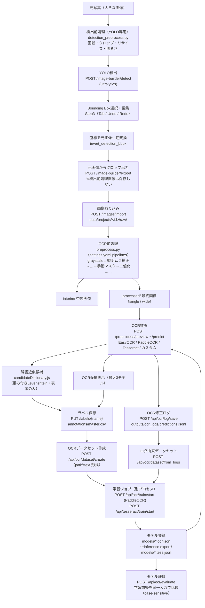
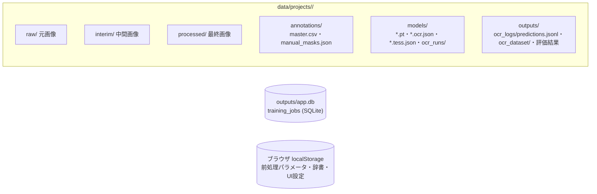

# 17. データフロー全体図

画像の入力から学習・評価までの一連の流れを1枚で示す。根拠は `src/app/main.py` の各エンドポイントと `src/app/services/` の実装。

## 全体フロー

## 補足（フロー上の重要な不変条件）

| 箇所 | 不変条件 | 根拠 |
|---|---|---|
| 検出前処理 → クロップ | クロップは**必ず元画像から**。検出前処理画像を学習画像として保存しない | `training_image_builder.py`（`export_selected_crops`）、`docs/15_CHANGELOG_AI.md` |
| YOLOモデル解決 | 「絶対/相対パス実在 → プロジェクト内 `data/projects/<id>/models/yolo/` → 共通 `models/yolo/`（リポジトリ直下）→ 名前をそのまま ultralytics へ（ビルトインは自動DL）」の順 | `training_image_builder.py`（`_resolve_model_name` / `COMMON_YOLO_MODELS_DIR`） |
| 検出前処理 / OCR前処理 | 完全に独立（モジュール・設定・保存が別） | `detection_preprocess.py` / `preprocess.py` |
| OCR前処理 | 元画像（raw/）は変更しない。手動マスク・照明補正は派生画像にのみ作用 | `preprocess.py`, `manual_mask.py` |
| 辞書候補 | 表示のみ。OCRエンジンの学習・推論内部へ注入しない | `candidateDictionary.js` |
| ラベル | `master.csv` が唯一の正解。評価でGTを大文字化しない（case-sensitive） | `labels.py`, `ocr_evaluation.py` |
| 学習ジョブ | APIプロセスと分離（`job_runner.py` をPopen）。状態は SQLite `training_jobs` | `main.py`, `db.py` |
| 推論モデル | export済み（inference）モデルのみ使用可（`STRICT_OCR_EXPORT_REQUIRED=True`） | `predict.py` |

## 永続化ポイント一覧

- どの矢印がどのAPIかは `docs/06_API_REFERENCE.md`、ファイル形式は `docs/07_DATABASE.md` を参照。
