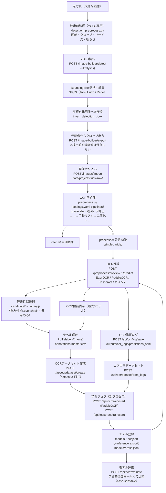
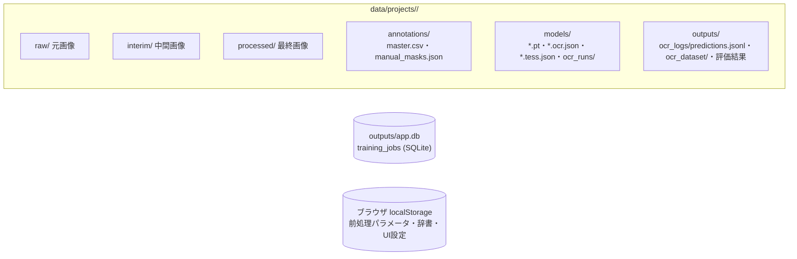

# 17. データフロー全体図

画像の入力から学習・評価までの一連の流れを1枚で示す。根拠は `src/app/main.py` の各エンドポイントと `src/app/services/` の実装。

## 全体フロー

## 補足（フロー上の重要な不変条件）

| 箇所 | 不変条件 | 根拠 |
|---|---|---|
| 検出前処理 → クロップ | クロップは**必ず元画像から**。検出前処理画像を学習画像として保存しない | `training_image_builder.py`（`export_selected_crops`）、`docs/15_CHANGELOG_AI.md` |
| YOLOモデル解決 | **取得元別に独立解決**（暗黙フォールバック禁止）: path=明示実在パス / project=`data/projects/<id>/models/yolo/` / common=`models/yolo/` / builtin=`models/yolo/builtin/`（旧自動DLのリポジトリ直下も取得済みとして互換認識）。`model_source`未指定時のみ後方互換の従来順（path→project→common→取得済みbuiltin）。**検出API実行中は自動ダウンロードしない**（未取得標準モデル=409）。標準モデルの取得は専用API `POST /image-builder/yolo-models/builtin/download`（許可リスト制）のみ | `training_image_builder.py`（`resolve_yolo_model` / `resolve_project_yolo_model` / `resolve_common_yolo_model` / `resolve_builtin_yolo_model` / `download_builtin_yolo_model`） |
| Step間の選択画像保持 | 選択画像（file/プレビューURL/サイズ）・検出結果はビュー全体のstateで保持し、Step移動では解除しない（App側ErrorBoundaryのkeyをStep1〜4で共通化）。クリア条件: 別画像選択=旧検出結果もクリア / プロジェクト切替=全クリア / Step移動=維持 | `App.jsx`（`viewBoundaryKey`）、`TrainingImageBuilderView.jsx` |
| 画像の向き（EXIF） | **読込時に1回だけ** `ImageOps.exif_transpose` でEXIF Orientationを反映し、以降のStep1〜4・YOLO検出・クロップはすべて同じ向きのピクセルを使用（途中で再解釈しない）。ブラウザの``はEXIFを自動適用するため、サーバー側で反映しないとStep1（ブラウザ表示）とStep2以降（サーバー生成画像）で90°ずれる。検出前処理の回転はユーザーが意図して行う別機能で、EXIF反映後の画像を基準に回転する | `training_image_builder.py`（`_decode_image_bytes`） |
| 検出実行スナップショット | 検出成功時に model_name / model_source / resolved_model / inference_time_ms / total_time_ms / preprocess_applied / detected_count / inference_count / series_filtered_count / selected_series をフロントstateへ保持し、Step2結果サマリーとStep3「検出モデル」「検出Series」表示に使用（現在の設定値ではなく検出時点の値） | `TrainingImageBuilderView.jsx`（`detectRunInfo`） |
| 検出対象Series | 「モデルclass一覧取得（/yolo-models/classes・キャッシュあり）→ Step2で複数選択（初期=全選択・モデル変更で入れ替え）→ detectへ series_json 送信 → 推論後にclass名で絞り込み→ID振り直し→重複統合」。Step3には選択SeriesのBBoxのみが渡る。未指定=従来動作（全class対象） | `training_image_builder.py`（`get_yolo_model_classes` / `detect_bboxes_with_yolo(series=...)`） |
| 評価用データ作成（Step5） | 「Step4出力時にマニフェスト保存（`image_builder_exports/<export_id>/manifest.json`=元画像・BBox・Series・sha256の確定情報）→ Step5が候補として読込 → ラベル・回転・評価対象を `evaluation/editing_state.json` へ途中保存 → 作成時に `evaluation/<dataset_id>/` へ画像コピー＋回転焼き込み（0/90/180/270。Step4学習画像は不変）＋ground_truth.csv（filename,label・utf-8-sig・csv.writer・case-sensitive）＋metadata.json」。CSVは既存モデル評価（`ocr_evaluation._read_gt_csv`）互換で、image_dir/gt_csv へそのまま指定可能 | `evaluation_dataset.py` / `training_image_builder.py`（`export_selected_crops`） |
| 評価用データ作成（フォルダ取得モード） | 「Step5で取得方法=フォルダを選択 → `GET /image-builder/evaluation/directory-images` でフォルダ直下の画像を一覧化（サブフォルダ・非画像は対象外）→ プレビュー/OCR候補はフォルダ直下のみ解決（トラバーサル拒否）で、読込時にEXIF Orientationを1回だけ反映してからユーザー回転を適用 → 作成時は 無回転かつEXIFなし=バイト等価コピー / 回転またはEXIFあり=PNGへ焼き込み（`<元stem>.png`。名前衝突は連番付与）→ metadata.json へ `source: "directory"` と `source_directory` を保存」。Step4モードは従来動作のまま（metadata `source: "step4"`）で、両モードの混在作成は拒否。元フォルダの画像は変更しない | `evaluation_dataset.py`（`list_directory_images` / `resolve_directory_image_path` / `load_directory_image` / `create_evaluation_dataset`） |
| Step5のOCR候補 | 「Step4元画像クロップ（EXIF反映済み）→ Step5のユーザー回転（サーバー側適用）→ **Step5専用OCR前処理**（グレースケール・二値化。既存 `_op_grayscale`/`_op_threshold` を再利用する `apply_eval_preprocess` アダプター。**OCR候補生成用の推論入力にのみ適用し、評価用画像・作成データセット・学習画像へは一切反映しない**）→ プロジェクト共通のOCR前処理（既存 `_process_image` を `preview_preprocess_image` で共通利用・手動マスクなし）→ OCR推論（既存 `_attach_preview_prediction`=predict_from_image。小文字制御・whitelist・Confidence正規化も共通）」。回転前の画像はOCRへ渡さない。**OCR設定は最大3モデルのStep5専用スロット**（各スロット: 有効/Engine/Model/Language/小文字/Tesseract PSM/whitelist。エンジン非対応の項目は既定値へ正規化）で localStorage `ocr_eval_preview_slots_by_project_v1` にプロジェクト別保存（旧単一キーは読み込み時にモデル1へ自動移行。ラベル編集=前処理画面の推論設定とは独立）。有効スロットをスロット番号順に並列実行し最大3候補を表示（重複設定は拡張 `predictSignature`＝Engine+Model+Language+小文字+PSM+whitelist で判定しスキップ・1件失敗しても他は表示・Confidence順へ並べ替えない）。Escはスロット順で最初に成功した候補を採用。辞書候補は全スロット結果を入力として既存ロジックで統合。ラベル編集UI部品（入力欄・候補行・辞書候補・ソフトキーボード・ショートカット）は `components/labeling/` の共通部品を既存ラベル編集と共用し、保存先だけコールバックで差し替え（既存=master.csv系API / Step5=評価用editing_state） | `preprocess.py`（`apply_eval_preprocess`）/ `main.py`（`/api/ocr/preview-file/batch`）/ `lib/evalOcrSettings.js` / `lib/evalPreprocess.js` |
| Step5のOCR実行タイミング（性能設計） | 「画像選択・前へ/次へ・保存して次へ・90°/180°回転・前処理/OCR設定変更 → 元画像・保存済みラベル・回転を即表示し、**自動OCR（既定ON・連続操作終了後300msデバウンスで1回だけ）**を実行。実行前に必ず実行条件キー（画像key+回転+Step5前処理+有効スロット設定）のキャッシュを確認し、**ヒット時はAPIを呼ばず即時表示**。自動実行OFF時は候補を『要再実行』表示にして[OCR再実行]押下時のみ推論」。OCRバッチは1リクエストで「前処理1回＋**同時実行数2のスレッドプールでスロット並列実行**」（3モデル合計時間の単純合算を避ける。エンドポイントはasyncio.to_threadでイベントループを塞がない=ラベル編集のsync def並行性と同等）。バッチ応答は中間・最終画像も運ぶため、自動OCR時はプレビュー単独リクエストを発行しない（反映済みプレビューキーで重複取得を防止）。「保存して次へ」は保存成功後にのみ移動し、移動によるrunKey変化が次画像の自動OCRを起動する（保存失敗時は移動もOCRもしない）。OCR実行中の画像移動はAbortControllerで旧リクエストを中止し古い結果を反映しない。現在画像のOCR完了後は表示一覧の**次の1画像だけ先読み**（自動ON・未キャッシュ時のみ。include_images=falseで転送削減・結果はキャッシュへ入れるだけ）。結果キャッシュは二層（サーバー=処理済み画像sha256+設定のLRU128件・エラー除外 / フロント=実行条件キーのLRU30件）。editing_stateへはOCR候補・base64画像・ローディング状態を保存せず、差分がない場合は書き込まない | `main.py`（`run_preview_ocr_batch` / `_execute_preview_slot`）/ `services/ocr_preview_cache.py` / `lib/evalOcrRun.js` |
| Step5のOCR実行キュー（連続作業の安定性） | 推論は**プロセス共有の `_STEP5_OCR_EXECUTOR`（同時実行数2）**へsubmitし、リクエスト横断で同時推論数を制限（リクエスト毎のPool生成・`asyncio.to_thread`への推論積み上げを廃止。Abort残骸や先読みが重なってもCPU飽和せず、連続作業時の周期的な遅延が発生しない）。**in-flight共有**: 同一キャッシュキー（処理済み画像sha256+設定）の推論が実行中なら新規開始せず同じFutureを待つ（先読み×現在画像の二重実行を1回に統合。エントリは所有者が成功・失敗・キャンセルで必ず削除）。**優先順位**: 現在画像のOCR＞プレビュー＞先読み（runOcr開始時に進行中の先読みをAbort。`prefetch=true` はサーバー側で実行中/待機中のOCRがあると破棄=skipped_busy）。**切断対応**: 画像デコード前と各スロット実行前に `request.is_disconnected()` を確認し、切断済みなら未開始スロットを実行しない（キュー内Futureはキャンセル）。**先読み条件**: 現在OCR完了→400ms後に「同じ画像に留まっている・現在OCRが実行中でない・次画像が存在・未キャッシュ」を再判定して次の1画像だけ（連鎖・複数積み上げ・連打中の発火は構造的に不可能） | `main.py`（`_STEP5_OCR_EXECUTOR` / `_OCR_INFLIGHT`）/ `lib/evalOcrRun.js`（`shouldPrefetchNext`） |
| Step5の保存とOCRの資源分離 | ラベル保存（editing_state）はOCRと**資源を一切共有しない**: 保存API（`/image-builder/evaluation/state` POST）はsync defでFastAPI標準スレッドプール実行（OCR専用Executor・in-flight・Futureを経由しない・広域ロックなし・ファイル書込のみ）。実測: OCR専用Executorが遅い推論で満杯でも保存は10〜25msで完了（回帰テストあり）。「保存して次へ」のPromiseチェーンは「入力確定→保存POST→成功→次画像index更新→元画像/保存済みラベル即表示」のみで、OCR・プレビュー・先読みを含まない（自動OCRは移動後のrunKey変化で独立に予約）。保存中はボタンが「保存中...」表示になるが、ラベル入力・移動は操作可能なまま。辞書候補の類似度計算はuseDeferredValueで候補表示より低優先へ分離。Step5サムネイル（crop/directory-image）は `max-age=300` でブラウザキャッシュされ、保存・OCRリクエストと同時接続枠を奪い合わない | `main.py` / `EvaluationDatasetBuilder.jsx`（`saveAndNext` / `saveCurrentLabel`） |
| EasyOCRの入力方式 | `readtext` へは**パス文字列ではなく2次元グレースケールnumpy配列**を渡す。ultralytics（YOLO検出）はWindowsで `cv2.imread` を「グレースケール指定でも常に3次元(H,W,1)を返す」実装へグローバル差し替えするため、パス渡し（easyocr内部のcv2.imread依存）はYOLO実行後に必ず `too many values to unpack (expected 2)` で失敗する。配列渡しはこのパッチの影響を受けず、非ASCIIパスにも安全 | `predict.py`（`_run_easyocr`） |
| 評価データセット→モデル評価 | 「`GET /api/evaluation/datasets` でmetadata.json由来の一覧取得 → モデル評価画面で選択（image_dir/gt_csvを自動反映・手動パス入力は詳細設定へ折り畳み）→ 選択時に学習データ重複チェック（`outputs/ocr_dataset/*/{train,val,test}` のsha256 → マニフェスト逆引きで元画像+BBoxID → ファイル名の優先順位。回転焼き込み後の画像も元画像+BBoxIDで検出）→ 評価実行で結果にdataset_id/名前/枚数/作成日時を紐付け → 履歴はlocalStorage `ocr_model_eval_history_by_project_v1`（モデル×データセットの2軸）」。削除は `safe_rmtree`（`evaluation/` 配下のみ）・名前変更はディレクトリ改名+metadata更新（CSV・画像参照は相対のため不変） | `evaluation_dataset.py`（`list_evaluation_datasets` / `check_training_overlap` / `delete_evaluation_dataset` / `rename_evaluation_dataset`）、`OcrEvaluationView.jsx` |
| モデル評価の前処理 | 「UIでOCRプロファイル選択（none=前処理なし（従来）/ step5=Step5の保存済み前処理設定（`ocr_eval_preprocess_settings_by_project_v1`）と同期 / custom=画面で上書き）→ `POST /api/ocr/evaluate` へ `eval_preprocess`＋`preprocess_source` を送信 → サーバーは全評価画像へ**Step5と共通の `apply_eval_preprocess`** を適用（処理定義を複製しない。適用順=元画像→評価前処理→OCR入力整形→推論→whitelist→完全一致評価）→ 応答へ**実際に適用した値**をecho → フロントは結果表示と履歴（`pre: {source, summary}`）へ保存」。評価データセットの回転は**作成時に画像へ焼き込み済み（構造A）**のため評価時は回転を適用しない（二重回転防止）。未指定・全設定OFFは従来動作（パスをそのまま渡す・後方互換）。旧履歴（pre無し）は「未記録」表示 | `ocr_evaluation.py`（`evaluate_ocr`）/ `preprocess.py`（`apply_eval_preprocess`）/ `lib/evalPreprocess.js` / `lib/evalHistory.js` |
| 検出前処理 / OCR前処理 | 完全に独立（モジュール・設定・保存が別） | `detection_preprocess.py` / `preprocess.py` |
| OCR前処理 | 元画像（raw/）は変更しない。手動マスク・照明補正は派生画像にのみ作用 | `preprocess.py`, `manual_mask.py` |
| 辞書候補 | 表示のみ。OCRエンジンの学習・推論内部へ注入しない | `candidateDictionary.js` |
| ラベル | `master.csv` が唯一の正解。評価でGTを大文字化しない（case-sensitive） | `labels.py`, `ocr_evaluation.py` |
| 学習ジョブ | APIプロセスと分離（`job_runner.py` をPopen）。状態は SQLite `training_jobs` | `main.py`, `db.py` |
| 推論モデル | export済み（inference）モデルのみ使用可（`STRICT_OCR_EXPORT_REQUIRED=True`） | `predict.py` |

## 永続化ポイント一覧

- どの矢印がどのAPIかは `docs/06_API_REFERENCE.md`、ファイル形式は `docs/07_DATABASE.md` を参照。
