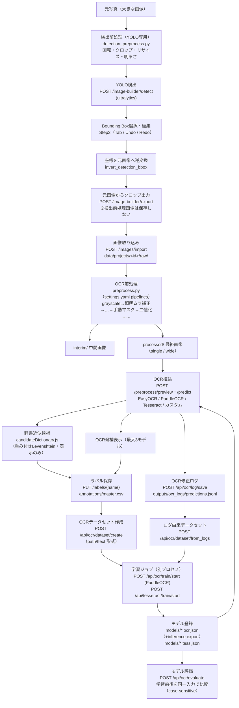
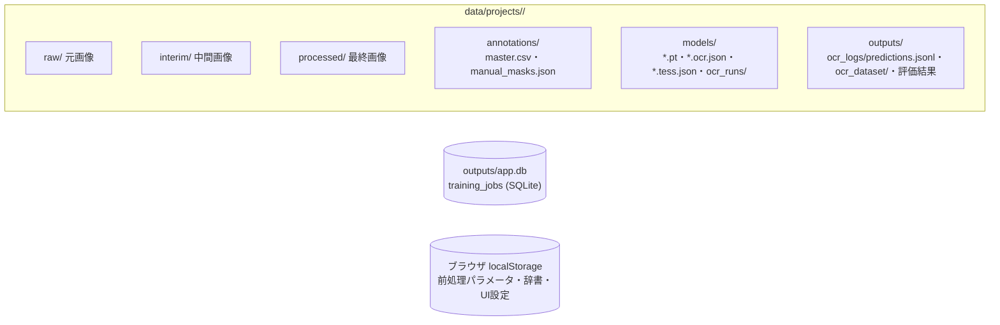

# 17. データフロー全体図

画像の入力から学習・評価までの一連の流れを1枚で示す。根拠は `src/app/main.py` の各エンドポイントと `src/app/services/` の実装。

## 全体フロー

## 補足（フロー上の重要な不変条件）

| 箇所 | 不変条件 | 根拠 |
|---|---|---|
| 検出前処理 → クロップ | クロップは**必ず元画像から**。検出前処理画像を学習画像として保存しない | `training_image_builder.py`（`export_selected_crops`）、`docs/15_CHANGELOG_AI.md` |
| YOLOモデル解決 | **取得元別に独立解決**（暗黙フォールバック禁止）: path=明示実在パス / project=`data/projects/<id>/models/yolo/` / common=`models/yolo/` / builtin=`models/yolo/builtin/`（旧自動DLのリポジトリ直下も取得済みとして互換認識）。`model_source`未指定時のみ後方互換の従来順（path→project→common→取得済みbuiltin）。**検出API実行中は自動ダウンロードしない**（未取得標準モデル=409）。標準モデルの取得は専用API `POST /image-builder/yolo-models/builtin/download`（許可リスト制）のみ | `training_image_builder.py`（`resolve_yolo_model` / `resolve_project_yolo_model` / `resolve_common_yolo_model` / `resolve_builtin_yolo_model` / `download_builtin_yolo_model`） |
| Step間の選択画像保持 | 選択画像（file/プレビューURL/サイズ）・検出結果はビュー全体のstateで保持し、Step移動では解除しない（App側ErrorBoundaryのkeyをStep1〜4で共通化）。クリア条件: 別画像選択=旧検出結果もクリア / プロジェクト切替=全クリア / Step移動=維持 | `App.jsx`（`viewBoundaryKey`）、`TrainingImageBuilderView.jsx` |
| 画像の向き（EXIF） | **読込時に1回だけ** `ImageOps.exif_transpose` でEXIF Orientationを反映し、以降のStep1〜4・YOLO検出・クロップはすべて同じ向きのピクセルを使用（途中で再解釈しない）。ブラウザの``はEXIFを自動適用するため、サーバー側で反映しないとStep1（ブラウザ表示）とStep2以降（サーバー生成画像）で90°ずれる。検出前処理の回転はユーザーが意図して行う別機能で、EXIF反映後の画像を基準に回転する | `training_image_builder.py`（`_decode_image_bytes`） |
| 検出実行スナップショット | 検出成功時に model_name / model_source / resolved_model / inference_time_ms / total_time_ms / preprocess_applied / detected_count / inference_count / series_filtered_count / selected_series をフロントstateへ保持し、Step2結果サマリーとStep3「検出モデル」「検出Series」表示に使用（現在の設定値ではなく検出時点の値） | `TrainingImageBuilderView.jsx`（`detectRunInfo`） |
| 検出対象Series | 「モデルclass一覧取得（/yolo-models/classes・キャッシュあり）→ Step2で複数選択（初期=全選択・モデル変更で入れ替え）→ detectへ series_json 送信 → 推論後にclass名で絞り込み→ID振り直し→重複統合」。Step3には選択SeriesのBBoxのみが渡る。未指定=従来動作（全class対象） | `training_image_builder.py`（`get_yolo_model_classes` / `detect_bboxes_with_yolo(series=...)`） |
| 評価用データ作成（Step5） | 「Step4出力時にマニフェスト保存（`image_builder_exports/<export_id>/manifest.json`=元画像・BBox・Series・sha256の確定情報）→ Step5が候補として読込 → ラベル・回転・評価対象を `evaluation/editing_state.json` へ途中保存 → 作成時に `evaluation/<dataset_id>/` へ画像コピー＋回転焼き込み（0/90/180/270。Step4学習画像は不変）＋ground_truth.csv（filename,label・utf-8-sig・csv.writer・case-sensitive）＋metadata.json」。CSVは既存モデル評価（`ocr_evaluation._read_gt_csv`）互換で、image_dir/gt_csv へそのまま指定可能 | `evaluation_dataset.py` / `training_image_builder.py`（`export_selected_crops`） |
| Step5のOCR候補 | 「Step4元画像クロップ（EXIF反映済み）→ Step5のユーザー回転（サーバー側適用）→ OCR前処理（既存 `_process_image` を `preview_preprocess_image` で共通利用・手動マスクなし）→ OCR推論（既存 `_attach_preview_prediction`=predict_from_image。小文字制御・whitelist・Confidence正規化も共通）」。回転前の画像はOCRへ渡さない。ラベル編集UI部品（入力欄・候補行・辞書候補・ソフトキーボード・ショートカット）は `components/labeling/` の共通部品を既存ラベル編集と共用し、保存先だけコールバックで差し替え（既存=master.csv系API / Step5=評価用editing_state） | `preprocess.py` / `main.py`（`/api/ocr/preview-file`） |
| 評価データセット→モデル評価 | 「`GET /api/evaluation/datasets` でmetadata.json由来の一覧取得 → モデル評価画面で選択（image_dir/gt_csvを自動反映・手動パス入力は詳細設定へ折り畳み）→ 選択時に学習データ重複チェック（`outputs/ocr_dataset/*/{train,val,test}` のsha256 → マニフェスト逆引きで元画像+BBoxID → ファイル名の優先順位。回転焼き込み後の画像も元画像+BBoxIDで検出）→ 評価実行で結果にdataset_id/名前/枚数/作成日時を紐付け → 履歴はlocalStorage `ocr_model_eval_history_by_project_v1`（モデル×データセットの2軸）」。削除は `safe_rmtree`（`evaluation/` 配下のみ）・名前変更はディレクトリ改名+metadata更新（CSV・画像参照は相対のため不変） | `evaluation_dataset.py`（`list_evaluation_datasets` / `check_training_overlap` / `delete_evaluation_dataset` / `rename_evaluation_dataset`）、`OcrEvaluationView.jsx` |
| 検出前処理 / OCR前処理 | 完全に独立（モジュール・設定・保存が別） | `detection_preprocess.py` / `preprocess.py` |
| OCR前処理 | 元画像（raw/）は変更しない。手動マスク・照明補正は派生画像にのみ作用 | `preprocess.py`, `manual_mask.py` |
| 辞書候補 | 表示のみ。OCRエンジンの学習・推論内部へ注入しない | `candidateDictionary.js` |
| ラベル | `master.csv` が唯一の正解。評価でGTを大文字化しない（case-sensitive） | `labels.py`, `ocr_evaluation.py` |
| 学習ジョブ | APIプロセスと分離（`job_runner.py` をPopen）。状態は SQLite `training_jobs` | `main.py`, `db.py` |
| 推論モデル | export済み（inference）モデルのみ使用可（`STRICT_OCR_EXPORT_REQUIRED=True`） | `predict.py` |

## 永続化ポイント一覧

- どの矢印がどのAPIかは `docs/06_API_REFERENCE.md`、ファイル形式は `docs/07_DATABASE.md` を参照。
