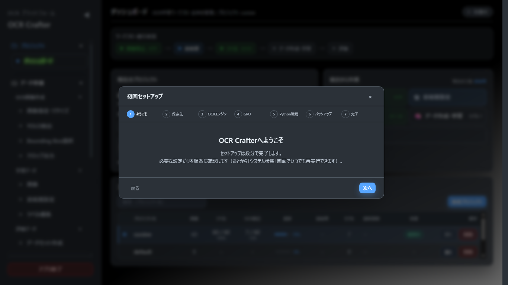
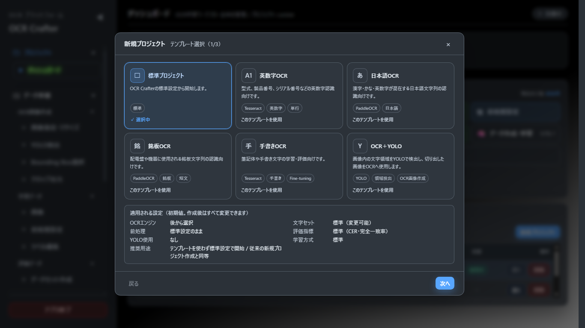

# クイックスタート（10〜15分）

初めてOCR Crafterを使う方向けに、最初のプロジェクト作成から評価・レポート生成までの基本フローを最短で体験する手順です。
環境構築がまだの場合は先に [INSTALLATION_GUIDE.md](INSTALLATION_GUIDE.md) を実施してください。

> 画面の詳しい説明は [USER_GUIDE.md](USER_GUIDE.md)、用語は [GLOSSARY.md](GLOSSARY.md) を参照してください。

## 1. 起動

```powershell
# バックエンド（リポジトリルートで）
.\.venv\Scripts\Activate.ps1
uvicorn src.app.main:app --port 8000

# フロントエンド（別ターミナルで）
cd frontend
npm run dev
```

- ブラウザで `http://localhost:5173` を開く
- **完了条件**: 画面左に「OCR Crafter」のサイドバーが表示される
- **注意**: 表示されない場合は [TROUBLESHOOTING.md](TROUBLESHOOTING.md#起動) を参照

## 2. 初回セットアップウィザード

初めて開くと**初回セットアップウィザード**（7ステップ）が自動表示されます。



- 「次へ」で進む: ようこそ → 保存先 → OCRエンジン → GPU → Python環境 → バックアップ → 完了
- OCRエンジンやGPUが未導入でも続行できます（あとから導入可能）
- **完了条件**: 完了画面まで進み「完了」を押す（次回以降は表示されません）
- **注意**: 途中で右上「×」で中断すると次回起動時に再表示されます。再実行は「運用 > システム状態」の「セットアップを再実行」

## 3. 新規プロジェクト作成

- **場所**: サイドバー「プロジェクト > ダッシュボード」右上の「新規プロジェクト」
- **完了条件**: テンプレート選択画面（1/3）が開く

## 4. プロジェクトテンプレート選択



1. 用途に合うテンプレートを選ぶ（標準プロジェクト / 英数字OCR / 日本語OCR / 銘板OCR / 手書きOCR / OCR＋YOLO の6種）
2. 「次へ」→ プロジェクト名を入力 → 設定内容を確認 → 「作成」
- **完了条件**: ダッシュボードの「現在のプロジェクト」に作成したプロジェクトが表示される
- **注意**: テンプレートは初期値を設定するだけで、作成後にすべて変更できます

## 5. OCR画像作成（元画像から文字領域を切り出す場合）

撮影画像から文字領域を切り出す工程です。**すでに文字領域だけの画像がある場合はこの工程を飛ばして手順6へ**進んでください。

- **場所**: サイドバー「データ準備 > OCR画像作成」
- 手順: 「画像指定・リサイズ」で元画像を指定 → 「YOLO検出」で文字領域を検出 → 「Bounding Box選択」で採用領域を選ぶ → 「クロップ出力」で切り出し
- **完了条件**: クロップ出力で切り出し画像が生成される
- **注意**: YOLO検出には学習済みYOLOモデルが必要です（未導入なら手動で画像を用意して手順6へ）

## 6. 学習データ作成

- **場所**: サイドバー「データ準備 > 学習データ」
1. 「画像」画面: 「画像取込」でフォルダを選択して取り込み（取り込み後に前処理が自動実行されます）
2. 「前処理設定」画面: プレビューで二値化などを確認・調整（初回は既定のままでも可）
3. 「ラベル編集」画面: 各画像の正解文字列を入力して保存
- **完了条件**: ダッシュボードのワークフロー進行状況で「ラベル」が全件になる
- **注意**: ラベルは大文字・小文字を実物どおりに入力します（評価は大文字・小文字を区別します）

## 7. 評価データセット作成

学習データとは別に、精度確認用の評価データを用意します。

- **場所**: サイドバー「データ準備 > 評価データ > データセット作成」
- 評価用の画像と正解CSV（`filename,text` 形式）を準備・作成します
- **完了条件**: 評価データセットが保存され、モデル評価画面で選択できる
- **注意**: 学習に使った画像を評価に使うと精度が過大評価されます（重複チェック機能あり）

## 8. 学習開始

- **場所**: サイドバー「OCRモデル > データ作成・学習」
1. 学習方式 `ocr`、OCRタイプ（`Tesseract` または `PaddleOCR`）を選択
2. 「OCRデータ作成」を実行（ラベル済み画像から学習用データセットを生成）
3. 学習パラメータを確認して「OCR学習開始」
- **完了条件**: 学習ログが `completed` になり、「OCRモデル > モデル管理」へモデルが追加される（管理No: M0001形式）
- **注意**: Tesseract学習は学習ツール（lstmtraining等）の導入が必要です（[INSTALLATION_GUIDE.md](INSTALLATION_GUIDE.md)）

## 9. 評価

- **場所**: サイドバー「OCRモデル > モデル評価」
- 評価データセットとモデルを選んで評価を実行。主指標は **CER**（文字誤り率。低いほど良い）
- **完了条件**: CER・文字正解率・完全一致率・誤認識一覧が表示される
- **次**: 評価結果は実験カルテ（実験管理）とモデルカルテへ自動記録されます

## 10. モデル比較

- **場所**: サイドバー「OCRモデル > モデル管理」（最大3件の比較）/「OCRモデル > 実験管理」（実験条件の比較）
- 複数モデルの性能サマリー・学習条件・条件差分を並べて確認します
- **注意**: 評価条件（Evaluation Hash）が異なるモデルのCERは直接比較できません（画面に警告が表示されます）

## 11. レポート生成

- **場所**: サイドバー「運用 > レポート」
1. 種別「単一モデル」・対象モデル・形式（Markdown/PDF）を選び「レポートを生成」
2. 生成はバックグラウンドJobで実行（進捗は「運用 > ジョブ管理」）
3. 完了後、履歴からダウンロード
- **完了条件**: レポート履歴に RPT-0001 形式のIDで追加され、ダウンロードできる

## 12. 終了時の確認

- 実行中のJobがないことを「運用 > ジョブ管理」で確認（実行中に停止した場合も、再起動後に「中断（再起動）」から再実行できます）
- サイドバー下部の「アプリ終了」でフロントエンド・バックエンドを終了できます
- 定期的なバックアップを推奨します（[BACKUP_AND_RESTORE.md](BACKUP_AND_RESTORE.md)）

---

次のステップ: 各画面の詳しい使い方は [USER_GUIDE.md](USER_GUIDE.md) を参照してください。
