# OCR Crafter ユーザーガイド（v1.0.0）

OCR Crafterの利用者向け正式マニュアルです。環境構築は [INSTALLATION_GUIDE.md](INSTALLATION_GUIDE.md)、最短の体験は [QUICK_START.md](QUICK_START.md) を参照してください。
各画面のUI仕様（項目・状態の完全な定義）は [16_SCREEN_SPEC.md](16_SCREEN_SPEC.md)、APIは [06_API_REFERENCE.md](06_API_REFERENCE.md) にあります。

## 目次

1. [OCR Crafter概要](#1-ocr-crafter概要)
2. [画面構成](#2-画面構成)
3. [初回セットアップ](#3-初回セットアップ)
4. [プロジェクト管理](#4-プロジェクト管理)
5. [プロジェクトテンプレート](#5-プロジェクトテンプレート)
6. [OCR画像作成](#6-ocr画像作成)
7. [学習データ作成](#7-学習データ作成)
8. [評価データセット作成](#8-評価データセット作成)
9. [OCR学習](#9-ocr学習)
10. [モデル評価](#10-モデル評価)
11. [モデル比較](#11-モデル比較)
12. [実験管理](#12-実験管理)
13. [Benchmark](#13-benchmark)
14. [モデル管理](#14-モデル管理)
15. [リリース管理](#15-リリース管理)
16. [レポート](#16-レポート)
17. [ジョブ管理](#17-ジョブ管理)
18. [バックアップ](#18-バックアップ)
19. [監査ログ](#19-監査ログ)
20. [システム状態](#20-システム状態)
21. [用語](#21-用語)
- [付録A: 推論・OCR修正・バッチ推論](#付録a-推論ocr修正バッチ推論)
- [付録B: 生成物の保存先](#付録b-生成物の保存先)
- [付録C: CLI](#付録c-cli)

---

## 1. OCR Crafter概要

ローカル環境で完結する**OCRモデル開発プラットフォーム**です。以下を1つのWeb UIで行います。

- 画像の取り込み → 前処理 → ラベル付け → データセット作成 → 学習 → 評価 → 推論・修正
- モデル管理（管理No・カルテ・比較）、実験管理、リリース管理（Production昇格）、Benchmark、レポート生成
- 運用機能（ジョブ管理・監査ログ・バックアップ・システム状態）

対応OCRエンジン:

| エンジン | 学習 | 推論 | 備考 |
|---|---|---|---|
| Tesseract | ○（LSTM fine-tune） | ○ | 既定の学習対象文字 `A-Z0-9klt`（[12_TESSERACT_CHARSET_SPEC.md](12_TESSERACT_CHARSET_SPEC.md)） |
| PaddleOCR | ○（認識モデル） | ○ | `external/PaddleOCR` リポジトリを使用 |
| EasyOCR | ×（推論のみ） | ○ | |
| custom（分類モデル） | ○（実験機能） | ○ | 文字分割ベースの分類学習 |

データはすべてプロジェクト単位（`data/projects/<project_id>/`）で分離管理され、**外部Webサービスへ送信されません**（[SECURITY_AND_DATA_HANDLING.md](SECURITY_AND_DATA_HANDLING.md)）。

## 2. 画面構成

サイドバーはOCRモデル開発の作業工程順に並んでいます。上から順に進めるとモデルが完成します。

```text
プロジェクト     … ダッシュボード
データ準備       … OCR画像作成（画像指定・リサイズ / YOLO検出 / Bounding Box選択 / クロップ出力）
                   / 学習データ（画像 / 前処理設定 / ラベル編集）
                   / 評価データ（データセット作成）   ※3つの折りたたみグループ
OCRモデル        … データ作成・学習 / モデル管理 / 実験管理 / リリース管理 / モデル評価
                   / 推論 / OCR修正 / バッチ推論
運用             … ジョブ管理 / Benchmark / レポート / 監査ログ / システム状態
実験機能         … 分類学習 / 分類モデル管理 / 分類推論 / 分類評価
```

- サイドバー左上の「◀」で折りたたみできます（状態はブラウザに保存）
- 画面右上のステータスバッジは処理の実行状態を表します
- 専門用語のそばの「?」アイコン（ツールチップ）で用語説明を確認できます

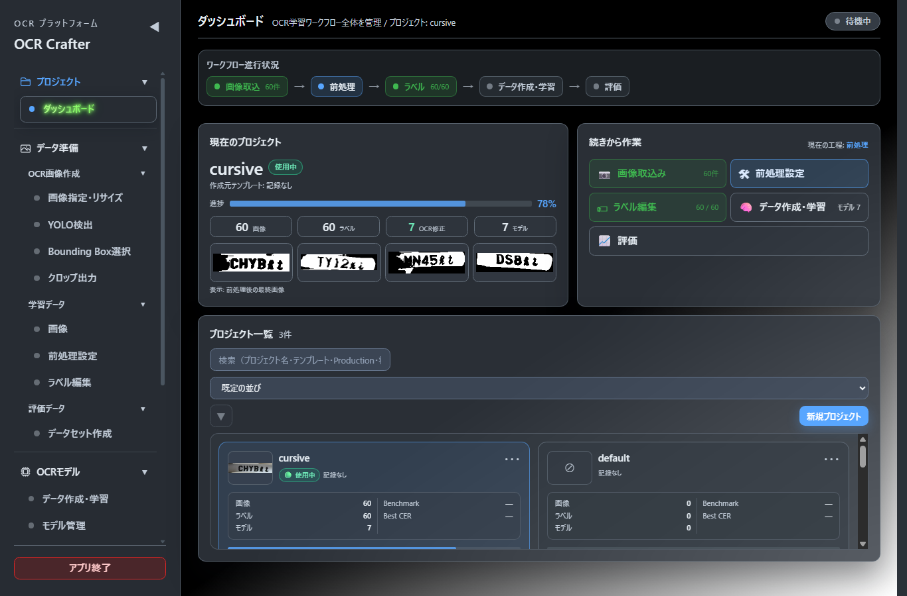

## 3. 初回セットアップ

初めてブラウザで開くと**初回セットアップウィザード**（7ステップ）が自動表示されます。

1. ようこそ → 2. プロジェクト保存先（書き込み確認） → 3. OCRエンジン確認（Tesseract/PaddleOCR。未導入でも続行可） → 4. GPU確認（CPUでも実行可） → 5. Python環境確認 → 6. バックアップ推奨設定（metadata=毎日 / full=毎週） → 7. 完了

- 完了するとブラウザ（localStorage）へ記録され、次回以降は表示されません
- 右上「×」で中断できます（確認あり。次回起動時に再表示）。**Escキーでは閉じません**
- 再実行: 「運用 > システム状態」の「セットアップを再実行」

## 4. プロジェクト管理

**画面**: プロジェクト > ダッシュボード

- **目的**: プロジェクトの作成・切替・削除、進行状況の確認
- **表示**: ワークフロー進行状況（画像取込→前処理→ラベル→データ作成・学習→評価）、現在のプロジェクト（統計・作成元テンプレート）、続きから作業（次工程へのショートカット）、プロジェクト一覧（検索つき）
- **ボタン**: 「新規プロジェクト」（テンプレート選択モーダル）/ 一覧の「開く」「削除」
- **注意**:
  - 削除は取り消せません。**プロジェクト名の入力一致**を求める確認ダイアログが表示されます
  - データは `data/projects/<project_id>/` に保存されます。削除前のバックアップを推奨します（[BACKUP_AND_RESTORE.md](BACKUP_AND_RESTORE.md)）

## 5. プロジェクトテンプレート

新規プロジェクト作成時に用途別テンプレートを選択できます（6種）。

| テンプレート | 用途 |
|---|---|
| 標準プロジェクト | 標準設定で開始（従来の新規作成と同等） |
| 英数字OCR | 型式・製品番号・シリアル番号などの英数字認識 |
| 日本語OCR | 漢字・かな・英数字が混在する日本語文字列 |
| 銘板OCR | 配電盤や機器の銘板文字列 |
| 手書きOCR | 筆記体や手書き文字（Fine-tuning前提） |
| OCR＋YOLO | 文字領域をYOLOで検出して切り出す運用 |

- テンプレートは**初期値を設定するだけ**で、作成後にすべての設定を変更できます（固定されません）
- 作成元テンプレートはダッシュボードの「現在のプロジェクト」で確認できます（記録はブラウザ単位。既存プロジェクトや別ブラウザでは「記録なし」表示）

## 6. OCR画像作成

**画面**: データ準備 > OCR画像作成（4ステップ）

- **目的**: 撮影した元画像から、OCR対象の文字領域画像を切り出す
- **利用タイミング**: 元画像に文字以外が写っている場合（文字領域だけの画像が既にあるならこの工程は不要）

| ステップ | 操作 | 完了条件 |
|---|---|---|
| 画像指定・リサイズ | 元画像を指定し、必要ならリサイズ | プレビュー表示 |
| YOLO検出 | 使用するYOLOモデルを選び「検出」 | 検出結果（件数・使用モデル・処理時間）が表示される |
| Bounding Box選択 | 検出領域の一覧右端のチェックで有効/無効を切替。**編集モードON**で移動・サイズ変更・追加・削除 | 採用する領域が確定 |
| クロップ出力 | 切り出しを実行 | 出力画像が生成される |

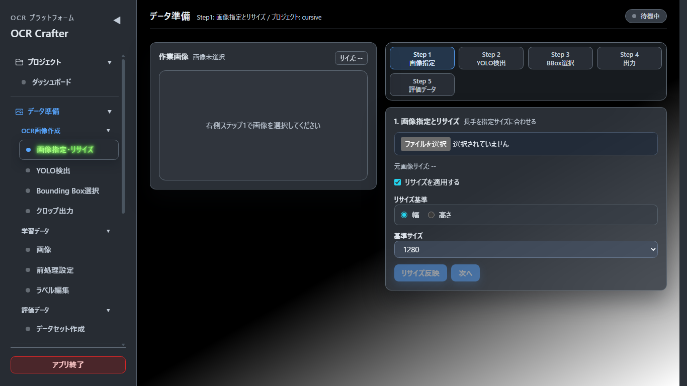

- **エラー時**: YOLOモデルが見つからない場合は明示エラーになります（モデルは `data/projects/<id>/models/yolo/` または共通 `models/yolo/` へ配置）。検出0件は「正常終了」と表示されます（エラーではありません）
- **注意**: 検出用の前処理（検出前処理）は**検出専用**で、学習画像はかならず元画像から切り出されます

## 7. 学習データ作成

**画面**: データ準備 > 学習データ（画像 / 前処理設定 / ラベル編集）

### 7.1 画像

- **目的**: 学習画像の取り込み・確認・回転
- **操作**: 「画像取込」でフォルダを選択 → `raw/` へコピー後、前処理パイプラインが自動実行
- **ボタン**: 回転（90°単位。対象画像のみ再前処理）、サムネイル一覧、検索・未ラベルフィルタ
- **注意**: 元画像（`raw/`）は前処理で変更されません（回転操作のみ例外）

### 7.2 前処理設定

- **目的**: 二値化・照明ムラ補正・手動マスク補正など多段パイプラインの調整
- **操作**: リアルタイムプレビューで結果を確認 → 「前処理実行」で全画像へ適用
- **表示**: プレビューは処理後画像とOCR推論結果を並べて確認可能。プリセット保存に対応

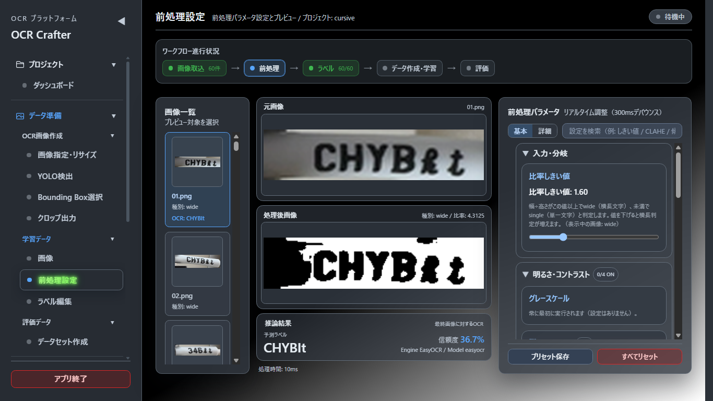

- **完了条件**: 前処理実行が完了し `processed/` が更新される（実行時点の設定はスナップショットとして保存され、データセット作成時に確定記録されます）
- **注意**: 実行前に確認ダイアログで設定要約が表示されます。同一設定ならプレビューと実行結果は画素単位で一致します

### 7.3 ラベル編集

- **目的**: 各画像の正解文字列（Ground Truth）の入力
- **操作**: 画像を見ながらラベルを入力して保存。OCR候補・辞書近似候補のクリック採用、未編集フィルタあり

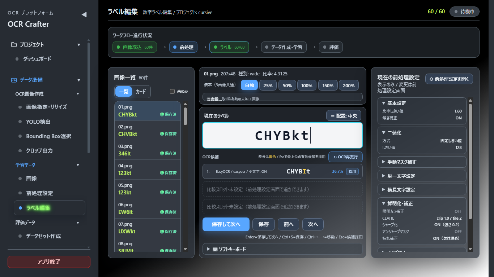

- **注意**: **大文字・小文字は実物どおり**入力してください（例: `CHYBkt`）。評価はcase-sensitive完全一致で行われ、勝手に大文字化されません

## 8. 評価データセット作成

**画面**: データ準備 > 評価データ > データセット作成

- **目的**: 学習データから独立した評価専用データセットの作成・編集
- **理由**: 学習に使った画像で評価すると精度が過大評価されるため、評価データは分離します（学習データ重複チェック機能あり）
- **正解CSVの形式**（モデル評価で使用）:

```csv
filename,text
sample_001.png,CHYBkt
sample_002.png,TY12lt
```

- `filename` は評価用画像フォルダ内のファイル名と一致させる（拡張子含む）
- `text` は実運用の表記どおり（case-sensitive。`KT` と `kt` は別物として評価）
- ヘッダ行あり推奨・UTF-8推奨

## 9. OCR学習

**画面**: OCRモデル > データ作成・学習

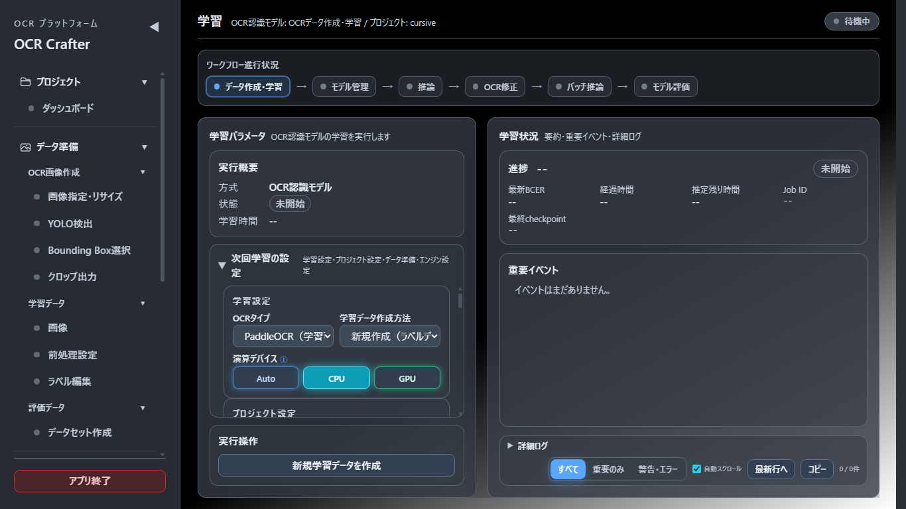

### 9.1 OCRデータ作成

1. 学習方式 `ocr`、OCRタイプ（`Tesseract` / `PaddleOCR`）を選択
2. `charset`（学習対象文字セット）、`max_text_length`、`image_shape` を確認
3. 必要に応じてオーグメンテーション（コントラスト変化・軽微ブラー・ノイズ・微小回転。強度1〜3）を設定。「Augプレビュー」で事前確認可能
4. 「OCRデータ作成」を実行（分割予定枚数のプレビューあり）

- **注意**:
  - charset外の文字を含むラベルは**サンプルごと除外**され、skippedとして集計されます（文字削除はされません）
  - Tesseract選択時はラベルの大小文字を保持します（`text_case=keep`）
  - オーグメンテーションはTrainのみに適用され、元画像は必ず残ります
  - 「ログ再学習データ作成」でOCR修正ログから再学習用データセットも作成できます

### 9.2 次回学習の設定

学習画面左の「次回学習の設定」はカテゴリサマリー表示です。各行の「編集」で設定モーダル（4タブ: データ分割 / オーグメンテーション / 学習パラメータ / エンジン設定）が開きます。**ここで変更した設定は次回の学習から適用され、完了済みの学習結果には影響しません。**

- **データ分割**: Train/Val/Test比率（0.05刻み・Testは自動計算）、Split Seed、「分割枚数を確認」
- **オーグメンテーション**: 適用モード（なし/弱い/カスタム）・生成倍率・3カテゴリ（幾何変換/明るさ・コントラスト/ノイズ・ぼかし）5項目の個別設定（チェック・確率%・範囲±°/±%・強度）。「推奨設定を適用」（確認つき）・「設定をリセット」・右側プレビュー（サンプル数選択・「プレビューを再生成」）・下部の設定サマリー（適用項目数/平均適用確率/生成倍率/推定追加枚数）。無効にした項目の値は保持され、再度ONにすると直前の値へ戻ります
- **学習パラメータ**: OCRタイプ・学習回数（Tesseractは最大イテレーション）・演算デバイス・出力先
- **エンジン設定**: エンジン固有の設定（Tesseract: charset・実験情報等 / PaddleOCR: 初期重み・実行プロファイル等）

### 9.3 学習実行

| エンジン | 主なパラメータ | 補足 |
|---|---|---|
| Tesseract | 最大イテレーション・charset・PSM・ベースモデル（eng.traineddata） | LSTM fine-tune。学習ツール（lstmtraining等）の導入が必要。EpochやBatch Sizeは使用しません |
| PaddleOCR | エポック数・バッチサイズ・device（auto/cpu/gpu）・ワーカー数・AMP | `Mac Safe` / `RTX Train` プリセットあり。GPU検出時は自動最適化、OOM時はbatch半減で1回自動リトライ |

- 実験名・親モデル・学習メモを指定すると実験カルテ（実験管理）へ記録されます
- **完了条件**: 学習ログが `completed` になり、モデル管理へ追加される（PaddleOCRは推論用モデルの自動export込み）
- **エラー時**: 学習は非同期Jobです。失敗時は「運用 > ジョブ管理」のエラー要約と学習ログを確認してください。同一プロジェクトでのOCR学習の二重実行は409エラーで拒否されます
- **注意**: 学習中にBackendを再起動した場合、Jobは「中断（再起動）」となり再実行できます

## 10. モデル評価

**画面**: OCRモデル > モデル評価

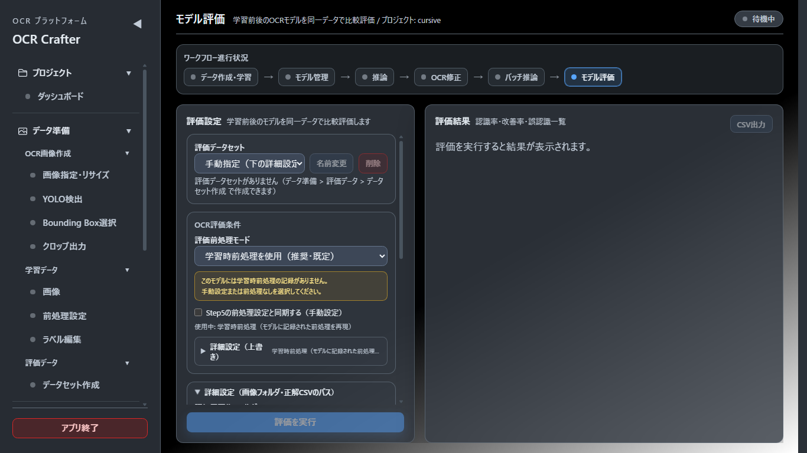

- **目的**: 学習前後のモデルを同一データで評価し、改善を数値で確認する
- **入力**: 評価データセット（画像フォルダ＋正解CSV）、学習前モデル（例: `eng.traineddata`）と学習後モデル、Whitelist（既定 `A-Z0-9klt`。「なし」「カスタム」へ変更可）
- **主指標**: **CER**（文字誤り率。全画像の編集距離総和÷正解文字数総和のマイクロ平均。低いほど良い）
- **補助指標**: 文字正解率（1−CER）/ 完全一致率 / 誤認識数 / CER差・相対改善率 / 改善・同等・悪化件数 / 混同TOP（置換・脱落・挿入）
- **結果の記録**: 評価条件は **Evaluation Profile** として実験カルテへ保存され、**Evaluation Hash**（評価条件のハッシュ）が生成されます。同一Hash=同一条件評価であり、比較の妥当性判定に使われます
- **CSV出力**: 明細（画像×モデル）・モデル別サマリ・混同集計の3セクション
- **エラー時の案内**:

| 症状 | 対処 |
|---|---|
| Tesseract本体が未導入 | Tesseractを導入し `tesseract.tesseract_cmd` またはPATHを設定 |
| eng.traineddataが無い | tessdata_bestを配置し `tessdata_dir` を指定 |
| 正解CSVが不正 | 形式（`filename,text`）とパスを確認 |
| 画像未検出N件 | CSVの `filename` と画像フォルダ内ファイル名の一致を確認 |

## 11. モデル比較

**画面**: OCRモデル > モデル管理（モデル比較）

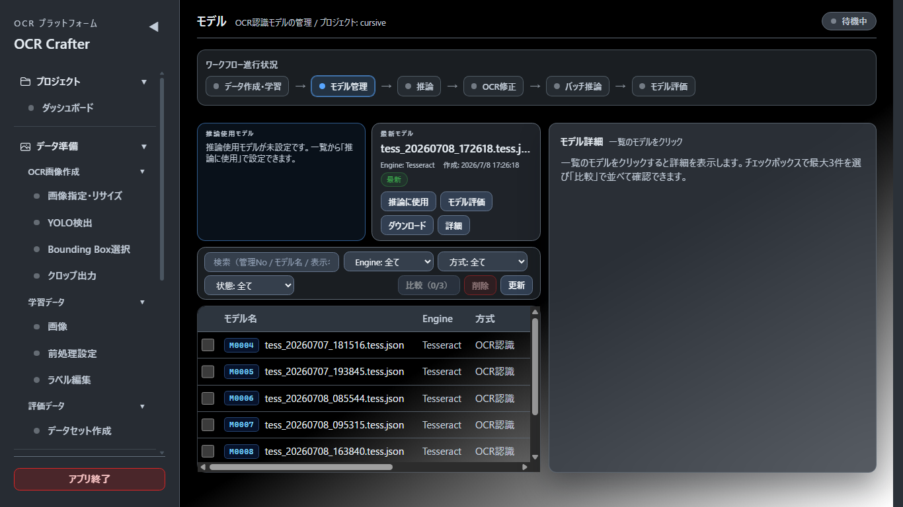

- **目的**: 最大3件のモデルを並べて性能・条件を比較する
- **表示**: 性能サマリー / 学習条件比較 / 条件差分（違いの強調表示）/ 次回学習の提案
- **評価条件再現**: モデルカルテの評価履歴から評価条件（データセット・前処理・Whitelist）を確認し、同条件で再評価できます
- **注意**: **Evaluation Hashが異なるモデルのCERは直接比較できません**。「⚠比較条件が異なります」の警告と**比較品質（★1〜5）**が表示されます（★5=完全一致条件、★1=比較不可）。比較自体は禁止されませんが、数値差の解釈には注意してください

## 12. 実験管理

**画面**: OCRモデル > 実験管理

- **目的**: 学習実行ごとの条件・結果を実験カルテ（EXP-0001形式）として記録し、条件と精度の関係を分析する
- **表示**: 実験一覧（タグ・★・フィルタ・CSV出力）、Experiment比較（条件差分の強調）、CER推移グラフ、簡易相関・ベスト条件・条件推薦
- **Evaluation Profile / Evaluation Hash**: 評価実行時に評価条件（データセット・画像数・評価前処理・エンジン・PSM・Whitelist・文字正規化・CER算出方式）がProfileとして保存され、そのハッシュがEvaluation Hashです
- **Comparable Group**: 同一Evaluation Hashの実験をまとめたグループ（CG-0001形式）。**同一グループ内の実験だけがCERを直接比較できます**
- **Scientific Mode**: ON（既定）=比較可能な実験のみを分析対象にする / OFF=全実験を対象（混在の参考値であることが明示されます）。設定はプロジェクト別にブラウザへ保存
- **推薦の安全性**: 条件推薦は最大のComparable Groupを根拠に生成され、「この推薦はN件の比較可能Experimentから生成されています。」と根拠件数を必ず表示します。5件未満は「参考値（データ不足）」
- **注意**: 相関分析は因果関係を示すものではありません。失敗実験やデバッグ実験は「分析対象OFF」で分析から除外できます

## 13. Benchmark

**画面**: 運用 > Benchmark

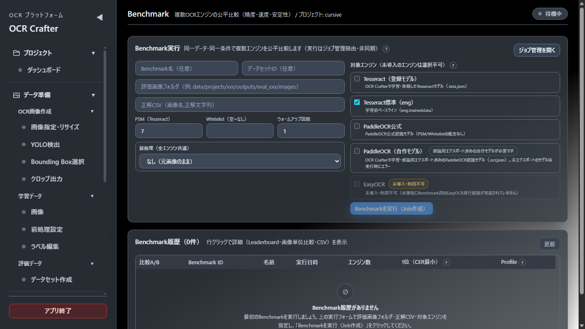

- **目的**: 複数OCRエンジン（Tesseract / PaddleOCR / EasyOCR / 学習済みモデル）を**同一条件で公平比較**する
- **モデル評価との違い**: モデル評価は「1つのモデルの精度測定と学習前後の比較」、Benchmarkは「複数エンジン間の横並び比較（速度・メモリ含む）」です
- **表示**: Leaderboard（BM-0001形式）、用途別ベスト＋バランススコア、画像単位の結果比較、cold start（初回読み込み）と推論時間の分離、P50/P95、Peak Memory、CSV出力3種
- **前処理**: 前処理条件（なし/手動設定/プロジェクト設定等の4モード）を明示して実行します。条件はProfile Hashとして記録され、同一Hash同士のみ直接比較できます
- **完了条件**: Jobが完了しLeaderboardに結果が表示される
- **注意**: 結果はレポートの「誤認識分析（代表失敗例）」の情報源にもなります

## 14. モデル管理

**画面**: OCRモデル > モデル管理

- **目的**: 学習済みモデルの一覧・カルテ・削除・ダウンロード
- **管理No**: M0001形式。全プロジェクト横断で一意、削除後も再利用されません
- **モデルカルテ**: 学習条件・実験リンク・評価履歴・リリースStatus（＋Version）を表示
- **ダウンロード**: `.pt`=そのまま / `.ocr.json`（PaddleOCR）=inference ZIP / `.tess.json`（Tesseract）=`.traineddata`
- **削除**: 確認ダイアログで対象一覧＋**「DELETE」の入力**が必要です。削除は `models/` 配下に限定される安全ガードつき
- **注意**: Productionモデルの削除は運用に影響します。リリース管理の状態を確認してから操作してください

## 15. リリース管理

**画面**: OCRモデル > リリース管理

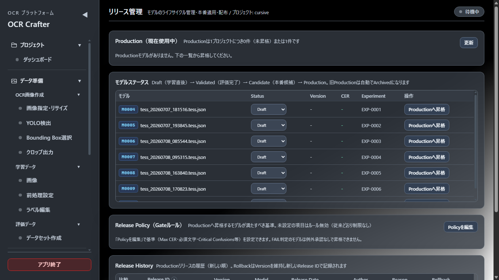

- **目的**: モデルのライフサイクル管理と本番モデルの決定
- **ステータス**: `Draft`（学習直後）→ `Validated`（評価完了で自動遷移）→ `Candidate`（本番候補）→ `Production`（本番使用中）→ `Archived`（旧モデル）
- **Production は常に0件または1件**です。新しいモデルの昇格時に旧Productionは自動でArchivedになります
- **昇格フロー**: Candidate → Release Note入力（必須）→ **Release Gate判定** → 昇格
  - Gate判定は Release Policy（Max CER・必須文字・Critical Confusions等の最大12項目）に基づく自動判定: `PASS` / `CONDITIONAL_PASS` / `FAIL` / `NOT_EVALUATED`
  - **FAIL判定のモデルは、Override Reason＋Approved By（承認者）が揃った場合のみ昇格可能**（Override履歴が監査ログへ記録されます）
- **Release ID / Version**: Release ID（REL-0001形式）は「リリース行為」の識別子、Versionは「配布物の版」（Candidate=0.x、Production初回=1.0.0→マイナー加算）です
- **Rollback**: Release Historyから過去Versionのモデルを再Productionへ戻せます（Versionは維持・新しいRelease IDが発行）
- **Model Card / Deployment Package**: Productionモデルのカルテ（Markdown）自動生成と、traineddata・設定・前処理スナップショット・RELEASE_NOTE・MODEL_CARDを含むZIP Export
- 詳細仕様: [20_RELEASE_POLICY.md](20_RELEASE_POLICY.md)

## 16. レポート

**画面**: 運用 > レポート

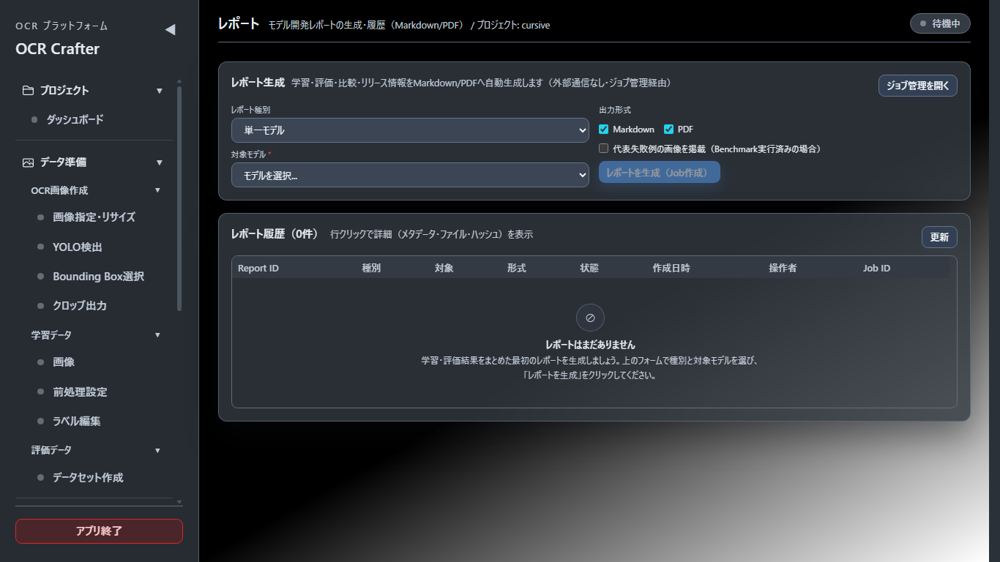

- **目的**: 学習・評価・比較・リリース情報をまとめた社内報告・引き継ぎ・監査用レポートの自動生成
- **種別**: 単一モデル / モデル比較（2件以上）/ プロジェクト総括
- **形式**: Markdown・PDF（同一Markdownから変換・内容差分なし）。PDFはローカル生成で外部送信されません
- **操作**: 種別・対象モデル・形式・画像掲載を選び「レポートを生成」→ Job完了後に履歴からダウンロード。再生成・削除（確認つき）可能
- **Report ID**: RPT-0001形式。保存先は `data/reports/<project_id>/`、各ファイルのSHA-256が記録されます
- **注意**: 記録のない項目は「記録なし」と表示されます（推測で補完されません）。総合判定・推奨事項はルールベースで、断定的な表現を避けています

## 17. ジョブ管理

**画面**: 運用 > ジョブ管理

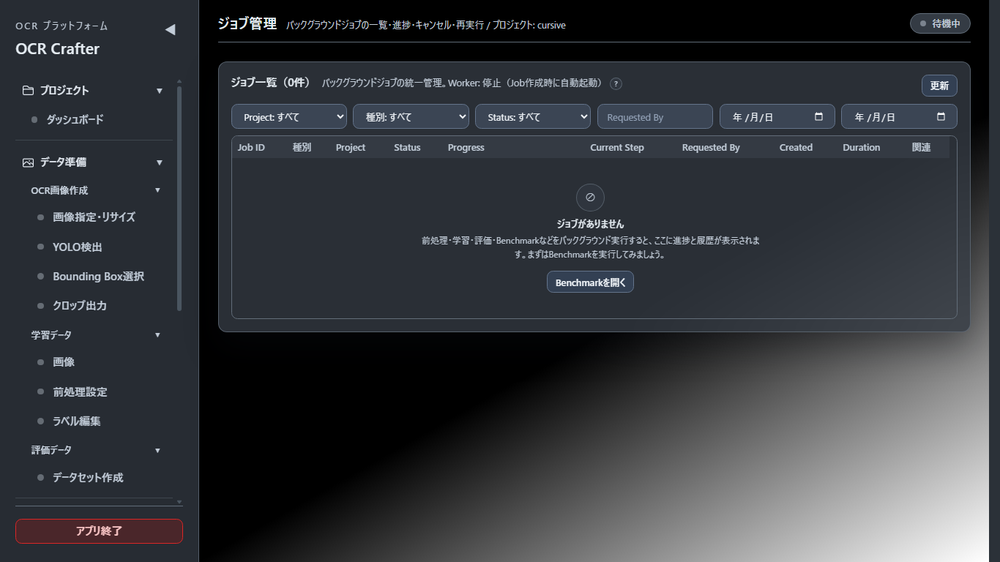

- **目的**: バックグラウンドジョブ（前処理・データセット作成・学習・評価・Benchmark・Deployment Export・レポート生成の7種）の統一管理
- **状態**: `queued`（待機）→ `running`（実行中）→ `succeeded` / `failed` / `cancelled`。再起動で中断されたものは `interrupted`（中断（再起動））
- **操作**: キャンセル（実行中は現在工程の終了後に停止）/ 再実行（failed・cancelled・interrupted）
- **表示**: Job ID（JOB-000001形式・全体一意）、進捗0-100%、イベント履歴、エラー要約、関連ID（BM-/RPT-等）
- **Worker**: Job作成時に自動起動します。「Worker: 停止」表示でもJobを作成すれば処理が始まります
- 詳細仕様: [18_JOB_MANAGEMENT.md](18_JOB_MANAGEMENT.md)

## 18. バックアップ

**画面**: 運用 > システム状態 の「バックアップ」カード

- 種別: `metadata_only`（ラベル・実験・リリース等の記録のみ）/ `full`（プロジェクト全体）
- 復元は**必ず新しいProject IDへ**行われ、既存プロジェクトを上書きしません
- 手順・推奨頻度・検証・制約は [BACKUP_AND_RESTORE.md](BACKUP_AND_RESTORE.md) を参照してください

## 19. 監査ログ

**画面**: 運用 > 監査ログ

- **目的**: 誰がいつ何をしたかの追跡（24操作を記録・追記型・削除不可）
- **表示**: AUD-000001形式のID、操作者（X-Operatorヘッダ由来）、操作種別、Before/After差分、関連ID
- **注意**: 監査ログを削除・編集する機能は存在しません（改ざん防止のための仕様です）。閲覧はどのロールでも可能です

## 20. システム状態

**画面**: 運用 > システム状態

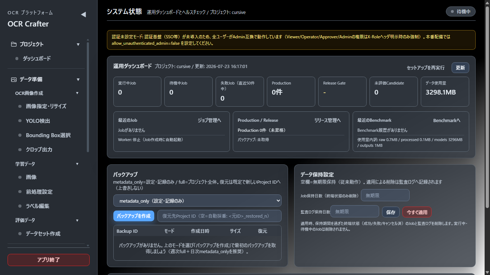

- **運用ダッシュボード**: Job状況・Productionモデル・Release Gate状態・未評価Candidate・最近のBenchmark・データ使用量・バックアップ状態
- **ヘルスチェック**: Backend / データ書き込み / 設定 / Tesseract / PaddleOCR / GPU / Job Worker / ディスク空き / プロジェクトDir（取得不能な値はnull=推測しない）
- **バックアップ / データ保持設定**: 作成・一覧・復元、Job・監査ログの保持日数（未設定=無期限）
- **セットアップを再実行**: 初回セットアップウィザードの再表示
- 詳細仕様: [21_OPERATIONS_GUIDE.md](21_OPERATIONS_GUIDE.md)

## 21. 用語

CER・Evaluation Hash・Comparable Group・Release Gate などの用語は [GLOSSARY.md](GLOSSARY.md) を参照してください。画面上の「?」アイコンでも主要用語の説明を確認できます。

---

## 付録A: 推論・OCR修正・バッチ推論

### 推論（OCRモデル > 推論）

- エンジン: custom / EasyOCR / PaddleOCR / Tesseract。学習済みモデルまたは標準モデルを選択
- YOLO検出＋OCRの複合推論に対応
- 結果には文字単位の確信度（ヒートマップ表示用）が付きます
- 補足: PaddleOCRで推論できるのはexport済みモデルのみです（学習完了時に自動export。旧モデルの一括変換は `POST /api/ocr/models/export-migrate`）

### OCR修正（OCRモデル > OCR修正）

キーボード中心の修正画面です。

1. OCR結果のヒートマップで赤/黄の文字（確信度が低い文字）をクリックして修正
2. `Enter` で確定して次へ、`Shift+Enter` で保留
3. 修正結果はOCRログへ保存され、「ログ再学習データ作成」で再学習に使えます

### バッチ推論（OCRモデル > バッチ推論）

- フォルダ一括推論。結果CSVに engine / model が記録されます（Tesseract結果は大小文字を保持）
- 業務ルール（例 `^[A-Z0-9]{8}$`・禁止パターン）で valid/invalid 判定
- 候補辞書による近似候補の提示は推論後の補助であり、OCRエンジン内部には注入されません

## 付録B: 生成物の保存先

| 生成物 | 保存先 |
|---|---|
| ラベルCSV | `data/projects/<id>/annotations/master.csv` |
| 前処理済み画像 | `data/projects/<id>/interim/` / `processed/<type>/images/` |
| OCRデータセット | `data/projects/<id>/outputs/ocr_dataset/` |
| 学習済みモデル | `data/projects/<id>/models/`（`.pt` / `.ocr.json` / `.tess.json`） |
| 評価結果 | `data/projects/<id>/outputs/metrics/` / `outputs/errors/` |
| 実験・リリース・Benchmark記録 | `data/projects/<id>/experiments.json` / `releases.json` / `benchmarks.json` |
| レポート | `data/reports/<project_id>/` |
| バックアップ | `data/backups/` |
| Job・監査ログ | `data/jobs/` / `data/audit/` |

詳細: [17_DATAFLOW.md](17_DATAFLOW.md)

## 付録C: CLI

```powershell
# 単一画像の推論
python -m src.app.predict path\to\image.png --project-id default --engine tesseract
python -m src.app.predict path\to\image.png --project-id default --engine paddleocr --easyocr-langs en

# EasyOCR / PaddleOCR チューニング用データのエクスポート（任意機能）
python -m src.app.ocr_tuning --project-id default --engine both --image-types wide `
  --train-ratio 0.8 --val-ratio 0.1 --test-ratio 0.1
```

- `ocr_tuning` の出力先: `data/projects/<id>/outputs/ocr_tuning/<timestamp>/`（EasyOCR用 `train_labels.txt` 等 / PaddleOCR用 `train.txt`・`charset.txt`・`rec_train_config.yaml`・`meta.json`）
- 追加依存が必要な場合は `pip install -r requirements-ocr-tuning.txt`
