# OCR Crafter ユーザーガイド（v1.0.0）

OCR Crafterの利用者向け正式マニュアルです。環境構築は [INSTALLATION_GUIDE.md](INSTALLATION_GUIDE.md)、最短の体験は [QUICK_START.md](QUICK_START.md) を参照してください。
各画面のUI仕様（項目・状態の完全な定義）は [16_SCREEN_SPEC.md](16_SCREEN_SPEC.md)、APIは [06_API_REFERENCE.md](06_API_REFERENCE.md) にあります。

## 目次

1. [OCR Crafter概要](#1-ocr-crafter概要)
2. [画面構成](#2-画面構成)
3. [初回セットアップ](#3-初回セットアップ)
4. [プロジェクト管理](#4-プロジェクト管理)
5. [プロジェクトテンプレート](#5-プロジェクトテンプレート)
6. [OCR画像作成](#6-ocr画像作成)
7. [学習データ作成](#7-学習データ作成)
8. [評価データセット作成](#8-評価データセット作成)
9. [OCR学習](#9-ocr学習)
10. [Dataset Manager](#10-dataset-manager)
11. [モデル評価](#11-モデル評価)
12. [モデル比較](#12-モデル比較)
13. [実験管理](#13-実験管理)
14. [Benchmark Runner](#14-benchmark-runner)
15. [Benchmark Center](#15-benchmark-center)
16. [モデル管理](#16-モデル管理)
17. [リリース管理](#17-リリース管理)
18. [レポート](#18-レポート)
19. [ジョブ管理](#19-ジョブ管理)
20. [バックアップ](#20-バックアップ)
21. [監査ログ](#21-監査ログ)
22. [システム状態](#22-システム状態)
23. [用語](#23-用語)
- [付録A: 推論・OCR修正・バッチ推論](#付録a-推論ocr修正バッチ推論)
- [付録B: 生成物の保存先](#付録b-生成物の保存先)
- [付録C: CLI](#付録c-cli)

---

## 1. OCR Crafter概要

ローカル環境で完結する**OCRモデル開発プラットフォーム**です。以下を1つのWeb UIで行います。

- 画像の取り込み → 前処理 → ラベル付け → データセット作成 → 学習 → 評価 → 推論・修正
- モデル管理（管理No・カルテ・比較）、Dataset Manager、実験管理、リリース管理（Production昇格）、Benchmark Runner / Benchmark Center、レポート生成
- 運用機能（ジョブ管理・監査ログ・バックアップ・システム状態）

対応OCRエンジン:

| エンジン | 学習 | 推論 | 備考 |
|---|---|---|---|
| Tesseract | ○（LSTM fine-tune） | ○ | 既定の学習対象文字 `A-Z0-9klt+-`（[12_TESSERACT_CHARSET_SPEC.md](12_TESSERACT_CHARSET_SPEC.md)） |
| PaddleOCR | ○（認識モデル） | ○ | `external/PaddleOCR` リポジトリを使用 |
| EasyOCR | ×（推論のみ） | ○ | |
| custom（分類モデル） | ○（実験機能） | ○ | 文字分割ベースの分類学習 |

データはすべてプロジェクト単位（`data/projects/<project_id>/`）で分離管理され、**外部Webサービスへ送信されません**（[SECURITY_AND_DATA_HANDLING.md](SECURITY_AND_DATA_HANDLING.md)）。

## 2. 画面構成

サイドバーはOCRモデル開発の作業工程順に並んでいます。上から順に進めるとモデルが完成します。

```text
プロジェクト     … ダッシュボード
データ準備       … OCR画像作成（画像指定・リサイズ / YOLO検出 / Bounding Box選択 / クロップ出力）
                   / 学習データ（画像 / 前処理設定 / ラベル編集）
                   / 評価データ（データセット作成）   ※3つの折りたたみグループ
OCRモデル        … データ作成・学習 / モデル管理 / Dataset Manager / 実験管理 / リリース管理 / モデル評価
                   / 推論 / OCR修正 / バッチ推論
運用             … ジョブ管理 / Benchmark Runner / Benchmark Center / レポート / 監査ログ / システム状態
実験機能         … 分類学習 / 分類モデル管理 / 分類推論 / 分類評価
```

- サイドバー左上の「◀」で折りたたみできます（状態はブラウザに保存）
- 画面右上のステータスバッジは処理の実行状態を表します
- 専門用語のそばの「?」アイコン（ツールチップ）で用語説明を確認できます

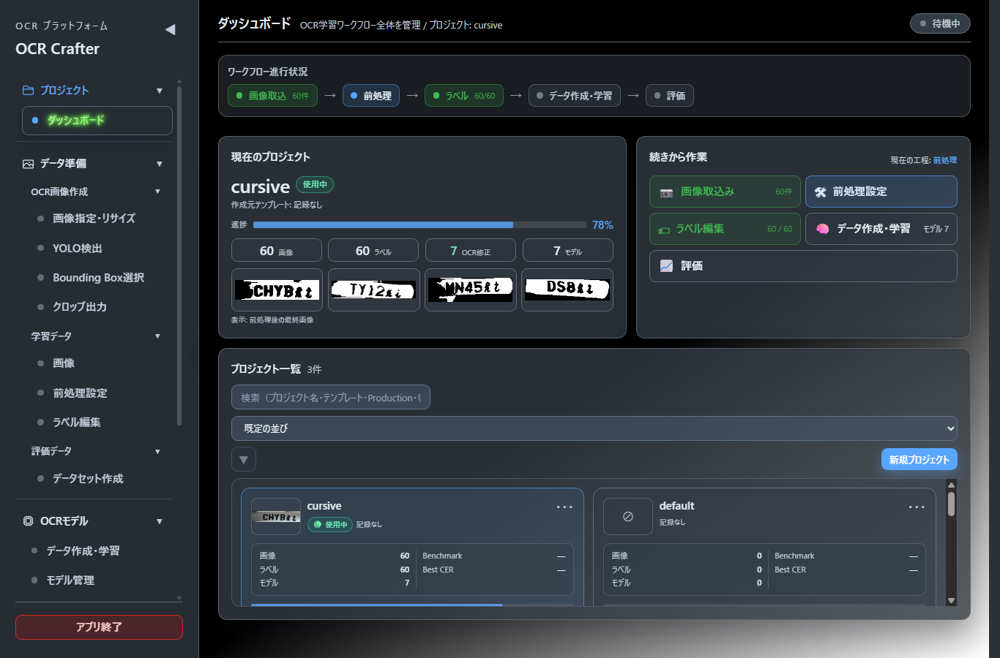

## 3. 初回セットアップ

初めてブラウザで開くと**初回セットアップウィザード**（7ステップ）が自動表示されます。

1. ようこそ → 2. プロジェクト保存先（書き込み確認） → 3. OCRエンジン確認（Tesseract/PaddleOCR。未導入でも続行可） → 4. GPU確認（CPUでも実行可） → 5. Python環境確認 → 6. バックアップ推奨設定（metadata=毎日 / full=毎週） → 7. 完了

- 完了するとブラウザ（localStorage）へ記録され、次回以降は表示されません
- 右上「×」で中断できます（確認あり。次回起動時に再表示）。**Escキーでは閉じません**
- 再実行: 「運用 > システム状態」の「セットアップを再実行」

## 4. プロジェクト管理

**画面**: プロジェクト > ダッシュボード

- **目的**: プロジェクトの作成・切替・削除、進行状況・品質・運用状況の確認
- **表示**: ワークフロー進行状況（画像取込→前処理→ラベル→データ作成・学習→評価）、現在のプロジェクト（統計・作成元テンプレート）、続きから作業（次工程へのショートカット）、プロジェクト一覧（カードビュー・検索つき）
- **ボタン**: 「新規プロジェクト」（テンプレート選択モーダル）/ カードの「開く」「学習」「評価」「Benchmark」「Report」・「・・・」メニューの「削除」（このダッシュボードのクイックアクションボタンは運用画面のメニュー名変更後も引き続き「Benchmark」と表示されます）

### 4.1 プロジェクト一覧（カードビュー）

一覧はプロジェクトごとのカードをGrid表示する「プロジェクト管理ダッシュボード」です。カード全体をクリック（またはTabでフォーカスしEnter/Space）するとそのプロジェクトが開きます。

**Gridの列数**: 画面幅により自動調整されます（横スクロールなし）。

| 画面幅 | 列数 |
|---|---|
| 1920px以上 | 3列 |
| 1100〜1919px | 2列 |
| 1099px以下 | 1列 |

**カードの構成**:

- **ヘッダー**: サムネイル（大きめ表示。プロジェクトの見た目上の識別子）＋プロジェクト名（大きめ表示）＋状態バッジ＋テンプレート名。**右上にProductionを独立表示**します（Productionモデルがあれば「Production」＋管理No、例: `M0009`。無ければ控えめに「Productionなし」）。さらに右の「・・・」から削除できます（誤操作防止のためクイックアクションとは別メニューにしています）
- **品質情報**: 「データ」（画像数・ラベル数・モデル数）、「品質」（Best CER・Exact Match）、「性能」（Balance Score・P95推論時間・実施回数）を**横並び3列**で表示し、AI開発で重要な「品質」「性能」を色付きで目立たせています。Exact Matchは記録が無い場合は表示されません（推測での補完は行いません）。性能はBenchmarkを1度も実施していない場合、「Benchmark未実施」と「Benchmarkを実行 →」（Benchmark画面を開く導線）を表示します
- **進捗**: 現在の工程名を太字でバー上部に表示し、その下に進捗バー（前回よりも太く）＋%を表示します
- **クイックアクション**: 「▶ 開く」を優先操作（Primary）として大きく強調表示し、「学習」「評価」「Benchmark」「Report」は控えめな表示（Secondary）で2×2に並べています。評価・Reportはモデルが1件も無い場合、Benchmarkは画像が1枚も無い場合に無効化されます（ボタンにカーソルを合わせると理由が表示されます）。Benchmarkボタンには最新結果（例:「最新Benchmark: Balance 96.2 / P95 42 ms」）または「Benchmarkはまだ実施されていません」がツールチップで表示されます
- **フッター**: 最終更新日時（相対表示＋絶対表示）／Health Badge（カーソルを合わせると判定根拠が表示されます）

**状態バッジ**: 🟢使用中（選択中）/ 🟡学習中・🔵評価中（学習/評価Jobが実行中）/ ⚪Archived（Productionが無く全モデルがArchived）/ 「—」（該当なし）。

**Production**: Productionモデルが存在する場合のみカード右上に管理No（例: `M0009`）を表示。存在しなければ「Productionなし」と控えめに表示します。

**Best CER**: 記録されている評価結果のうち、①Production→②Candidate→③プロジェクト内で最良のモデルの順に採用して表示します（推測での補完は行いません。評価未実施のプロジェクトは常に「—」）。

**Balance Score・P95推論時間**: 最新の正常完了Benchmark（Failed・Cancelled・Interruptedで終わった実行は対象に含めません）から、バランス最良エンジンのBalance ScoreとP95推論時間を表示します。Benchmarkを1度も実施していない場合は「未実施」と表示します（推測値は使用しません）。

**Health Badge**: プロジェクトの健全性をルールベースで判定します（AIによる推定は行いません）。バッジにカーソルを合わせると、判定根拠（例:「評価済みモデルがあります。」「Benchmarkは未実施です。」）がツールチップで表示されます。色だけに頼らず、絵文字＋テキストラベル（Excellent/Good等）でも判定結果が分かるようにしています。

| バッジ | 意味 |
|---|---|
| 🔴 Incomplete | 画像・ラベル・モデルのいずれかが未着手 |
| 🟢 Excellent | Production・Benchmark・CER・Candidate以上のモデルがすべて揃っている |
| 🟡 Good | 評価済みのモデルがある |
| 🟠 Needs Review | 評価が未実施 |

Benchmarkの有無は、試行回数ではなく**最新の正常完了Benchmarkが存在するか**で判定します。

**ソート・検索**: 検索欄の右にある並び替えセレクト（更新日時・画像・ラベル・モデル・CER・Benchmark・進捗・Health）と方向切替ボタン（▼降順/▲昇順）で並び替えできます。検索欄はプロジェクト名に加え、テンプレート名・Productionモデル・状態・Healthでも絞り込めます。

- **注意**:
  - 削除は取り消せません。**プロジェクト名の入力一致**を求める確認ダイアログが表示されます
  - データは `data/projects/<project_id>/` に保存されます。削除前のバックアップを推奨します（[BACKUP_AND_RESTORE.md](BACKUP_AND_RESTORE.md)）

## 5. プロジェクトテンプレート

新規プロジェクト作成時に用途別テンプレートを選択できます（6種）。

| テンプレート | 用途 |
|---|---|
| 標準プロジェクト | 標準設定で開始（従来の新規作成と同等） |
| 英数字OCR | 型式・製品番号・シリアル番号などの英数字認識 |
| 日本語OCR | 漢字・かな・英数字が混在する日本語文字列 |
| 銘板OCR | 配電盤や機器の銘板文字列 |
| 手書きOCR | 筆記体や手書き文字（Fine-tuning前提） |
| OCR＋YOLO | 文字領域をYOLOで検出して切り出す運用 |

- テンプレートは**初期値を設定するだけ**で、作成後にすべての設定を変更できます（固定されません）
- 作成元テンプレートはダッシュボードの「現在のプロジェクト」で確認できます（記録はブラウザ単位。既存プロジェクトや別ブラウザでは「記録なし」表示）

## 6. OCR画像作成

**画面**: データ準備 > OCR画像作成（4ステップ）

- **目的**: 撮影した元画像から、OCR対象の文字領域画像を切り出す
- **利用タイミング**: 元画像に文字以外が写っている場合（文字領域だけの画像が既にあるならこの工程は不要）

| ステップ | 操作 | 完了条件 |
|---|---|---|
| 画像指定・リサイズ | 元画像を指定し、必要ならリサイズ | プレビュー表示 |
| YOLO検出 | 使用するYOLOモデルを選び「検出」 | 検出結果（件数・使用モデル・処理時間）が表示される |
| Bounding Box選択 | 検出領域の一覧右端のチェックで有効/無効を切替。**編集モードON**で移動・サイズ変更・追加・削除 | 採用する領域が確定 |
| クロップ出力 | 切り出しを実行 | 出力画像が生成される |

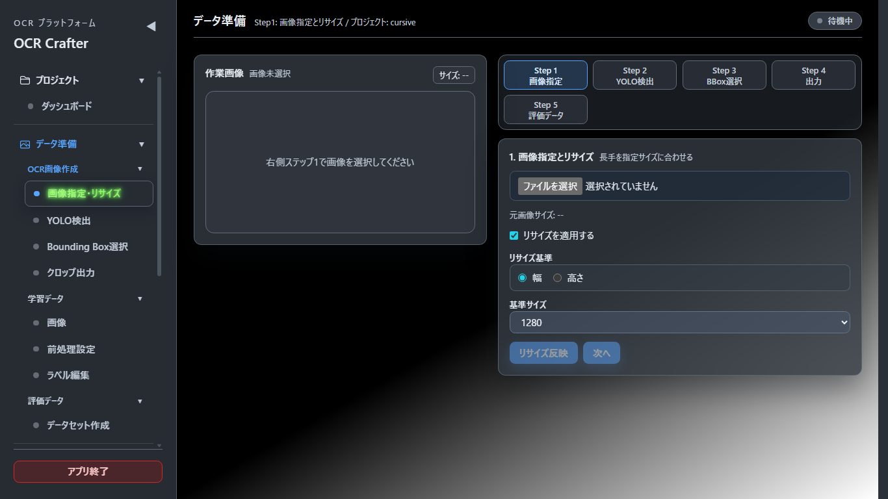

- **エラー時**: YOLOモデルが見つからない場合は明示エラーになります（モデルは `data/projects/<id>/models/yolo/` または共通 `models/yolo/` へ配置）。検出0件は「正常終了」と表示されます（エラーではありません）
- **注意**: 検出用の前処理（検出前処理）は**検出専用**で、学習画像はかならず元画像から切り出されます

## 7. 学習データ作成

**画面**: データ準備 > 学習データ（画像 / 前処理設定 / ラベル編集）

### 7.1 画像

- **目的**: 学習画像の取り込み・確認・回転
- **操作**: 「画像取込」でフォルダを選択 → `raw/` へコピー後、前処理パイプラインが自動実行
- **ボタン**: 回転（90°単位。対象画像のみ再前処理）、サムネイル一覧、検索・未ラベルフィルタ
- **注意**: 元画像（`raw/`）は前処理で変更されません（回転操作のみ例外）

### 7.2 前処理設定

- **目的**: 二値化・照明ムラ補正・手動マスク補正など多段パイプラインの調整
- **操作**: リアルタイムプレビューで結果を確認 → 「前処理実行」で全画像へ適用
- **表示**: プレビューは処理後画像とOCR推論結果を並べて確認可能。プリセット保存に対応

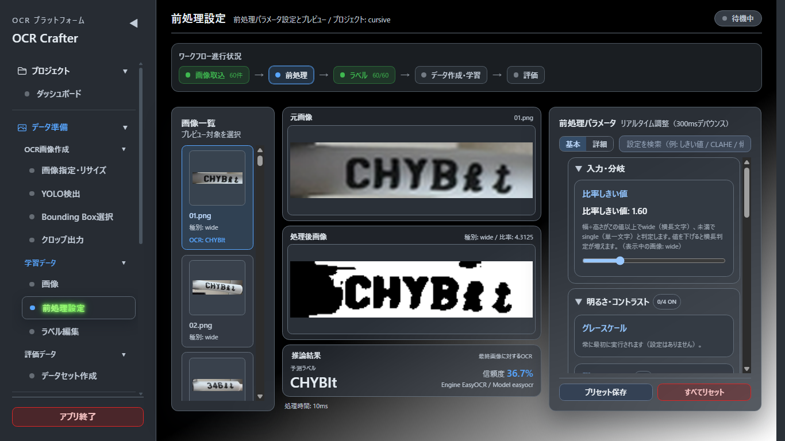

- **完了条件**: 前処理実行が完了し `processed/` が更新される（実行時点の設定はスナップショットとして保存され、データセット作成時に確定記録されます）
- **注意**: 実行前に確認ダイアログで設定要約が表示されます。同一設定ならプレビューと実行結果は画素単位で一致します

### 7.3 ラベル編集

- **目的**: 各画像の正解文字列（Ground Truth）の入力
- **操作**: 画像を見ながらラベルを入力して保存。OCR候補・辞書近似候補のクリック採用、未編集フィルタあり

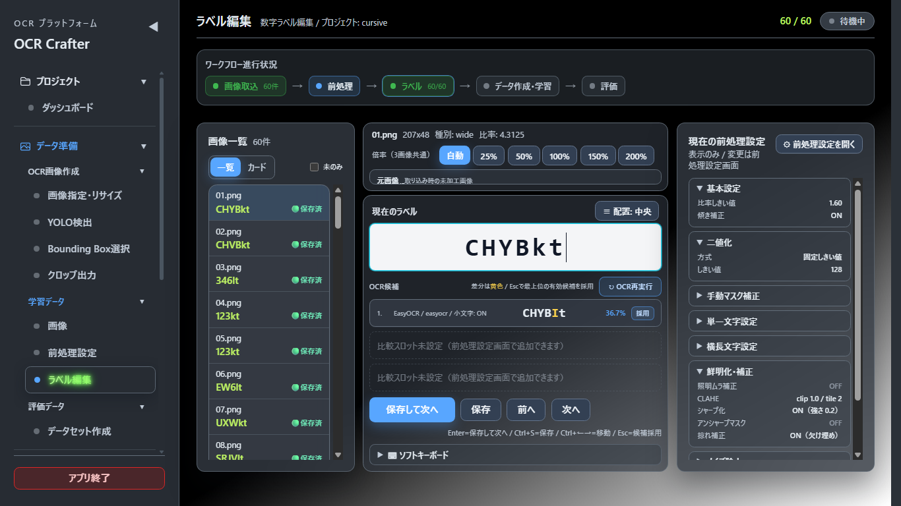

- **注意**: **大文字・小文字は実物どおり**入力してください（例: `CHYBkt`）。評価はcase-sensitive完全一致で行われ、勝手に大文字化されません

## 8. 評価データセット作成

**画面**: データ準備 > 評価データ > データセット作成

- **目的**: 学習データから独立した評価専用データセットの作成・編集
- **理由**: 学習に使った画像で評価すると精度が過大評価されるため、評価データは分離します（学習データ重複チェック機能あり）
- **正解CSVの形式**（モデル評価で使用）:

```csv
filename,text
sample_001.png,CHYBkt
sample_002.png,TY12lt
```

- `filename` は評価用画像フォルダ内のファイル名と一致させる（拡張子含む）
- `text` は実運用の表記どおり（case-sensitive。`KT` と `kt` は別物として評価）
- ヘッダ行あり推奨・UTF-8推奨

## 9. OCR学習

**画面**: OCRモデル > データ作成・学習

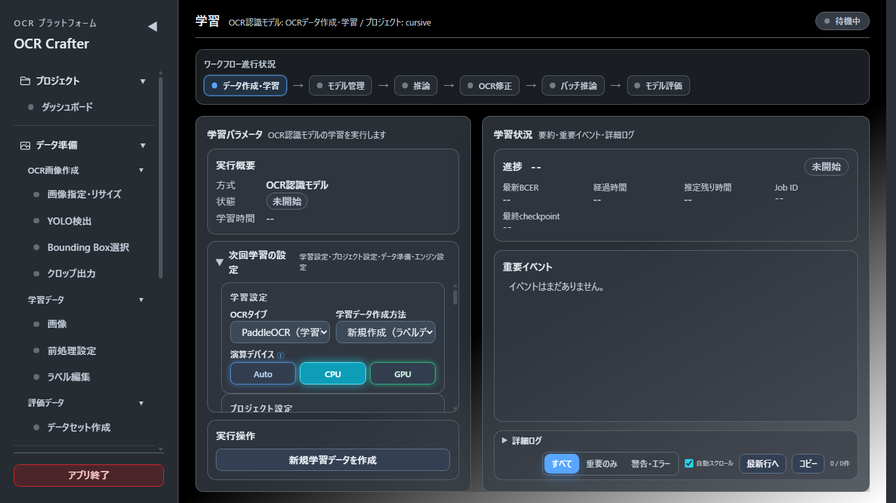

### 9.1 OCRデータ作成

1. 学習方式 `ocr`、OCRタイプ（`Tesseract` / `PaddleOCR` / `TrOCR`）を選択
2. `charset`（学習対象文字セット）、`max_text_length`、`image_shape` を確認
3. 必要に応じてオーグメンテーション（コントラスト変化・軽微ブラー・ノイズ・微小回転。強度1〜3）を設定。「Augプレビュー」で事前確認可能
4. 「OCRデータ作成」を実行（分割予定枚数のプレビューあり）

- **注意**:
  - charset外の文字を含むラベルは**サンプルごと除外**され、skippedとして集計されます（文字削除はされません）
  - Tesseract選択時はラベルの大小文字を保持します（`text_case=keep`）
  - オーグメンテーションはTrainのみに適用され、元画像は必ず残ります
  - 「ログ再学習データ作成」でOCR修正ログから再学習用データセットも作成できます

### 9.2 次回学習の設定

学習画面左の「次回学習の設定」はカテゴリサマリー表示です。カードを選択すると**モーダルではなく左パネルがそのまま編集表示へ切り替わり**（左パネルが広がり、右側の学習状況は表示されたまま）、**4タブ**（学習設定 / 学習前処理 / オーグメンテーション / エンジン設定）で編集できます。**ここで変更した設定は次回の学習から適用され、完了済みの学習結果には影響しません。**

編集後は「**次回学習に適用**」で確定（「設定を次回学習へ適用しました」と表示）、「**変更を破棄**」・←・Escで編集開始前の値へ戻せます（未適用の変更がある場合のみ確認が表示されます）。タブを切り替えても編集内容は失われません。これらの設定は画面内で保持され、ページを再読み込みすると初期値に戻ります。

- **学習設定**: 旧「学習パラメータ」と「データ分割」を1つのタブへ統合し、上から順に①学習パラメータ（OCRタイプ・学習回数（Tesseractは最大イテレーション）・演算デバイス・出力先）②データ分割（Train/Val/Test比率＝0.05刻み・Testは自動計算、Split Seed、「分割枚数を確認」）の2セクションで表示します
- **学習前処理**（新規）: 学習時に実際に使われる前処理（グレースケール・二値化方式・照明ムラ補正・CLAHE・傾き補正・リサイズ等）を**表示名・専門パラメータ名・現在値・単位・説明**の形式で確認できます。**このタブでは新しい設定はできません**——学習前処理は常に「前処理設定」画面で設定した内容がそのまま使われるため、ここは確認用の表示専用タブです。前処理を一度も実行していないプロジェクトは「未記録」と表示されます（推測での補完はしません）
- **オーグメンテーション**: 適用モード（なし/弱い/カスタム）・生成倍率・3カテゴリ（幾何変換/明るさ・コントラスト/ノイズ・ぼかし）5項目の個別設定（チェック・確率%・範囲±°/±%・強度）。「推奨設定を適用」（確認つき）・「設定をリセット」・右側プレビュー（サンプル数選択・「プレビューを再生成」）・下部の設定サマリー（適用項目数/平均適用確率/生成倍率/推定追加枚数）。無効にした項目の値は保持され、再度ONにすると直前の値へ戻ります。**強度（弱・中）を選ぶ項目（ぼかし・ノイズ）は、抽象的な強度ラベルに加えて実際の内部パラメータ（例:「実効値: sigma=3」）も表示**され、この設定画面とモデル管理の履歴・比較画面で同じ値だと確認できます
- **エンジン設定**: エンジン固有の設定（Tesseract: charset・実験情報等 / PaddleOCR: 初期重み・実行プロファイル等）

### 9.3 学習実行

| エンジン | 主なパラメータ | 補足 |
|---|---|---|
| Tesseract | 最大イテレーション・charset・PSM・ベースモデル（eng.traineddata） | LSTM fine-tune。学習ツール（lstmtraining等）の導入が必要。EpochやBatch Sizeは使用しません |
| PaddleOCR | エポック数・バッチサイズ・device（auto/cpu/gpu）・ワーカー数・AMP | `Mac Safe` / `RTX Train` プリセットあり。GPU検出時は自動最適化、OOM時はbatch半減で1回自動リトライ |
| TrOCR | エポック数・バッチサイズ・device（auto/cpu/gpu）・学習率・Base Model・local_files_only | Base Modelは「登録済みモデルから継続Fine-tune」または「Hugging Face model ID／ローカルパスを手動入力」の二択。`local_files_only`を有効にするとHugging Face Hubへのネットワークアクセスを行いません |

- 実験名・親モデル・学習メモを指定すると実験カルテ（実験管理）へ記録されます
- **完了条件**: 学習ログが `completed` になり、モデル管理へ追加される（PaddleOCRは推論用モデルの自動export込み）
- **評価へ引き継ぐ**: Tesseract/PaddleOCR/TrOCRの学習完了時、[評価へ（このモデルを引き継ぐ）]ボタンで学習したモデルとエンジンをそのままモデル評価画面へ引き継げます（評価用データセットは学習データセットとは別概念のため引き継がれず、評価画面側で選択してください。Issue #119）
- **エラー時**: 学習は非同期Jobです。失敗時は「運用 > ジョブ管理」のエラー要約と学習ログを確認してください。同一プロジェクトでのOCR学習の二重実行は409エラーで拒否されます
- **注意**: 学習中にBackendを再起動した場合、Jobは「中断（再起動）」となり再実行できます
- **TrOCRのモデル管理**: TrOCR学習完了時のモデル登録（`.trocr.json`）は、Tesseract/PaddleOCRの登録簿（`.tess.json`/`.ocr.json`）とは別の専用ファイルですが、学習完了後のTrOCRモデルは**「16. モデル管理」画面の一覧・ダウンロード・削除に表示されます**（Issue #141でTesseract/PaddleOCRと同等のparityを実現。「方式」列は「OCR認識」と表示され、登録済み＝Export済み扱いのため常にダウンロード可能です）。TrOCRの継続Fine-tune用モデル選択は引き続き学習画面自身の「登録済みモデルから選択」・モデル評価/Benchmark Runner画面の同様の選択欄からも利用できます。リリース管理（Release Gate）はこの`.trocr.json`を直接認識するため、TrOCRモデルの昇格・状態管理はモデル管理を経由せず「17. リリース管理」画面からも行えます

## 10. Dataset Manager

**画面**: OCRモデル > Dataset Manager

- **目的**: 学習に使ったデータセットを資産として一覧管理し、どのDatasetからどのモデルが作られたかの再現性を確保する
- **Dataset ID**: `DS0001`形式。全プロジェクト共通の登録簿で、削除後も再利用されません
- **表示**: 一覧（作成日時降順・列ソート可能なテーブル）、Dataset詳細（前処理Version/Hash・学習設定・使用モデル一覧・使用Experiment・Benchmark参加件数）
- **Dataset⇔Model双方向リンク**: あるDatasetから作られたモデルの一覧、あるモデルの学習元Datasetを相互に確認できます（モデル管理・実験管理の各画面からもリンクで遷移できます）
- **操作**: コピー、削除（使用中のモデルがある場合は確認あり）、コメント編集（複数行）
- **検索**: Dataset名・コメント・Charset・前処理Versionで絞り込みできます

## 11. モデル評価

**画面**: OCRモデル > モデル評価

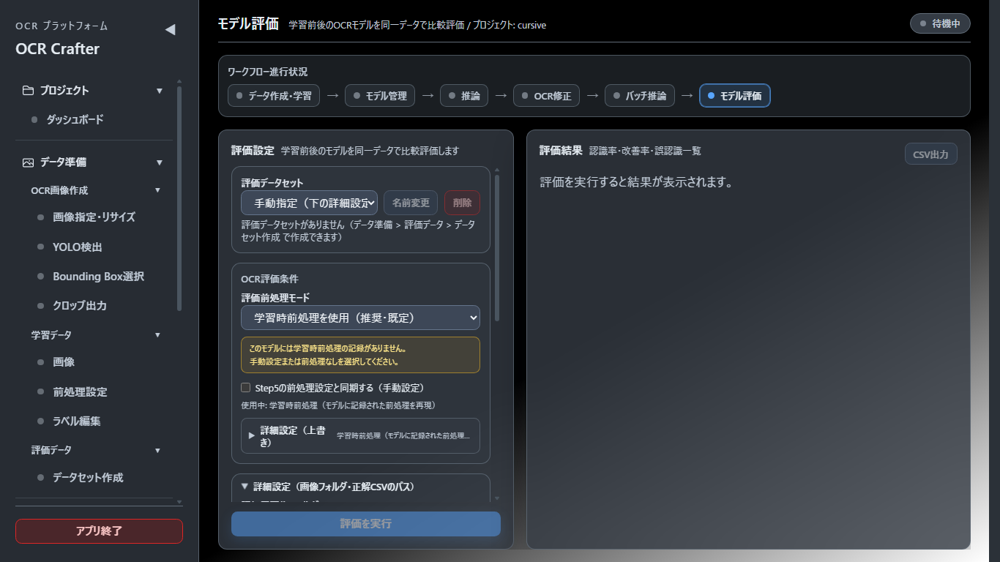

- **目的**: 学習前後のモデルを同一データで評価し、改善を数値で確認する
- **対応エンジン**: Tesseract / PaddleOCR / EasyOCR / TrOCR。エンジンを切り替えると評価対象モデルの入力欄も切り替わります（Tesseractのみ学習前後比較・Whitelistが利用可能。他エンジンは単一モデルの評価のみ）
- **入力**: 評価データセット（画像フォルダ＋正解CSV）、学習前モデル（例: `eng.traineddata`）と学習後モデル、Whitelist（既定 `A-Z0-9klt+-`。「なし」「カスタム」へ変更可）。TrOCRはモデル参照（登録済みモデルから選択、または手動でHugging Face model ID／ローカルパスを入力）を指定します
- **TrOCRのconfidence**: TrOCRは文字単位のconfidence（確信度）を算出できないため、確信度に依存する表示・ヒートマップは対象外です。CER等の主要指標には影響しません
- **主指標**: **CER**（文字誤り率。全画像の編集距離総和÷正解文字数総和のマイクロ平均。低いほど良い）
- **補助指標**: 文字正解率（1−CER）/ 完全一致率 / 誤認識数 / CER差・相対改善率 / 改善・同等・悪化件数 / 混同TOP（置換・脱落・挿入）
- **結果の記録**: 評価条件は **Evaluation Profile** として実験カルテへ保存され、**Evaluation Hash**（評価条件のハッシュ）が生成されます。同一Hash=同一条件評価であり、比較の妥当性判定に使われます
- **CSV出力**: 明細（画像×モデル）・モデル別サマリ・混同集計の3セクション
- **Benchmarkへ引き継ぐ**: 評価結果がある場合、[Benchmarkへ]ボタンでエンジン・モデル・評価データセットをBenchmark Runner画面へ引き継げます（EasyOCRはBenchmark Runnerで実行できないため表示されません。Issue #119）
- **エラー時の案内**:

| 症状 | 対処 |
|---|---|
| Tesseract本体が未導入 | Tesseractを導入し `tesseract.tesseract_cmd` またはPATHを設定 |
| eng.traineddataが無い | tessdata_bestを配置し `tessdata_dir` を指定 |
| 正解CSVが不正 | 形式（`filename,text`）とパスを確認 |
| 画像未検出N件 | CSVの `filename` と画像フォルダ内ファイル名の一致を確認 |

## 12. モデル比較

**画面**: OCRモデル > モデル管理（モデル比較）

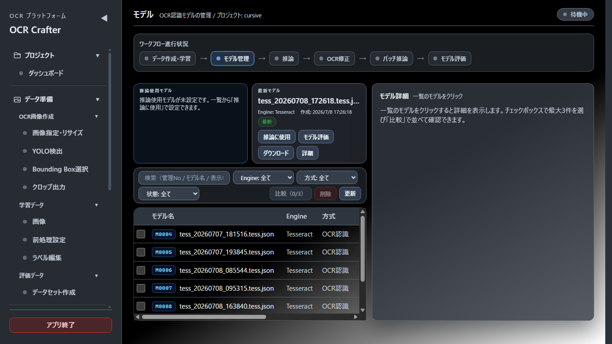

- **目的**: 最大3件のモデルを並べて性能・条件を比較する
- **表示**: 性能サマリー / 学習条件比較 / **学習前処理比較**（実際に使われた前処理工程を項目別に比較。一致/差分/詳細も確認可能）/ **オーグメンテーション比較**（新規。プリセット・生成倍率・各項目を確率＋実際の内部パラメータ[sigma/radius/角度]で比較。新形式の記録が無い旧モデルは「未記録」）/ 条件差分（違いの強調表示）/ 次回学習の提案
- **評価条件再現**: モデルカルテの評価履歴から評価条件（データセット・前処理・Whitelist）を確認し、同条件で再評価できます
- **注意**: **Evaluation Hashが異なるモデルのCERは直接比較できません**。「⚠比較条件が異なります」の警告と**比較品質（★1〜5）**が表示されます（★5=完全一致条件、★1=比較不可）。比較自体は禁止されませんが、数値差の解釈には注意してください

## 13. 実験管理

**画面**: OCRモデル > 実験管理

- **目的**: 学習実行ごとの条件・結果を実験カルテ（EXP-0001形式）として記録し、条件と精度の関係を分析する
- **表示**: 実験一覧（★お気に入り・タグ・フィルタ・CSV出力・**Dataset列**でDataset Managerの詳細へ遷移）、Experiment比較（条件差分の強調）、CER推移グラフ、簡易相関・ベスト条件・条件推薦
- **Evaluation Profile / Evaluation Hash**: 評価実行時に評価条件（データセット・画像数・評価前処理・エンジン・PSM・Whitelist・文字正規化・CER算出方式）がProfileとして保存され、そのハッシュがEvaluation Hashです
- **Comparable Group**: 同一Evaluation Hashの実験をまとめたグループ（CG-0001形式）。**同一グループ内の実験だけがCERを直接比較できます**
- **Scientific Mode**: ON（既定）=比較可能な実験のみを分析対象にする / OFF=全実験を対象（混在の参考値であることが明示されます）。設定はプロジェクト別にブラウザへ保存
- **推薦の安全性**: 条件推薦は最大のComparable Groupを根拠に生成され、「この推薦はN件の比較可能Experimentから生成されています。」と根拠件数を必ず表示します。5件未満は「参考値（データ不足）」
- **Dataset Manager・モデル管理との相互リンク**: 「このモデルを作成したExperiment」「使用Dataset」など、学習データセット・生成モデルとの行き来ができます
- **注意**: 相関分析は因果関係を示すものではありません。失敗実験やデバッグ実験は「分析対象OFF」で分析から除外できます

## 14. Benchmark Runner

**画面**: 運用 > Benchmark Runner（v1.0.0でメニュー表示名を「Benchmark」から変更。ダッシュボードのクイックアクションボタンは引き続き「Benchmark」と表示されます。`activeView`のid・API・保存先は無変更）

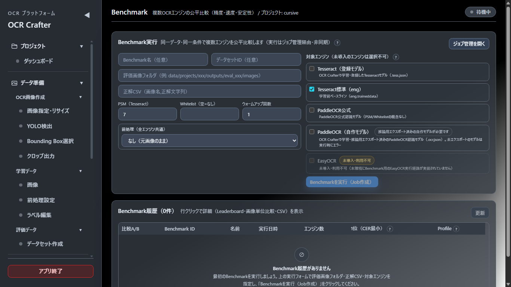

- **目的**: 複数OCRエンジン（Tesseract / PaddleOCR / EasyOCR / TrOCR / 学習済みモデル）を**実際に実行**し、同一条件で公平比較する
- **TrOCR**: モデルは「登録済みモデルから選択」または「Hugging Face model ID／ローカルパスを手動入力」で指定します。device（auto/cpu/gpu）・local_files_onlyも設定できます。confidenceは算出されないため結果表・Leaderboardには含まれません（CER等の主要指標には影響しません）
- **モデル評価との違い**: モデル評価は「1つのモデルの精度測定と学習前後の比較」、Benchmark Runnerは「複数エンジン間の横並び比較（速度・メモリ含む）」です
- **Benchmark Centerとの違い**: Benchmark RunnerはOCRエンジンを実行して測定する**実行ツール**です。既存の結果を実行せずに横断比較するだけの参照ビューは、次章の別画面「Benchmark Center」です
- **表示**: Leaderboard（BM-0001形式）、用途別ベスト＋バランススコア、画像単位の結果比較、cold start（初回読み込み）と推論時間の分離、P50/P95、Peak Memory、CSV出力3種
- **前処理**: 前処理条件（なし/手動設定/プロジェクト設定等の4モード）を明示して実行します。条件はProfile Hashとして記録され、同一Hash同士のみ直接比較できます
- **完了条件**: Jobが完了しLeaderboardに結果が表示される
- **注意**: 結果はレポートの「誤認識分析（代表失敗例）」の情報源にもなります

## 15. Benchmark Center

**画面**: 運用 > Benchmark Center（v1.0.0で追加）

- **目的**: Dataset Manager・実験管理・モデル管理にすでに蓄積されている評価結果を、**実行せずに横断比較**する参照ビュー
- **Benchmark Runnerとの違い**: Benchmark Centerは**評価を実行しません**。新しい評価ロジックは持たず、既存のExperiment Trackingの評価結果を整理・比較・可視化するだけです（コード・保存先ともBenchmark Runnerとは完全に別）
- **表示**: 比較表、🏆最良値のハイライト、レーダーチャート、CER等の推移グラフ、モデル推薦、CSV/Markdown/JSON出力
- **評価結果が無いモデル**: 「評価結果がありません」と表示し、モデル評価画面（`ocr-eval`）への遷移導線を提示します
- **Benchmark履歴**（`BMC-0001`形式）: 保存されるのは比較条件（対象Dataset・対象Model・対象Experiment・フィルタ・並び順）のみです。**評価結果自体は保存しません**——評価結果の情報源は引き続き実験管理（Experiment Tracking）です
- **相互リンク**: Dataset Manager・実験管理・モデル管理の各画面に「Benchmark参加/Benchmark N件」表示があり、このBenchmark Centerの比較履歴と相互に行き来できます

## 16. モデル管理

**画面**: OCRモデル > モデル管理

- **目的**: 学習済みモデルの一覧・カルテ・削除・ダウンロード
- **管理No**: M0001形式。全プロジェクト横断で一意、削除後も再利用されません
- **推論使用中の強調表示**: 「推論に使用」に設定したモデルの行は、一覧上で常時（hoverしなくても）分かるようにシアン系の背景・左端のライン・「推論使用中」バッジ・管理Noの強調で表示されます。比較用のチェックボックスとは独立しており、両方を同時に選択できます
- **推論モデルの切替**: 「推論に使用」ボタンを押すと選択が**プロジェクト単位で即時サーバー側へ保存**され（`GET/POST /api/ocr/inference/model`、`data/projects/<id>/inference_model.json`）、画面遷移・ブラウザ再読み込み・アプリ再起動をまたいで維持されます。すでに別モデルが設定されている状態からの切替時のみ確認ダイアログが表示されます（初回設定時は確認なし）。保存済みモデルが削除・移動済みで見つからない場合は警告を表示し、勝手に別モデルへ置き換えません
- **切替ボタンは画面内3か所**（①「推論使用モデル」カード ②「最新モデル」カード ③モデル詳細パネル下部）にあります。①のカードは常に現在の使用中モデル自身を表示するサマリーのため切替ボタン自体を持たず（使用中バッジ・モデル評価/ダウンロード/詳細ボタンは表示されます）、②③は対象モデルが現在の使用中モデルと同じ場合のみ「推論使用中」で無効、異なる場合は「推論に使用」として有効です
- **モデルカルテ**: 学習条件・実験リンク・評価履歴・リリースStatus（＋Version）・学習Dataset（Dataset Managerへのリンク）を表示
- **ダウンロード**: `.pt`=そのまま / `.ocr.json`（PaddleOCR）=inference ZIP / `.tess.json`（Tesseract）=`.traineddata` / `.trocr.json`（TrOCR）=モデルディレクトリ一式のZIP（Issue #141）
- **削除**: 確認ダイアログで対象一覧＋**「DELETE」の入力**が必要です。削除対象が現在の推論使用モデルの場合は個別に警告されます。削除は `models/` 配下に限定される安全ガードつき
- **注意**: Productionモデルの削除は運用に影響します。リリース管理の状態を確認してから操作してください

## 17. リリース管理

**画面**: OCRモデル > リリース管理

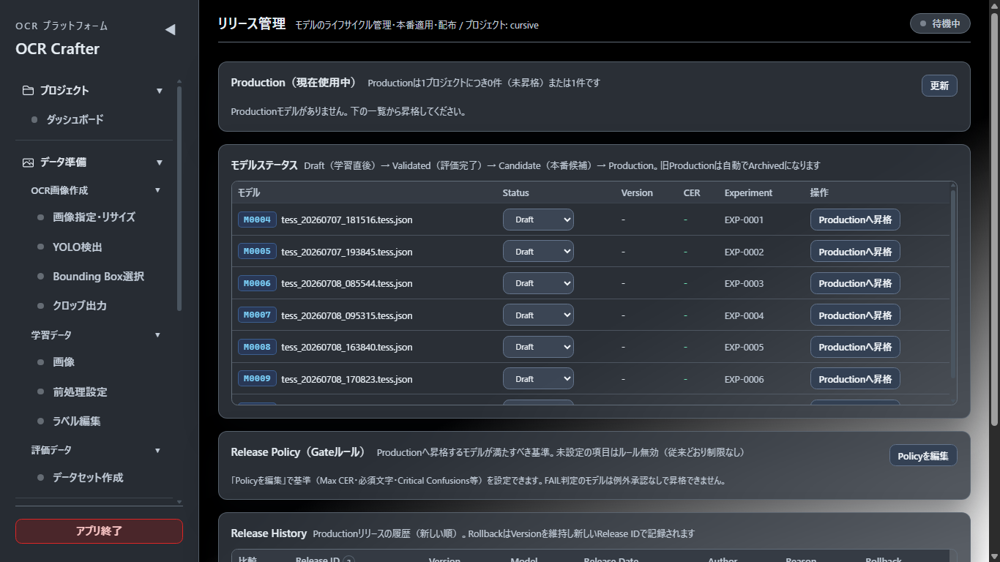

- **目的**: モデルのライフサイクル管理と本番モデルの決定
- **対応エンジン**: Tesseract / PaddleOCR / TrOCR（Release Policyの許可エンジン設定`allowed_engines`にも`trocr`を指定可能）。TrOCRモデルは「16. モデル管理」画面にも表示されます（Issue #141）。本画面には学習完了時に登録された`.trocr.json`がそのまま一覧表示されます
- **ステータス**: `Draft`（学習直後）→ `Validated`（評価完了で自動遷移）→ `Candidate`（本番候補）→ `Production`（本番使用中）→ `Archived`（旧モデル）
- **Production は常に0件または1件**です。新しいモデルの昇格時に旧Productionは自動でArchivedになります
- **昇格フロー**: Candidate → Release Note入力（必須）→ **Release Gate判定** → 昇格
  - Gate判定は Release Policy（Max CER・必須文字・Critical Confusions等の最大12項目）に基づく自動判定: `PASS` / `CONDITIONAL_PASS` / `FAIL` / `NOT_EVALUATED`
  - **FAIL判定のモデルは、Override Reason＋Approved By（承認者）が揃った場合のみ昇格可能**（Override履歴が監査ログへ記録されます）
- **Release ID / Version**: Release ID（REL-0001形式）は「リリース行為」の識別子、Versionは「配布物の版」（Candidate=0.x、Production初回=1.0.0→マイナー加算）です
- **Rollback**: Release Historyから過去Versionのモデルを再Productionへ戻せます（Versionは維持・新しいRelease IDが発行）
- **Model Card / Deployment Package**: Productionモデルのカルテ（Markdown）自動生成と、モデル実体・設定・前処理スナップショット・RELEASE_NOTE・MODEL_CARDを含むZIP Export。Tesseract/PaddleOCR/TrOCRいずれのProductionモデルにも対応し、エンジン名・対象文字（TrOCRは「対象外」と表示）・ベースモデル/学習量・既知の制約はエンジンごとに正しい内容が表示されます（Issue #117）。モデル実体はTesseractがtraineddata単一ファイル、PaddleOCR/TrOCRはディレクトリ一式としてZIPへ含まれます。**既知の制約**: EasyOCRは学習・モデル登録機能自体が無いため、Model Card/Deployment Packageの対象になりません
- 詳細仕様: [20_RELEASE_POLICY.md](20_RELEASE_POLICY.md)

## 18. レポート

**画面**: 運用 > レポート

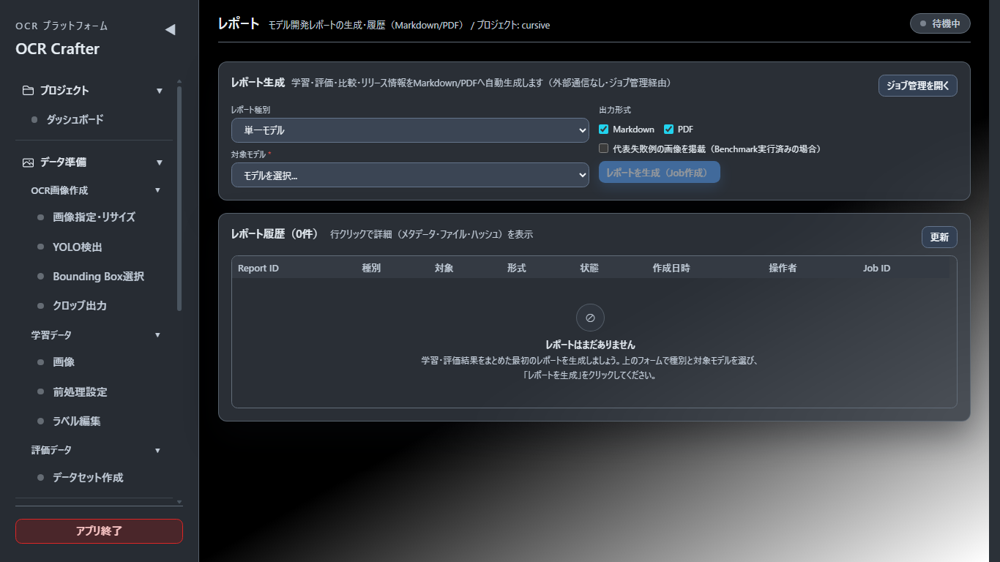

- **目的**: 学習・評価・比較・リリース情報をまとめた社内報告・引き継ぎ・監査用レポートの自動生成
- **種別**: 単一モデル / モデル比較（2件以上）/ プロジェクト総括
- **形式**: Markdown・PDF（同一Markdownから変換・内容差分なし）。PDFはローカル生成で外部送信されません
- **操作**: 種別・対象モデル・形式・画像掲載を選び「レポートを生成」→ Job完了後に履歴からダウンロード。再生成・削除（確認つき）可能
- **Report ID**: RPT-0001形式。保存先は `data/reports/<project_id>/`、各ファイルのSHA-256が記録されます
- **注意**: 記録のない項目は「記録なし」と表示されます（推測で補完されません）。総合判定・推奨事項はルールベースで、断定的な表現を避けています

## 19. ジョブ管理

**画面**: 運用 > ジョブ管理

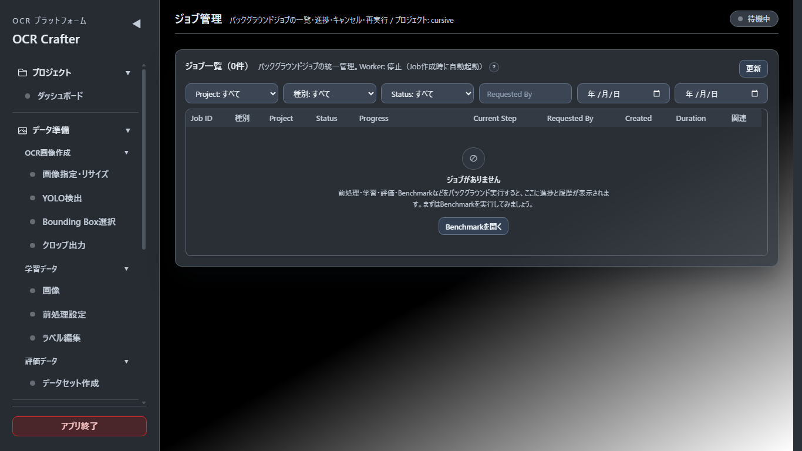

- **目的**: バックグラウンドジョブ（前処理・データセット作成・学習・評価・Benchmark・レポート生成・Deployment Export等）の統一管理
- **状態**: `queued`（待機）→ `running`（実行中）→ `succeeded` / `failed` / `cancelled`。再起動で中断されたものは `interrupted`（中断（再起動））
- **操作**: キャンセル（実行中は現在工程の終了後に停止）/ 再実行（failed・cancelled・interrupted）
- **表示**: Job ID（JOB-000001形式・全体一意）、進捗0-100%、イベント履歴、エラー要約、関連ID（BM-/RPT-等）
- **Worker**: Job作成時に自動起動します。「Worker: 停止」表示でもJobを作成すれば処理が始まります
- 詳細仕様: [18_JOB_MANAGEMENT.md](18_JOB_MANAGEMENT.md)

## 20. バックアップ

**画面**: 運用 > システム状態 の「バックアップ」カード

- 種別: `metadata_only`（ラベル・実験・リリース等の記録のみ）/ `full`（プロジェクト全体）
- 復元は**必ず新しいProject IDへ**行われ、既存プロジェクトを上書きしません
- 手順・推奨頻度・検証・制約は [BACKUP_AND_RESTORE.md](BACKUP_AND_RESTORE.md) を参照してください

## 21. 監査ログ

**画面**: 運用 > 監査ログ

- **目的**: 誰がいつ何をしたかの追跡（32操作を記録・追記型・削除不可）
- **表示**: AUD-000001形式のID、操作者（X-Operatorヘッダ由来）、操作種別、Before/After差分、関連ID
- **注意**: 監査ログを削除・編集する機能は存在しません（改ざん防止のための仕様です）。閲覧はどのロールでも可能です

## 22. システム状態

**画面**: 運用 > システム状態

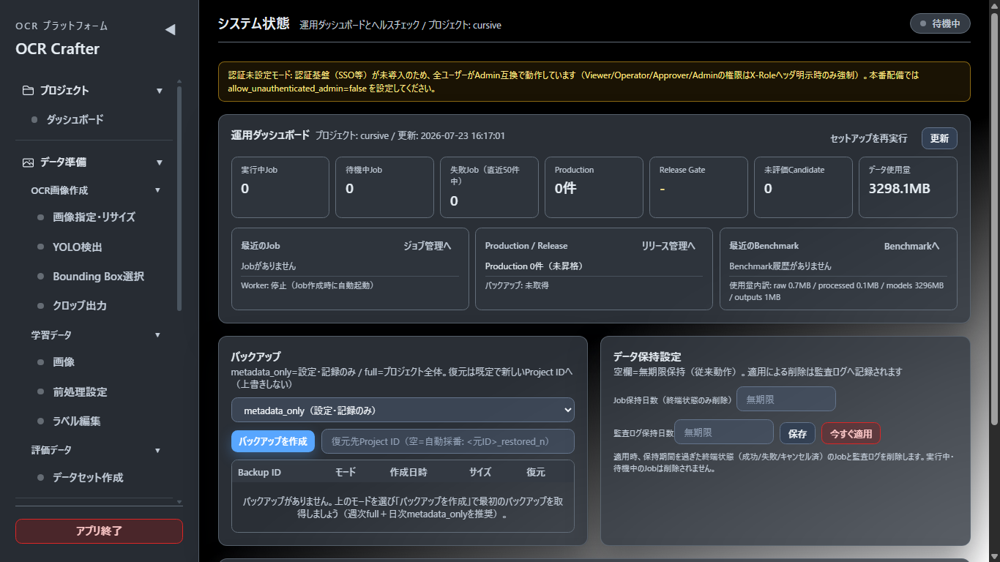

- **運用ダッシュボード**: Job状況・Productionモデル・Release Gate状態・未評価Candidate・最近のBenchmark・データ使用量・バックアップ状態
- **ヘルスチェック**: Backend / データ書き込み / 設定 / Tesseract / PaddleOCR / GPU / Job Worker / ディスク空き / プロジェクトDir（取得不能な値はnull=推測しない）
- **バックアップ / データ保持設定**: 作成・一覧・復元、Job・監査ログの保持日数（未設定=無期限）
- **セットアップを再実行**: 初回セットアップウィザードの再表示
- 詳細仕様: [21_OPERATIONS_GUIDE.md](21_OPERATIONS_GUIDE.md)

## 23. 用語

CER・Evaluation Hash・Comparable Group・Release Gate などの用語は [GLOSSARY.md](GLOSSARY.md) を参照してください。画面上の「?」アイコンでも主要用語の説明を確認できます。

---

## 付録A: 推論・OCR修正・バッチ推論

### 推論（OCRモデル > 推論）

- エンジン: custom / EasyOCR / PaddleOCR / Tesseract / TrOCR。学習済みモデルまたは標準モデルを選択（TrOCRは登録済みモデルから選択、またはHugging Face model ID／ローカルパスを手動入力）
- YOLO検出＋OCRの複合推論に対応
- 結果には文字単位の確信度（ヒートマップ表示用）が付きます（TrOCRはconfidenceを算出できないため、確信度ヒートマップは表示されません）
- 補足: PaddleOCRで推論できるのはexport済みモデルのみです（学習完了時に自動export。旧モデルの一括変換は `POST /api/ocr/models/export-migrate`）
- 補足: この画面のエンジン・モデル選択は試し撃ち用の表示であり、モデル管理画面で「推論に使用」により保存されたモデルとは独立しています（この画面で別モデルを選んでも、保存済みの推論使用モデルは変わりません）

### OCR修正（OCRモデル > OCR修正）

キーボード中心の修正画面です。

1. OCR結果のヒートマップで赤/黄の文字（確信度が低い文字）をクリックして修正
2. `Enter` で確定して次へ、`Shift+Enter` で保留
3. 修正結果はOCRログへ保存され、「ログ再学習データ作成」で再学習に使えます

### バッチ推論（OCRモデル > バッチ推論）

- フォルダ一括推論。結果CSVに engine / model が記録されます（Tesseract結果は大小文字を保持）
- 業務ルール（例 `^[A-Z0-9]{8}$`・禁止パターン）で valid/invalid 判定
- 候補辞書による近似候補の提示は推論後の補助であり、OCRエンジン内部には注入されません

## 付録B: 生成物の保存先

| 生成物 | 保存先 |
|---|---|
| ラベルCSV | `data/projects/<id>/annotations/master.csv` |
| 前処理済み画像 | `data/projects/<id>/interim/` / `processed/<type>/images/` |
| OCRデータセット | `data/projects/<id>/outputs/ocr_dataset/` |
| 学習済みモデル | `data/projects/<id>/models/`（`.pt` / `.ocr.json` / `.tess.json`） |
| 評価結果 | `data/projects/<id>/outputs/metrics/` / `outputs/errors/` |
| Dataset管理 | `data/projects/<id>/outputs/ocr_dataset*/<フォルダ>/meta.json`（Datasetごと）/ `data/dataset_ids.json`（全プロジェクト共通のID登録簿。集約ファイルはなくフォルダ走査で一覧化） |
| 実験・リリース・Benchmark記録 | `data/projects/<id>/experiments.json` / `releases.json` / `benchmarks.json` / `benchmark_center.json` |
| 推論使用モデルの選択 | `data/projects/<id>/inference_model.json` |
| レポート | `data/reports/<project_id>/` |
| バックアップ | `data/backups/` |
| Job・監査ログ | `data/jobs/` / `data/audit/` |

詳細: [17_DATAFLOW.md](17_DATAFLOW.md)

## 付録C: CLI

```powershell
# 単一画像の推論
python -m src.app.predict path\to\image.png --project-id default --engine tesseract
python -m src.app.predict path\to\image.png --project-id default --engine paddleocr --easyocr-langs en

# EasyOCR / PaddleOCR チューニング用データのエクスポート（任意機能）
python -m src.app.ocr_tuning --project-id default --engine both --image-types wide `
  --train-ratio 0.8 --val-ratio 0.1 --test-ratio 0.1
```

- `ocr_tuning` の出力先: `data/projects/<id>/outputs/ocr_tuning/<timestamp>/`（EasyOCR用 `train_labels.txt` 等 / PaddleOCR用 `train.txt`・`charset.txt`・`rec_train_config.yaml`・`meta.json`）
- 追加依存が必要な場合は `pip install -r requirements-ocr-tuning.txt`
