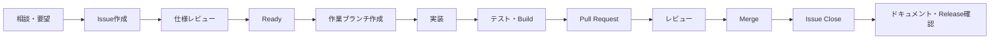

# GitHub Issues運用ガイド

OCR Crafterの開発を、チャット内の一時的な指示（`task.md`）中心から、GitHub Issuesを起点とする開発フローへ移行するための運用ガイドです。

Issueの書き方は [ISSUE_WRITING_GUIDE.md](ISSUE_WRITING_GUIDE.md)、AIコーディングエージェント（Claude Code・Codex等）への指示方法は [AI_AGENT_WORKFLOW.md](AI_AGENT_WORKFLOW.md)、コミット・ブランチ・PRのルールは [../../CONTRIBUTING.md](../../CONTRIBUTING.md) を参照してください。

## 基本フロー



- **Issue作成**: `.github/ISSUE_TEMPLATE/` のFeature/Bug/Refactor/Documentation/Investigationのいずれかを使う
- **仕様レビュー**: Issue本文（対象範囲・対象外・受け入れ条件等）が実装に着手できる粒度か確認する
- **Ready**: レビュー済みで着手可能な状態（後述の「Issueの状態」参照）
- **実装**: [CONTRIBUTING.md](../../CONTRIBUTING.md) のブランチ命名・Commit規約に従う
- **Pull Request**: `.github/PULL_REQUEST_TEMPLATE.md` を使い、`Closes #番号` を必ず記載する
- **Merge後**: Issueが自動的に（または手動で）Closeされたことを確認し、ドキュメント更新・CHANGELOG記載・リリースへの反映有無を確認する

## Issueの状態

GitHub Projects（Projects v2）を将来または現在使用できるよう、以下の状態を定義します。**この状態名を使ってGitHub Projectを自動作成することは今回行っていません**。GitHub Projectを実際に使う場合は、手動でこれらの状態（列）を作成してください。

| 状態 | 意味 |
|---|---|
| Backlog | 着手時期未定。アイデア・要望段階 |
| Ready | 仕様レビュー済みで、いつでも着手できる状態 |
| In Progress | 実装中（作業ブランチが存在する） |
| Review | Pull Requestが作成され、レビュー待ち・レビュー中 |
| Done | Mergeされ、Issueがクローズされた状態 |
| Blocked | 他の作業・意思決定・外部要因待ちで進められない状態 |

GitHub Projectを使わない場合も、これらの状態は `status: blocked` / `status: needs-info` / `status: ready` / `status: review` ラベル（[../../.github/labels.yml](../../.github/labels.yml)）と、Issueのオープン/クローズ状態の組み合わせで代替できます。

## Issueを分割する基準

1つのIssueが大きすぎると、レビュー・完了判定・回帰確認が難しくなります。次のような**巨大Issue**は避けてください。

```text
TrOCR対応
```

このような機能全体を指すIssueは、実装の実態（技術検証→設計→Backend→Frontend→関連機能連携→ドキュメント→テスト）に沿って、次のように分割することを検討してください。

- 技術調査（Investigation）: TrOCRライブラリの選定・ローカル完結で動作するかの検証
- 共通Engine Capability設計（Investigation または Refactor）: 既存4エンジン（custom/EasyOCR/PaddleOCR/Tesseract）の抽象化に新エンジンをどう組み込むか
- Backend学習処理（Feature）: 学習ジョブ・モデル登録処理の追加
- 推論処理（Feature）: `/predict` 系エンドポイントへの対応追加
- 評価処理（Feature）: モデル評価（またはBenchmark Runner）への対応追加
- Frontend UI（Feature）: 学習・推論・評価画面のエンジン選択肢追加
- Model管理連携（Feature）: モデル管理・リリース管理での表示・識別対応
- Benchmark連携（Feature）: Benchmark Runner/Centerでの比較対象への追加
- ドキュメント（Documentation）: USER_GUIDE・SCREEN_SPEC・API_REFERENCE等の更新
- 回帰テスト（Test）: 既存4エンジンの動作に影響がないことを保証するテスト追加

**このガイド自体では、上記のTrOCR分割例に基づく実際のIssueは作成していません。** 個別のTrOCR Issueは、この基盤整備が完了した後に別途作成されます。

分割の判断に迷う場合の詳細な考え方は [ISSUE_WRITING_GUIDE.md](ISSUE_WRITING_GUIDE.md) の「Issue分割の判断」を参照してください。

## ラベルの登録方法（GitHub CLI）

ラベルの定義は [../../.github/labels.yml](../../.github/labels.yml) にありますが、**このファイルを置くだけではGitHubへ自動登録されません**。GitHub CLI（`gh`）が導入・認証済みの環境で、以下のように手動登録できます。

```bash
# 現在のリポジトリを確認（ハードコードしない）
gh repo view

# labels.yml の各エントリを登録（既存の同名ラベルは --force で上書き。
# 事前に何が変わるか確認したい場合は --force を外して差分を確認してください）
# 例（1件ずつ登録する場合）:
gh label create "type: feature" --color 0E8A16 --description "新機能の追加・既存機能の拡張" --force
```

すべてのラベルを一括登録するスクリプトは、GitHub CLIの導入・認証が確認できる環境でのみ追加してください（今回のセッションでは `gh` コマンドが未導入だったため、スクリプト自体を作成していません）。作成する場合は次の要件を満たしてください。

- 既存ラベルを破壊しない（同名ラベルは更新またはスキップ）
- リポジトリ名をハードコードせず `gh repo view` から判定する
- GitHub認証が確認できない場合は実行しない
