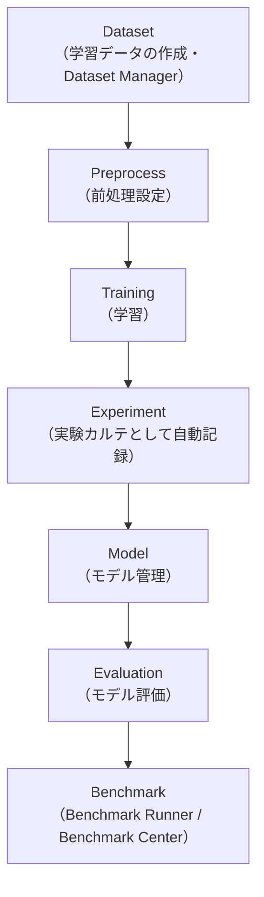

# 01. はじめに

## OCR Crafterとは

OCR Crafterは、ローカル環境（自分のPC）だけで完結する**OCRモデル開発プラットフォーム**です。画像の取り込みから、前処理・ラベル付け・学習データセット作成・OCRモデルの学習・評価・推論・修正までを、1つのWebブラウザ画面（UI）だけで行えます。

- バックエンド（処理本体）はFastAPI（Python）、フロントエンド（画面）はReactで動作します
- すべてのデータはプロジェクト単位（`data/projects/<project_id>/`）で保存され、**外部のWebサービスへは一切送信されません**
- インストール・起動方法は [../INSTALLATION_GUIDE.md](../INSTALLATION_GUIDE.md)・[../QUICK_START.md](../QUICK_START.md) を参照してください

## 対応OCRエンジン

| エンジン | 学習（自分のデータで再学習） | 推論（認識） | 備考 |
|---|---|---|---|
| Tesseract | ○（LSTM fine-tuning） | ○ | 学習対象文字は既定で `A-Z0-9klt+-`（大文字英数字＋筆記体の一部小文字k/l/t＋記号） |
| PaddleOCR | ○（認識モデルの学習） | ○ | `external/PaddleOCR` を使用 |
| EasyOCR | 現時点では未実装（推論のみ） | ○ | 自分のデータで再学習することはできません |
| カスタム分類モデル | ○（実験機能） | ○ | 文字を1文字ずつ切り出して分類するモデル。他の3エンジンとは方式が異なります |

## OCR Crafterで出来ること

| 分類 | 出来ること |
|---|---|
| データ作成 | 画像の取り込み・回転、前処理（二値化・照明ムラ補正・手動マスク補正等）、ラベル付け（正解文字列の入力） |
| データセット管理 | 学習に使ったデータセットをDataset Managerで資産として一覧・検索・再利用できる |
| 学習 | Tesseract・PaddleOCR・カスタム分類モデルの学習（いずれもバックグラウンドジョブとして実行） |
| 実験管理 | 学習を実行するたびに条件・結果が実験カルテとして自動記録され、比較・分析できる |
| モデル管理 | 学習済みモデルの一覧・カルテ表示・比較・ダウンロード・削除 |
| 評価 | CER（文字誤り率）を主指標としたモデル評価、モデル間比較 |
| Benchmark | 複数エンジンを実際に実行して比較するBenchmark Runner、既存の評価結果を横断比較するBenchmark Center |
| リリース管理 | モデルのライフサイクル管理（Draft→Validated→Candidate→Production→Archived） |
| 推論・修正 | 単一推論・バッチ推論・キーボード中心のOCR修正画面 |
| 運用 | ジョブ管理・監査ログ・バックアップ・システム状態の確認 |

## 開発フロー概要

OCR Crafterでのモデル開発は、大きく次の流れで進みます。

- **Dataset**: 画像を取り込み、ラベル（正解文字列）を付けて学習データセットを作ります。作成したデータセットはDataset Managerで一覧・再利用できます（[02_学習データ作成.md](02_学習データ作成.md)）
- **Preprocess**: 二値化や照明ムラ補正などの前処理を設定します。設定内容はスナップショットとして記録され、学習・評価・推論で同じ条件を再現できます
- **Training**: Tesseract・PaddleOCR・カスタム分類モデルのいずれかで学習を実行します（[04_Tesseract学習.md](04_Tesseract学習.md)）
- **Experiment**: 学習を実行すると、条件と結果が実験カルテへ自動記録されます。あとから条件と精度の関係を分析できます
- **Model**: 学習が完了すると、モデル管理へモデルが追加されます（管理No付与）。モデルの比較・ダウンロードもここで行います（[07_モデル管理.md](07_モデル管理.md)）
- **Evaluation**: 評価データセットを使ってモデルの精度（CER等）を測定します（[05_モデル評価.md](05_モデル評価.md)・[06_評価結果の見方.md](06_評価結果の見方.md)）
- **Benchmark**: 複数エンジン・複数モデルを比較したい場合はBenchmark Runner（実際に実行して比較）またはBenchmark Center（既存の評価結果を横断比較）を使います

この後の章では、①学習データ作成 ②評価データ作成 ③Tesseract学習 ④モデル評価 ⑤評価結果の見方 ⑥モデル管理 ⑦FAQ の順に、実際の画面に沿って説明します。

<!-- TODO: ここへダッシュボード画面（サイドバー全体が見えるもの）のスクリーンショット -->

## 次に読む

- 初めて起動する場合は [../QUICK_START.md](../QUICK_START.md) で全体の流れを10〜15分で体験できます
- 操作しながら学びたい場合は [../tutorial/01_Tesseractチュートリアル.md](../tutorial/01_Tesseractチュートリアル.md) を参照してください
- 各画面の完全な仕様は [../16_SCREEN_SPEC.md](../16_SCREEN_SPEC.md)、APIは [../06_API_REFERENCE.md](../06_API_REFERENCE.md) にあります
