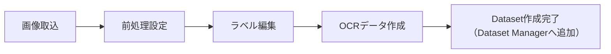

# 02. 学習データ作成

## Datasetとは

Datasetとは、OCRモデルの学習に使う「画像＋正解ラベル（文字列）のまとまり」のことです。OCR Crafterでは、ラベル編集済みの画像から「OCRデータ作成」を実行するとDatasetが生成され、そのDatasetを使ってモデルを学習します。

Datasetは学習後もフォルダとして保持され、あとから内容・使用したモデルを確認できます。この管理を行う画面が次に説明するDataset Managerです。

## Dataset Manager

**画面**: サイドバー「OCRモデル > Dataset Manager」

Dataset Managerは、作成済みのDatasetを資産として一覧・検索・管理する画面です。

- **Dataset ID**: `DS0001`形式。全プロジェクト共通の登録簿で管理され、削除しても番号は再利用されません
- **一覧**: 作成日時降順で表示され、列（作成日・Iteration・CER等）でソートできます
- **Dataset詳細**: 以下の情報を確認できます
  - 前処理情報: 前処理Version・保存日時・学習時前処理ハッシュ
  - 学習設定: Train/Val/Test比率・charset・回転設定・入力画像数・除外画像数
  - 件数: Train/Val/Testそれぞれの画像枚数
  - **使用モデル一覧**: このDatasetから学習されたモデル（Dataset⇔Modelの双方向リンク）
  - **使用Experiment一覧**: このDatasetを使った実験カルテ
- **操作**: コピー、削除（使用中のモデルがある場合は確認あり）、コメント編集（複数行）
- **検索**: Dataset名・コメント・Charset・前処理Versionで絞り込みできます

<!-- TODO: ここへDataset Manager画面（一覧）のスクリーンショット -->
<!-- TODO: ここへDataset詳細画面のスクリーンショット -->

## 作成手順

1. 「データ準備 > 学習データ」の「画像」画面で、フォルダから画像を取り込みます（取込後に前処理が自動実行されます）
2. 「前処理設定」画面で、二値化・照明ムラ補正などのパラメータを確認・調整します
3. 「ラベル編集」画面で、各画像の正解文字列を入力・保存します
4. 「OCRモデル > データ作成・学習」画面で、学習方式・OCRタイプ（Tesseract/PaddleOCR）を選び、「OCRデータ作成」を実行します
5. 作成が完了すると、Dataset ManagerにDatasetが追加されます

## 画像形式

- 取り込み対象は画像フォルダ（フォルダ選択ダイアログで指定）
- 取り込んだ元画像は `raw/` フォルダへ保存され、前処理では**変更されません**（回転操作のみ例外）
- 前処理後の画像は縦横比によって `single`（正方形に近い）と `wide`（横長）に自動分類されます

## ラベル形式

- ラベル編集画面で、画像ごとに正解文字列（Ground Truth）を入力します
- **大文字・小文字は実際の見た目どおりに入力してください**（例: `CHYBkt`）。評価はcase-sensitive（大文字・小文字を区別する）完全一致で行われ、勝手に大文字化されることはありません
- ラベルは `annotations/master.csv`（`filename,label,type` 形式）に保存されます
- OCRデータ作成時、学習対象文字セット（charset）外の文字を含むラベルは**そのサンプルごと除外**され、除外件数として集計されます（文字だけが削除されるわけではありません）

## 前処理Versionとの関係

OCRデータ作成を実行した時点の前処理設定は、実効パラメータのスナップショットとしてDatasetのメタ情報に記録されます（前処理Version・保存日時・前処理ハッシュ）。これにより、

- 同じ前処理条件で学習・評価・推論を再現できる
- 前処理設定を変更した後でも、過去に作成したDatasetがどの前処理条件で作られたかを確認できる

という利点があります。前処理を一度も実行していない状態で作成された古いDatasetは「未記録」と表示されます（推測で補完されません）。

## 推奨データ構成

- 学習に使う画像とは別に、精度確認用の**評価データセット**を用意してください（[03_評価データ作成.md](03_評価データ作成.md)）。学習に使った画像で評価すると精度が過大評価されます
- ラベル編集は大文字・小文字を実物どおりに統一し、表記ゆれ（全角/半角等）が無いようにしてください
- charset外の文字を含む画像が多いと除外件数が増えるため、事前に学習対象文字セットを確認しておくことを推奨します
