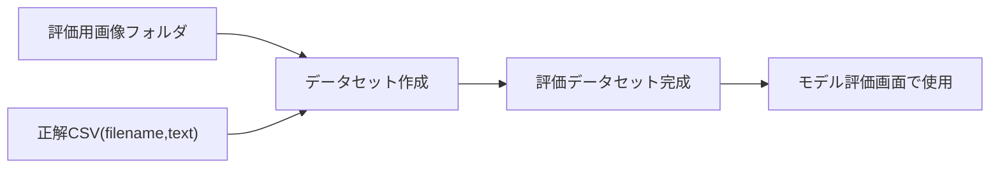

# 03. 評価データ作成

## 評価Datasetとは

評価Datasetとは、学習が終わったモデルの精度を測定するための「画像＋正解ラベルCSV」のまとまりです。モデル評価画面（[05_モデル評価.md](05_モデル評価.md)）で使用します。

## 学習Datasetとの違い

| | 学習Dataset | 評価Dataset |
|---|---|---|
| 作成場所 | データ準備 > 学習データ → OCRモデル > データ作成・学習 | データ準備 > 評価データ > データセット作成 |
| 目的 | モデルを学習させる | 学習済みモデルの精度を測定する |
| 管理画面 | Dataset Manager | モデル評価画面から選択 |
| 重要な注意 | 学習に使った画像は評価に使わない | 学習データと重複していないか確認する仕組みがある |

**学習に使った画像をそのまま評価に使うと、精度が過大評価されます**（モデルがすでに「見たことのある」画像だから）。そのため評価データは学習データと分離し、OCR Crafterには学習データとの重複をチェックする機能があります。

## 評価用画像

- 評価用の画像フォルダを用意します（学習に使っていない画像）
- 画像ファイル名は、後述の正解CSVの `filename` 列と一致させる必要があります（拡張子含む）

## 正解ラベル

正解CSVの形式（モデル評価で使用）:

```csv
filename,text
sample_001.png,CHYBkt
sample_002.png,TY12lt
```

- `filename`: 評価用画像フォルダ内のファイル名と一致させる（拡張子含む）
- `text`: 実運用の表記どおり（case-sensitive。`KT` と `kt` は別物として評価されます）
- ヘッダ行あり推奨・UTF-8推奨

## 評価Dataset作成手順

1. サイドバー「データ準備 > 評価データ > データセット作成」を開く
2. 評価用画像フォルダと正解CSVを指定する
3. データセット作成を実行する
4. 完了すると、モデル評価画面でこの評価データセットを選択できるようになる



<!-- TODO: ここへ評価データセット作成画面のスクリーンショット -->

## 推奨構成

- 評価用画像は学習に使用していないものを使う（学習データ重複チェック機能で確認可能）
- 正解ラベルは学習データのラベルと同じ表記ルール（大文字・小文字を実物どおり）で統一する
- ある程度の枚数（数十〜数百枚程度）を用意すると、CERなどの指標が安定します
