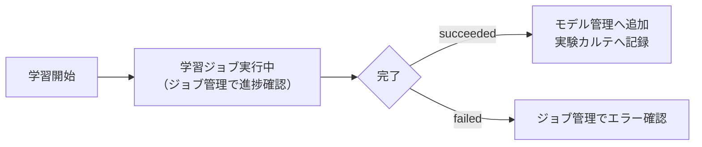

# 04. Tesseract学習

## 学習画面

**画面**: サイドバー「OCRモデル > データ作成・学習」

この画面で、学習方式を選び、パラメータを確認・調整してから学習を開始します。

1. 学習方式 `ocr`、OCRタイプ `Tesseract` を選択
2. 「次回学習の設定」でパラメータを確認（4タブ: 学習設定 / 学習前処理 / オーグメンテーション / エンジン設定）
3. 実験名・親モデル・学習メモを必要に応じて入力（実験カルテへ記録されます）
4. 「OCR学習開始」を押す

<!-- TODO: ここへデータ作成・学習画面のスクリーンショット -->

## 各パラメータ

| パラメータ | 既定値 | 説明 |
|---|---|---|
| 最大イテレーション（max_iterations） | 1000 | LSTM fine-tuningの学習回数上限。EpochやBatch Sizeという概念は使いません |
| charset（学習対象文字セット） | `A-Z0-9klt+-` | 学習する文字の範囲。charset外の文字を含むラベルはOCRデータ作成時に除外されます |
| base_lang（ベースモデル） | `eng`（`eng.traineddata`） | fine-tuningの元になる言語モデル |
| PSM（Page Segmentation Mode） | 7（単一行として認識） | 認識時の領域分割方式 |

- Tesseractの学習には学習ツール（`lstmtraining`等。UB-Mannheimビルド等に含まれる）の導入が必要です
- 学習中はラベルの大文字・小文字がそのまま保持されます（大文字化されません）

## Experiment（実験管理との関係）

学習を実行すると、学習条件（charset・イテレーション数・使用Dataset・前処理ハッシュ等）が実験カルテ（`EXP-0001`形式）として自動的に記録されます。実験名・親モデル・学習メモを入力していれば、それも一緒に記録されます。詳細は「OCRモデル > 実験管理」で確認できます。

## Model（モデル管理との関係）

学習が完了すると、モデルが「OCRモデル > モデル管理」へ自動的に追加されます（管理No `M0001` 形式が付与されます）。

## 進捗

- 学習は非同期のバックグラウンドジョブとして実行されます
- 進捗は「運用 > ジョブ管理」で確認できます（状態: `queued`→`running`→`succeeded`/`failed`/`cancelled`。Backend再起動時は`interrupted`「中断（再起動）」となり再実行できます）
- 学習画面自体にも学習ログが表示されます

## 保存先

学習済みモデルは `data/projects/<project_id>/models/` 以下に `*.tess.json` として保存されます（学習ログは同プロジェクトの `logs/` 以下）。

## 学習完了後

- 学習ログが `completed` になると、モデル管理へモデルが追加されます
- 同一プロジェクトでのTesseract学習の二重実行は409エラーで拒否されます（1プロジェクトにつき同時に1つの学習ジョブのみ）
- 学習後は「モデル評価」（[05_モデル評価.md](05_モデル評価.md)）で精度を確認し、必要であれば「モデル管理」（[07_モデル管理.md](07_モデル管理.md)）から推論に使用するモデルとして設定してください

