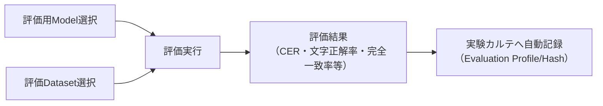

# 05. モデル評価

## 評価画面

**画面**: サイドバー「OCRモデル > モデル評価」

学習済みモデルの精度を、評価データセット（[03_評価データ作成.md](03_評価データ作成.md)）を使って測定する画面です。

<!-- TODO: ここへモデル評価画面のスクリーンショット -->

## Model選択

- 評価対象のモデル（学習後モデル）を選びます
- 学習前後を比較したい場合は、学習前モデル（例: `eng.traineddata`）も選べます
- Whitelist（評価時に許容する文字。既定は学習対象文字セットと同じ `A-Z0-9klt+-`）を「なし」「カスタム」へ変更することもできます

## Dataset選択

評価データセット（画像フォルダ＋正解CSV）を選びます。作成方法は [03_評価データ作成.md](03_評価データ作成.md) を参照してください。

## 評価実行

「評価実行」を押すと、選択したモデル・データセットで評価が実行されます。エラー時のよくある原因:

| 症状 | 対処 |
|---|---|
| Tesseract本体が未導入 | Tesseractを導入し `tesseract.tesseract_cmd` またはPATHを設定 |
| eng.traineddataが無い | tessdata_bestを配置し `tessdata_dir` を指定 |
| 正解CSVが不正 | 形式（`filename,text`）とパスを確認 |
| 画像未検出N件 | CSVの `filename` と画像フォルダ内ファイル名の一致を確認 |

## 評価結果

- 主指標: **CER**（文字誤り率）。数値の意味・読み方は [06_評価結果の見方.md](06_評価結果の見方.md) を参照してください
- 補助指標: 文字正解率（1−CER）・完全一致率・誤認識数・CER差・相対改善率・改善/同等/悪化件数・混同TOP（置換/脱落/挿入）
- 評価条件（データセット・前処理・エンジン・Whitelist等）は **Evaluation Profile** として実験カルテへ保存され、そのハッシュが **Evaluation Hash** になります。同一Hashの評価同士だけがCERを直接比較できます
- CSV出力（明細・モデル別サマリ・混同集計の3セクション）にも対応しています

## Benchmark Runnerとの関係

モデル評価は「**1つのモデル**の精度測定と学習前後の比較」を行う画面です。これに対してBenchmark Runner（「運用 > Benchmark Runner」）は、「**複数エンジン**を実際に実行して同一条件で横並び比較する」画面です（速度・メモリも計測）。モデル評価の結果は、Benchmark Runnerの結果とは別に記録されます。

## Benchmark Centerとの関係

Benchmark Center（「運用 > Benchmark Center」）は、モデル評価やBenchmark Runnerで**すでに得られた評価結果を、実行せずに横断比較するだけ**の画面です。Benchmark Center自体は新しい評価を実行しません。あるモデルに評価結果が存在しない場合、Benchmark Centerからこのモデル評価画面へ遷移する導線が表示されます。
