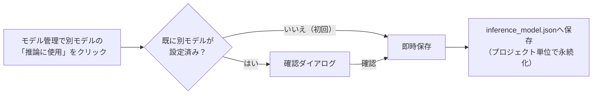

# 07. モデル管理

## Model Manager

**画面**: サイドバー「OCRモデル > モデル管理」

学習済みモデルの一覧・詳細（モデルカルテ）・比較・ダウンロード・削除を行う画面です。

- **管理No**: `M0001`形式。全プロジェクト横断で一意、削除後も再利用されません
- **モデルカルテ**: 学習条件・実験リンク・評価履歴・リリースStatus（＋Version）・学習に使ったDataset（Dataset Managerへのリンク）を表示
- **ダウンロード**: `.pt`（分類モデル）はそのまま／`.ocr.json`（PaddleOCR）はinference ZIP／`.tess.json`（Tesseract）は`.traineddata`形式
- **削除**: 確認ダイアログで対象一覧と「DELETE」の入力が必要です。削除は`models/`配下に限定される安全ガードつきです

<!-- TODO: ここへモデル管理画面（一覧）のスクリーンショット -->
<!-- TODO: ここへモデルカルテ画面のスクリーンショット -->

## 推論使用モデル

画面左上の「推論使用モデル」カードは、**現在OCR推論で使われているモデル**を常に表示するサマリーです。このカード自体は現在の使用中モデルを示すだけなので、切替ボタンはありません（使用中バッジ・モデル評価/ダウンロード/詳細ボタンは表示されます）。

## 最新モデル

画面中央上の「最新モデル」カードは、そのプロジェクトで**最後に学習が完了したモデル**を表示します。最新モデルが現在の推論使用モデルと同じ場合は「推論使用中」で無効、異なる場合は「推論に使用」ボタンが有効になり、そのままクリックして推論モデルを切り替えられます。

## Experimentとの関係

モデルカルテには、そのモデルを作成した学習実行の実験カルテへのリンクがあります。実験管理画面から、学習条件・評価結果・Datasetを行き来して確認できます（[04_Tesseract学習.md](04_Tesseract学習.md)参照）。

## Datasetとの関係

モデルカルテには、そのモデルの学習に使われたDataset（Dataset Manager）へのリンクが表示されます（学習登録時に確定保存された情報で、後から変わりません。記録の無い旧モデルは「未記録」）。Dataset Manager側からも、「このDatasetから作られたモデル」を逆に確認できます（双方向リンク）。

## 評価との関係

モデルカルテには評価履歴が表示され、モデル評価画面（[05_モデル評価.md](05_モデル評価.md)）で実行した評価結果を確認できます。また、最大3件のモデルを選んで性能サマリー・学習条件・条件差分を比較する「モデル比較」もこの画面から行えます。

## 推論モデル切替

「推論に使用」ボタンで、OCR推論に使うモデルをプロジェクト単位で切り替えられます。

- 選択は**サーバー側へ即時保存**され（`GET/POST /api/ocr/inference/model`。保存先は `data/projects/<id>/inference_model.json`）、画面遷移・ブラウザ再読み込み・アプリ再起動をまたいで維持されます
- すでに別のモデルが設定されている状態から切り替える場合のみ、確認ダイアログが表示されます（初回設定時は確認なし）
- 保存済みモデルが削除・移動済みで見つからない場合は警告が表示され、勝手に別モデルへ置き換わることはありません

切替ボタンは画面内**3か所**にあります。

| 場所 | 対象モデル | 挙動 |
|---|---|---|
| ① 推論使用モデルカード | 現在の使用中モデル自身 | ボタンなし（常に使用中の表示のみ） |
| ② 最新モデルカード | 最新の学習済みモデル | 使用中モデルと同じなら無効、違えば「推論に使用」で切替可能 |
| ③ モデル詳細パネル | 一覧でクリックして開いたモデル | 使用中モデルと同じなら無効、違えば「推論に使用」で切替可能 |

推論・OCR修正・バッチ推論の各画面のエンジン・モデル選択欄は、あくまで試し撃ち用の表示です。これらの画面で別モデルを選んでも、モデル管理で保存した「推論に使用」モデルは変わりません。
