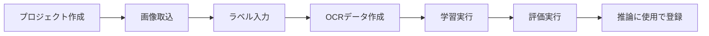

# 01. Tesseractチュートリアル

## 目的

手元に用意したサンプル画像（数十枚程度）を使って、**学習 → 評価 → 推論モデル登録**までを実際に操作しながら体験します。

このチュートリアルは操作手順のみを説明します。各機能の詳しい仕様は [../manual/](../manual/01_はじめに.md) を参照してください。

## 事前に準備するもの

- 認識させたい文字列が写った画像フォルダ（例: 10〜50枚程度）
- Tesseractの学習ツール（`lstmtraining`等）が導入済みであること（[../11_TESSERACT_CHECKLIST.md](../11_TESSERACT_CHECKLIST.md)）

## 手順1: プロジェクトを作る

1. アプリを開き、サイドバー「プロジェクト」画面で**「新規プロジェクト」をクリック**
2. テンプレート一覧から用途に近いものを選び（迷ったら「標準プロジェクト」）**「次へ」をクリック**
3. プロジェクト名を入力し、**「作成」をクリック**

<!-- TODO: ここへ新規プロジェクト作成モーダルのスクリーンショット -->

## 手順2: 画像を取り込む

1. サイドバー「データ準備 > 学習データ」の「画像」画面を開く
2. **「画像取込」をクリック**し、用意した画像フォルダを選択
3. 取り込みが終わると、一覧に画像のサムネイルが表示される（前処理が自動実行されます）

## 手順3: ラベルを入力する

1. 「ラベル編集」画面を開く
2. 一覧から画像を1枚選び、**正解文字列を入力して「保存」をクリック**（大文字・小文字は見たとおりに入力）
3. すべての画像にラベルを入力する（画面上部の未編集件数が0になれば完了）

## 手順4: 学習データセットを作る

1. サイドバー「OCRモデル > データ作成・学習」を開く
2. 学習方式で `ocr`、OCRタイプで **`Tesseract`をクリック**して選択
3. charset（学習対象文字セット）が意図した文字範囲になっているか確認
4. **「OCRデータ作成」をクリック**して実行

## 手順5: 学習を実行する

1. 同じ画面の「次回学習の設定」で、必要ならパラメータを調整（そのままでも学習可能）
2. **「OCR学習開始」をクリック**
3. サイドバー「運用 > ジョブ管理」を開き、進捗が`running`→`succeeded`になるまで待つ

<!-- TODO: ここへジョブ管理画面（学習ジョブ実行中）のスクリーンショット -->

## 手順6: 評価データを用意して評価する

1. 学習に使っていない画像と正解CSV（`filename,text`形式）を用意する
2. サイドバー「データ準備 > 評価データ > データセット作成」で**評価データセットを作成**
3. サイドバー「OCRモデル > モデル評価」を開き、評価対象モデル・評価データセットを選択して**「評価実行」をクリック**
4. CER・完全一致率などの結果が表示されることを確認（見方は [../manual/06_評価結果の見方.md](../manual/06_評価結果の見方.md)）

## 手順7: 推論モデルとして登録する

1. サイドバー「OCRモデル > モデル管理」を開く
2. 一覧から今回学習したモデルをクリックして詳細（モデルカルテ）を開く
3. **「推論に使用」をクリック**
4. （初めての設定であれば確認なしで）推論使用モデルとして保存される
5. 画面左上の「推論使用モデル」カードに、選んだモデル名が表示されることを確認する

これで、このモデルがOCR推論（「OCRモデル > 推論」）で使われるようになりました。

