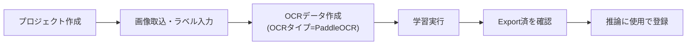

# 02. PaddleOCRチュートリアル

## 目的

手元に用意したサンプル画像を使って、PaddleOCRで**学習 → 評価 → 推論モデル登録**までを操作しながら体験します。実装済みの範囲のみを扱います。

## 事前に準備するもの

- 認識させたい文字列が写った画像フォルダ
- `external/PaddleOCR` リポジトリが配置されていること（[../03_TECH_STACK.md](../03_TECH_STACK.md)）

## 手順1〜3: プロジェクト作成・画像取込・ラベル入力

Tesseractチュートリアルの手順1〜3（[01_Tesseractチュートリアル.md](01_Tesseractチュートリアル.md)）と同じ操作です。プロジェクトを作成し、画像を取り込み、ラベルを入力してください。

## 手順4: 学習データセットを作る

1. サイドバー「OCRモデル > データ作成・学習」を開く
2. 学習方式で `ocr`、OCRタイプで **`PaddleOCR`をクリック**して選択
3. charsetを確認し、**「OCRデータ作成」をクリック**

## 手順5: 学習を実行する

1. 「次回学習の設定」で、演算デバイス（`auto`/`cpu`/`gpu`）を確認する。プリセット「`Mac Safe`」（CPU向け）・「`RTX Train`」（GPU向け）も選べます
2. エポック数・バッチサイズ等を必要に応じて調整
3. **「OCR学習開始」をクリック**
4. 「運用 > ジョブ管理」で進捗を確認する（GPU検出時は自動最適化、OOM発生時はバッチサイズ半減で1回自動リトライされます）

## 手順6: 評価データを用意して評価する

**現時点では未実装**です。「OCRモデル > モデル評価」画面はTesseract専用（`build_recognizer`がtesseract以外を拒否）のため、PaddleOCRモデルはこの画面では評価できません。精度を比較したい場合は「運用 > Benchmark Runner」で複数エンジン・複数モデルを実際に実行して比較してください。

## 手順7: 推論モデルとして登録する

1. サイドバー「OCRモデル > モデル管理」を開く
2. 学習したPaddleOCRモデルの詳細を開く
3. **Export状態が「Export済」になっていることを確認**（学習完了時に自動でexportされます。未exportの場合は「推論に使用」ボタンが無効になります）
4. **「推論に使用」をクリック**して登録する

「OCRモデル > モデル評価」でのPaddleOCR対応は**現時点では未実装**（`services/ocr_evaluation.py`のコメントに将来対応の記載あり）です。
