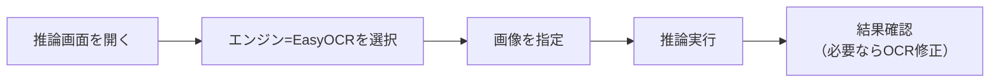

# 03. EasyOCRチュートリアル

## 目的

EasyOCRで実際に推論（文字認識）を試します。

## 学習について

**EasyOCRの学習（自分のデータでの再学習）は現時点では未実装**です。EasyOCRは推論専用エンジンとして組み込まれています。そのため、このチュートリアルは「推論」のみを扱います。学習・評価・推論モデル登録を体験したい場合は、[01_Tesseractチュートリアル.md](01_Tesseractチュートリアル.md) または [02_PaddleOCRチュートリアル.md](02_PaddleOCRチュートリアル.md) を参照してください。

## 事前に準備するもの

- 文字が写ったサンプル画像1枚以上

## 手順1: 推論画面を開く

1. サイドバー「OCRモデル > 推論」を開く

## 手順2: EasyOCRを選択する

1. エンジン選択で**「EasyOCR」をクリック**
2. 認識させたい言語を選択する

<!-- TODO: ここへ推論画面（EasyOCR選択時）のスクリーンショット -->

## 手順3: 画像を指定して推論する

1. **画像を選択**（アップロードまたは取込済み画像から選択）
2. 必要であれば90°単位で画像を回転する
3. **「推論を実行」をクリック**

## 手順4: 結果を確認する

- 認識されたテキストと、文字単位の確信度（ヒートマップ表示）が表示されます
- 結果に間違いがある場合は、「OCRモデル > OCR修正」画面でキーボード操作により修正できます（修正内容はOCRログへ保存され、再学習用データセットの作成に使えます。ただしEasyOCR自体の再学習は前述のとおり未実装です）

## まとめ

| 操作 | EasyOCRでの対応状況 |
|---|---|
| 推論（単一画像） | 実装済み |
| バッチ推論（フォルダ一括） | 実装済み |
| 学習（自分のデータで再学習） | 現時点では未実装 |
| モデル評価画面での評価 | 現時点では未実装（Tesseract専用画面のため） |
